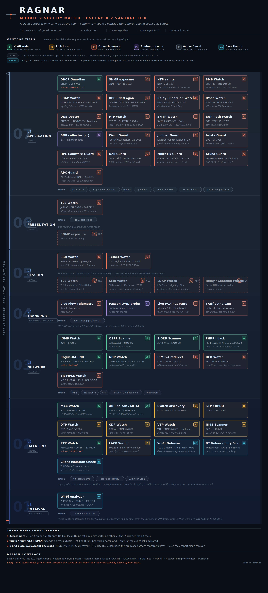

# 🛡️ Authority Verification Across the Stack

The **Network** tab in the Ragnar web interface is a built-in engine for
**verifying authority across the stack** — at every layer, someone claims to be
the legitimate authority (the root bridge, the default gateway, the DNS
resolver, the DHCP server, the routing neighbour, the name responder, the SMB
server), and each tool here answers one question: *is that claim genuine, or is
an impostor asserting authority it shouldn't have?* It runs straight from the
device that's already sitting on the segment you care about, so it sees what the
segment sees — plus the everyday diagnostics you'd normally reach for a laptop
and a bag of CLI tools to do.

It is split into two sub-tabs: **Diagnostics** and **Interfaces**. Diagnostics
holds every module, sorted by the **OSI layer** it mostly watches — a row of layer
buttons (**Overview · L7 · L6 · L5 · L4 · L3 · L2 · L1**) switches between them, and
each layer lists its passive detectors first and its active tools after. A module that
acts on more than one layer sits at the one it mostly watches (the matrix below). The
over-the-air RF tools live in **Signal Intelligence**.

> **Co-authored by [Solarflere](https://www.instagram.com/solarflere).** The
> Authority Verification suite was designed and built in collaboration with Solarflere.
### Module visibility matrix

Every module by OSI layer and **vantage tier** — what a tap has to see for a clean
verdict to mean anything (A VLAN-wide · B link-local · C on-path unicast · D configured
peer · E active / local · RF over-the-air). The Diagnostics layer buttons follow it.

The matrix is also in the web UI as a reference guide: **Overview** has a collapsible
*Module visibility matrix* card with the whole graphic, and every layer panel (L7 … L1)
opens with its own band of it (with the tier legend), so the tier of each module is right
next to its card. The images load only when you expand a card; tap one to open the full
matrix to zoom (`/web/images/osi/`).




### Tool index

| Tool | Sub-tab | Endpoint |
|------|---------|----------|
| [Network Integrity Monitor](#-network-integrity-monitor) | Diagnostics · Overview | `GET /api/net/integrity` + config |
| [Watchtower (unified watcher alerts)](watchtower.md) | Diagnostics · Overview | `GET /api/net/watchtower` + config |
| [Incident correlation (attack chains)](incident-correlation.md) | Diagnostics · Overview | `GET /api/net/incidents` + config |
| [Detector Self-Test](#detector-self-test) | Diagnostics · Overview | `GET /api/net/routing-selftest` |
| [PCAP Analyzer](#pcap-analyzer) | Diagnostics · Overview | `POST /api/net/pcap` |
| [On-Screen Network Diagnostic Mode](#-on-screen-network-diagnostic-mode) | Diagnostics · Overview (toggle) | config `network_diagnostic_mode` |
| [DHCP Guardian](#dhcp-guardian) | Diagnostics · L7 | `GET /api/net/dhcp-guardian`, `POST /api/net/dhcp-baseline` |
| [DNS Watch (passive)](#dns-watch) | Diagnostics · L7 | `GET /api/net/dns-watch` |
| [NTP Watch](#ntp-watch) | Diagnostics · L7 | `GET /api/net/ntp-watch`, `POST /api/net/ntp-baseline` |
| [SNMP Watch](#snmp-watch) | Diagnostics · L7 | `GET /api/net/snmp-watch`, `POST /api/net/snmp-baseline` |
| [SMB Watch](#smb-watch) | Diagnostics · L7 | `GET /api/net/smb-watch`, `POST /api/net/smb-baseline` |
| [LDAP Watch](#ldap-watch) | Diagnostics · L7 | `GET /api/net/ldap-watch` |
| [RPC / NetLogon Watch](#rpc--netlogon-watch) | Diagnostics · L7 | `GET /api/net/rpc-watch` |
| [Relay/Coercion Watch](#relaycoercion-watch) | Diagnostics · L7 | `GET /api/net/relay-watch`, `POST /api/net/relay-baseline` |
| [SMTP Watch](#smtp-watch) | Diagnostics · L7 | `GET /api/net/smtp-watch` |
| [FTP Watch](#ftp-watch) | Diagnostics · L7 | `GET /api/net/ftp-watch` |
| [BGP Path Watch](#bgp-path-watch) | Diagnostics · L7 | `GET /api/net/bgp-watch`, `POST /api/net/bgp-baseline` |
| [BGP Collector & Path Asymmetry](#bgp-collector--path-asymmetry-control-plane--data-plane) | Diagnostics · L7 | `GET/POST /api/net/bgp-collector`, `/api/net/owd-reflector`, `POST /api/net/path-asymmetry` |
| [IPsec / IKE Watch](#ipsec--ike-watch) | Diagnostics · L7 | `GET /api/net/ipsec-watch` |
| [Cisco Guard](#cisco-guard) | Diagnostics · L7 | `GET /api/net/cisco-guard` |
| [Juniper Guard](#juniper-guard) | Diagnostics · L7 | `GET /api/net/juniper-guard` |
| [Arista Guard](#arista-guard) | Diagnostics · L7 | `GET /api/net/arista-guard` |
| [Comware Guard](#comware-guard) | Diagnostics · L7 | `GET /api/net/comware-guard` |
| [Dell Guard (daemon control)](#dell-guard-standalone-daemon) | Diagnostics · L7 | `GET/POST /api/net/dell-guard` |
| [MikroTik Guard](#mikrotik-switch-and-router-guard) | Diagnostics · L7 | `GET /api/net/mikrotik-guard` |
| [Aruba Guard](#aruba-guard) | Diagnostics · L7 | `GET /api/net/aruba-guard` |
| [APC Guard](#apc-guard) | Diagnostics · L7 | `GET /api/net/apc-guard` |
| [DNS Doctor (poisoning check)](#dns-doctor) | Diagnostics · L7 | `POST /api/net/dns` |
| [Captive Portal Check](#captive-portal-check) | Diagnostics · L7 | `GET /api/net/captive-portal` |
| [DHCP Snooping (inline)](#dhcp-snooping-inline) | Diagnostics · L7 | `GET /api/net/dhcp-snoop` + `/dhcp-snoop/status`, `/config`, `/setup` |
| [WHOIS](#whois) | Diagnostics · L7 | `POST /api/net/whois` |
| [IP Attribution (country/ASN/ISP/abuse)](ip-intel.md) | Diagnostics · L7 | `POST /api/net/ip-intel` |
| [Speed Test](#speed-test) | Diagnostics · L7 | `POST /api/net/speedtest` |
| [TLS Watch](#tls-watch) | Diagnostics · L6 | `GET /api/net/tls-watch` |
| [Cert Watch](#cert-watch) | Diagnostics · L6 | `POST /api/net/cert-watch`, `POST /api/net/cert-baseline` |
| [SSH Watch](#ssh-watch) | Diagnostics · L5 | `GET /api/net/ssh-watch` |
| [Telnet Watch](#telnet-watch) | Diagnostics · L5 | `GET /api/net/telnet-watch` |
| [Live Flow Telemetry](#live-flow-telemetry) | Diagnostics · L4 | `GET /api/net/flows` |
| [LAN Throughput (iperf3)](#lan-throughput-iperf3) | Diagnostics · L4 | `POST /api/net/iperf3`, `/iperf3-server` |
| [IGMP Watch](#igmp-watch) | Diagnostics · L3 | `GET /api/net/igmp-watch`, `POST /api/net/igmp-baseline` |
| [OSPF Security Scanner](#ospf-security-scanner) | Diagnostics · L3 | `GET /api/net/ospf-watch`, `POST /api/net/ospf-baseline` |
| [EIGRP Watch](#eigrp-watch) | Diagnostics · L3 | `GET /api/net/eigrp-watch`, `POST /api/net/eigrp-baseline` |
| [FHRP Watch](#fhrp-watch) | Diagnostics · L3 | `GET /api/net/fhrp-watch`, `POST /api/net/fhrp-baseline` |
| [IPv6 First-Hop Watch](#ipv6-first-hop-watch) | Diagnostics · L3 | `GET /api/net/ipv6-watch`, `POST /api/net/ipv6-baseline` |
| [NDP Watch](#ndp-watch) | Diagnostics · L3 | `GET /api/net/ndp-watch`, `POST /api/net/ndp-baseline` |
| [ICMP Watch](#icmp-watch) | Diagnostics · L3 | `GET /api/net/icmp-watch`, `POST /api/net/icmp-baseline` |
| [BFD Watch](#bfd-watch) | Diagnostics · L3 | `GET /api/net/bfd-watch` |
| [SR-MPLS Watch](#sr-mpls-watch) | Diagnostics · L3 | `GET /api/net/srmpls-watch` |
| [Ping](#ping) | Diagnostics · L3 | `POST /api/net/ping` |
| [Traceroute](#traceroute) | Diagnostics · L3 | `POST /api/net/traceroute` |
| [MTR](#mtr) | Diagnostics · L3 | `POST /api/net/mtr` |
| [Path MTU / Black-hole](#path-mtu--black-hole) | Diagnostics · L3 | `POST /api/net/pmtu` |
| [IPv6 RA Guard](#ipv6-ra-guard) | Diagnostics · L3 | `GET /api/net/raguard`, `POST /api/net/raguard` `{action: harden}` |
| [MAC Watch](#mac-watch) | Diagnostics · L2 | `GET /api/net/mac-watch`, `POST /api/net/mac-watch-reset` |
| [ARP Poisoning](#arp-poisoning) | Diagnostics · L2 | `GET /api/net/arp-check`, `/arp-baseline` |
| [Switch Discovery + PoE](#switch-discovery-lldp--cdpv1v2--edp--fdp) | Diagnostics · L2 | `GET /api/net/lldp` |
| [STP/BPDU Watch](#stpbpdu-watch) | Diagnostics · L2 | `GET /api/net/stp-watch`, `POST /api/net/stp-baseline` |
| [DTP Watch](#dtp-watch) | Diagnostics · L2 | `GET /api/net/dtp-watch`, `POST /api/net/dtp-baseline` |
| [CDP Watch](#cdp-watch) | Diagnostics · L2 | `GET /api/net/cdp-watch`, `POST /api/net/cdp-baseline` |
| [VTP Watch](#vtp-watch) | Diagnostics · L2 | `GET /api/net/vtp-watch`, `POST /api/net/vtp-baseline` |
| [IS-IS Watch](#is-is-watch) | Diagnostics · L2 | `GET /api/net/isis-watch`, `POST /api/net/isis-baseline` |
| [PTP Watch](#ptp-watch) | Diagnostics · L2 | `GET /api/net/ptp-watch` |
| [PTP Timing Detection](#ptp-timing-detection) | Diagnostics · L2 | `POST /api/net/ptp` |
| [LACP Watch](#lacp-watch) | Diagnostics · L2 | `GET /api/net/lacp-watch` |
| [L2 Link Health](#l2-link-health) | Diagnostics · L2 | `POST /api/net/l2-health` |
| [ARP Scan](#arp-scan) | Diagnostics · L2 | `GET /api/net/arp-scan` |
| [Locate Port](#locate-port) | Diagnostics · L1 | `POST /api/net/locate-port` |
| [Cellular Uplink Fallback](cellular-uplink.md) | Interfaces | `GET /api/cellular/status` |
| [Interfaces](#interface-list) | Interfaces | `GET /api/net/interfaces` |
| [Network Identity](#network-identity) | Interfaces | `GET /api/net/identity` |
| [ISP / WAN + VPN Detection](#isp--wan-detection) | Interfaces | `GET /api/net/isp` |
| [VPN Egress Check](#vpn-egress-check) | Interfaces | `GET /api/net/vpn-check` |

---

## One-click install for missing tools

Most of these tools shell out to standard Linux utilities (`ping`, `mtr`,
`lldpd`, `arp-scan`, …). If one isn't present, Ragnar doesn't just show a dead
error — it shows an **Install** button. Clicking it runs a whitelisted
`apt-get install` for the exact package that provides the missing binary, then
re-runs the tool automatically. The button disappears once the tool is
available.

If a previous package operation on the box was interrupted (the classic
`dpkg was interrupted, you must manually run 'dpkg --configure -a'` state),
the installer detects it, runs the recovery automatically, and retries — so the
button works without you having to drop to a shell.

Installable packages are whitelisted (`iputils-ping`, `traceroute`, `mtr-tiny`,
`whois`, `speedtest-cli`, `lldpd`, `arp-scan`, `ethtool`, `curl`, `dnsutils`,
`iperf3`, `tcpdump`), so the tool name is never interpolated into a shell
command.

**Scapy** (for the routing-scanner end-to-end self-test) is installable the same
way — the **Detector Self-Test** panel (Diagnostics · Overview) has an **Install Scapy**
button that installs `python3-scapy` (falling back to `pip`). It's optional: the
IGMP / OSPF / BGP scanners work fully without it; Scapy only adds the end-to-end
leg that crafts real packets → pcap → `tcpdump` → parse to exercise the whole
capture path.

### Detector Self-Test
A one-click **Run self-test** that validates the IGMP, **IPv6 first-hop**, **NDP**, **RA Guard**,
**NTP**, **ICMP**, **SNMP**, **TLS-cert**, **STP**, **DTP**, **CDP**, **VTP**, **SMB**, **Relay/Coercion**, **SSH** (regreSSHion/Terrapin), **Telnet**, **RPC/NetLogon** (Zerologon/DCSync/WinRM), **LACP** (LAG hijack), **BFD** (failover manipulation), **PTP** (grandmaster takeover), **SR-MPLS** (label/segment injection), **IPsec/IKE** (D(HE)at / weak-DH / SWEET32 / Aggressive-Mode), **DNS Watch** (KeyTrap / NSEC3 / NXNSAttack / MaginotDNS cache-poisoning / SAD DNS), **EIGRP**, **IS-IS**, **FHRP**, OSPF and BGP detectors — plus the cross-protocol **D(HE)at** (CVE-2002-20001) coverage that also names finite-field-DH exposure in TLS and SSH — the vendor CVE guards (**Cisco**, **Juniper**, **Arista**, **Comware**, **MikroTik**, **Aruba** and **Dell** — Dell Guard is a standalone daemon, so the panel runs its offline classifier self-test) — plus the **BGP speaker** (codec/framer/FSM/RIB) and
**path-asymmetry / OWD** engine — by running each classifier against crafted attack
captures (no root, no external network) and reports per-suite pass/fail. With Scapy
installed it also runs the end-to-end packet-crafting leg for the capture-based
scanners, and Cert Watch grades a real self-signed cert over a local (loopback)
handshake. This is how you confirm the routing-security detectors are working on a
given box without waiting for a real attack — endpoint `GET /api/net/routing-selftest`.
The same checks run headless via
`python3 network_diagnostics.py {igmp,ipv6,raguard,ntp,icmp,snmp,tls,ospf,bgp}-selftest` and each module's
`selftest()`.

---

## 🖥️ On-Screen Network Diagnostic Mode

A toggle at the top of the Diagnostics sub-tab turns the **on-board display**
(e-Paper HAT or the 1.44" LCD HAT) into a standalone, Ethernet-focused field
tool — so you can plug the device
into a switch and read the essentials off the screen with **no laptop and no
internet**. Everything shown is gathered locally (`ip` / `ethtool` /
`lldpctl` / `resolv.conf`), so it works on an isolated or dead network.

The display auto-cycles six pages every **5 seconds**:

1. **LINK** — the physical wired port: interface, link up/down, negotiated
   speed, duplex, auto-negotiation, MAC. (Instantly spot a port that fell back
   to 100 Mbps or half-duplex.)
2. **IP** — addressing: DHCP vs static, IPv4/CIDR, default gateway (with its
   reverse-DNS name), and DNS servers.
3. **SWITCH** — the switch you're plugged into, via LLDP/CDP: switch name, the
   **exact port** (e.g. `GigabitEthernet1/0/12`), VLAN, **PoE** class/wattage,
   protocol, and management IP.
4. **DHCP** — the [DHCP Guardian](#dhcp-guardian) rogue-server watch: verdict,
   how many DHCP servers answered, the server-id and gateway it offers vs. your
   active gateway, and a **ROGUE!** count if a fake server is present. The scan
   runs in the background so the page never blocks the cycle.
5. **WIFI** — the wireless link you're on: **SSID**, **RSSI** (dBm) + quality %,
   band/channel and TX rate, with a live signal bar under the facts (walk around
   to find dead spots). Read passively from `iw dev … link` — no scan. Held in
   manual mode, the WIFI and SIGNAL cards **redraw every second** instead of
   the normal 5 s cycle, so the readings track you in real time.
6. **SIGNAL** — a bar chart of the **strongest nearby networks' signal
   strengths** (SSID + RSSI), from a background [passive Wi-Fi
   scan](wifi-analyzer.md) so the page never blocks. Between full discovery
   sweeps (~45 s) a **fast poll re-visits just the listed APs' channels every
   second**, so the bars move live as you walk — rows stay put, only the
   values change.
7. **SPECTRUM** — the [WiFi Spectrum Analyzer](wifi-analyzer.md)'s **Bar view on
   the panel**: a live **channel-occupancy graph** for one band (a bar per
   channel, height ∝ the strongest AP's signal there, **DFS/radar channels drawn
   hollow**, the busiest channel tick-marked), with the band, AP count and
   strongest channel + the **scanned adapter name** in the header. The ↑/↓
   joystick picks the **band** (2.4 / 5 / 6 GHz); an unsupported band says so.
   Shares the same background passive scan as SIGNAL, so it never blocks the
   cycle. *(LCD HAT only — the 2.7" e-Paper HAT's card set stops at SWITCH.)*
8. **IFACE** — pick which NIC the **egress tests** (Speed test, Ping GW, Ping
   WAN) originate from. ↑/↓ highlights **Auto** or an interface, press selects
   it; `*` marks the active choice and each row shows the NIC's IP, *no IP* or
   *down*. **Auto** follows a fixed priority — **built-in Ethernet → USB
   Ethernet → wlan1 → wlan0 → cellular** (tethered hotspot, last; pin it to
   test the cellular link) — taking the first interface that is up and
   addressed (and, for the speed test, verified able to reach the internet with
   a device-bound probe), so a plugged-in cable is what gets tested instead of
   whatever holds the default route. The selection resets to Auto each time the
   mode is switched on. *(LCD HAT only.)*
9. **BT** — an on-demand **Bluetooth/BLE discovery sweep** (the same BlueZ
   scanner behind the analyzer's [Bluetooth overlay](wifi-analyzer.md)), so the
   card answers "what else is in 2.4 GHz?" next to SPECTRUM. Shows the device
   count, the **LE/Classic** split, how many are close, the adapter, and the
   **Wi-Fi channel carrying the most BT pressure**, then the loudest devices by
   name/vendor with RSSI bars. Needs a controller that is present and unblocked
   (`rfkill unblock bluetooth`), else the card reads *no adapter*.
   *(LCD HAT only.)*
10. **ZIGBEE** — an on-demand **802.15.4 sniff** via a **HuginnESP** companion
    (the same capture behind the [Zigbee overlay](wifi-analyzer.md)). Shows the
    device count, how many distinct channels are in use, how many are close, the
    busiest channel, then the loudest devices as `c<channel> <addr>` with RSSI
    bars. Needs a Huginn on USB with an 802.15.4 radio (ESP32-C5/C6/H2), else
    the card reads *no Huginn* or *no 15.4 rx*. *(LCD HAT only.)*

    **These two are one-shot, by design.** Unlike the Wi-Fi cards nothing polls
    in the background: the **centre press runs the scan** (~8 s) and the card
    then shows that result — with an **Age** so a stale scan can't be mistaken
    for a live one — until you press again. BT discovery and an 802.15.4 sniff
    each cost radio time (and the Huginn may be busy), so leaving them on the
    5 s auto-cycle would re-trigger a scan every time the card came round.

   **Which radio it scans:** the SIGNAL and SPECTRUM cards auto-select the
   **widest-band adapter present** — so a tri-band dongle (e.g. the **Alfa
   AWUS036AXM**, 2.4/5/6 GHz) is used for 5/6 GHz instead of the connected
   2.4-only onboard radio. The header shows that interface name; if you only
   see 2.4 GHz, plug in the Alfa (or another 5/6 GHz-capable adapter) and the
   card switches to it automatically.

The wired pages focus on the **physical** wired NIC (`eth*` / `en*`), ignoring
VPN, tunnel, bridge and container interfaces; the WIFI/SIGNAL/SPECTRUM pages use
the wireless interface. Toggle it off to restore the normal Ragnar display. The
setting is persisted (`network_diagnostic_mode` in the config) and shared across
sessions.

#### Field-test key pad (2.7" HAT)

On the 2.7" e-Paper HAT the four hardware keys become a **standalone field
tester** while this mode is active — so you can run live tests on the switch
with no laptop. Each key has a **short press** and a **long press** (hold
~0.6 s); a test's result stays on the panel until **KEY1** dismisses it. Outside
this mode the keys keep their normal Ragnar / wardriving behaviour (they act on
press) — the netdiag layer only takes over the keys when the toggle is on.

| Key | Short press | Long press (hold ~0.6 s) |
|-----|-------------|--------------------------|
| **KEY1** | Next diagnostic page | **Pause / resume** the auto-cycle |
| **KEY2** | **Locate port** — blink the switch link LED | **L2 health** capture (~12 s) |
| **KEY3** | **Ping the gateway** (LAN) | **Ping the internet** (`8.8.8.8`, WAN) |
| **KEY4** | **Speed test** | **DNS Doctor** — poisoning/hijack verdict |

KEY4-long resolves a preset hostname (`netdiag_dns_test_name`, default
`example.com`, since the panel has no keyboard) and shows a big
**CLEAN / SUSPECT / HIJACK** verdict. Tests run on a background thread so a key
press is never blocked, and the panel wakes immediately on a press rather than
waiting out the 5 s cycle.

The speed test and pings originate from the **priority interface** — built-in
Ethernet → USB Ethernet → wlan1 → wlan0 → cellular, first one up and addressed (the speed
test also verifies it can reach the internet) — not from whatever holds the
default route, so plugging in a cable is enough to test the cable. The result
page shows the interface used.

#### Field-test pad (1.44" LCD HAT + joystick)

The Waveshare **1.44" LCD HAT** (ST7735S, 128×128) carries **3 keys plus a
5-way joystick**. On this HAT **KEY1 is the mode switch** — it toggles On-Screen
Network Diagnostic Mode on/off directly (no web UI needed). Select the HAT in
**Display settings** as *"1.44" ST7735S LCD HAT + joystick"*.

The mode is navigated as a stack of **cards** — `LINK · IP · SWITCH · DHCP ·
WIFI · SIGNAL · SPECTRUM · IFACE · BT · ZIGBEE`. **Left/Right move between cards; Up/Down
cycle the test functions *inside* a card; the centre press runs the highlighted
one** (the footer shows `>` + its name). While the mode is on:

| Input | Action |
|-------|--------|
| **KEY1** | **Switch to Ragnar** — toggle the mode off, back to the normal screens |
| **Joystick ← / →** | Previous / next **card** |
| **Joystick ↑ / ↓** | Cycle the highlighted **function** inside the card |
| **Joystick press** | **OK / select** — run the highlighted function (or dismiss a shown result) |
| **KEY2** | **Card-selection menu** — an overview list of the cards; press again to leave it |
| **KEY3** | **Pause / start auto-switch** — auto-cycle the cards every 5 s (off by default) |

The functions selectable inside each card (Up/Down, then press):

| Card | Functions |
|------|-----------|
| **LINK** / **SWITCH** | **Locate port** (blink the switch link LED) · **L2 health** capture (~12 s) |
| **IP** | **Ping gateway** (LAN) · **Ping internet** (`8.8.8.8`, WAN) · **DNS Doctor** (poison/hijack verdict) · **Speed test** |
| **DHCP** / **WIFI** / **SIGNAL** | read-only (no functions) |
| **SPECTRUM** | Up/Down selects the **band** (2.4 / 5 / 6 GHz) whose live channel-occupancy spectrum is drawn (scanned on the widest-band adapter — plug in the Alfa for 5/6 GHz); press does nothing (nothing to run) |
| **IFACE** | Up/Down highlights **Auto** or a NIC; press **pins the egress tests** (Speed test / pings) to it. Auto = built-in eth → USB eth → wlan1 → wlan0 → cellular |
| **BT** | **Scan BT** — press runs a ~8 s Bluetooth/BLE discovery sweep; the card then shows that result (with its age) until you scan again |
| **ZIGBEE** | **Scan Zigbee** — press runs a ~8 s 802.15.4 sniff on the HuginnESP; the card then shows that result (with its age) until you scan again |

In the **card-selection menu** any joystick direction moves the highlight and
press opens that card. The joystick arrows above are **as you read them on the
screen**: the HAT's joystick is physically mounted 90° clockwise of the panel's
text, so the listener remaps each push into the on-screen frame and re-aligns
automatically when the display is rotated.

Outside net-diag mode the joystick pages through the normal Ragnar screens and a
**joystick press starts/stops page autoscroll** (auto-cycle every 5 s); **KEY1**
toggles this diagnostic mode, **KEY2** rotates the screen, and **KEY3** is next
page (tap) or restart the service (hold).

> Applies to the e-Paper / LCD display. Headless installs (no display) accept
> the toggle but have nothing to render it on.

---

## 🩺 Reachability & service checks

Reachability, path and bandwidth testing to any target — plus application-layer
service-security checks (**NTP** time integrity, **SNMP** cleartext exposure, and
**TLS/certificate** hygiene). The sections below are grouped by topic; in the web UI
each card sits under its OSI layer in **Diagnostics** — see the [tool index](#tool-index)
for which layer.

### Ping
ICMP echo to a host or IP. Reports the raw output plus a parsed summary
(packets transmitted/received, loss %, and RTT min/avg/max). Count is
configurable (1–15). A 100 % loss result is still reported as a successful
*run* — the summary tells the story, so you can distinguish "tool failed" from
"host is down".

- Endpoint: `POST /api/net/ping` · binary: `ping` (`iputils-ping`)

### Traceroute
Hop-by-hop path to a target (numeric, one probe per hop, bounded wait), up to a
configurable max-hops (1–30). Useful for finding where along the path a
connection breaks or slows down.

- Endpoint: `POST /api/net/traceroute` · binary: `traceroute`

### MTR
A traceroute + ping hybrid that samples every hop over several cycles and
reports **per-hop loss and latency** — the fastest way to spot which single hop
on a path is dropping packets or adding jitter. Results are shown as a table
(Hop, Host, Loss %, Avg/Best/Worst ms, Jitter) with cells colour-coded by
severity.

On a multi-homed box you can pick the **start point** — a dropdown of this
host's local IPv4 addresses — to force the probes out of a specific
interface/path (`mtr -a`). The source is validated against the host's real
addresses before use.

- Endpoint: `POST /api/net/mtr` · binary: `mtr` (`mtr-tiny`)

### WHOIS
Registration/ownership lookup for a domain or IP.

- Endpoint: `POST /api/net/whois` · binary: `whois`

### DNS Doctor
Resolves a hostname through **every system resolver plus public 1.1.1.1 /
8.8.8.8**, and reports per resolver: the **answers**, **query latency**, the
**DNSSEC AD** (authenticated) flag, and status. Also reports **DoH** (443) and
**DoT** (853) reachability. Far more than a name→IP lookup: it's a
resolver-health and **DNS-poisoning / hijack detector**.

Alongside the per-resolver table it runs active poisoning probes and returns a
`poison` verdict — **clean**, **suspicious**, or **hijacked** — with the reasons:

- **NXDOMAIN rewriting** — queries a random name that *cannot* exist; a resolver
  that synthesizes an address for it is rewriting DNS (ISP redirect / typo /
  captive page). The public resolvers act as the control.
- **Private/bogon answer for a public name** — an RFC1918 / loopback / reserved
  address returned for a public hostname (redirect, blocklist sinkhole, portal).
- **SERVFAIL / DNSSEC-bogus** — a validating resolver refusing a name others
  resolve is the signature of a tampered (DNSSEC-bogus) record.
- **Resolver divergence** — the system/ISP resolver's answer shares nothing with
  the public resolvers' (split-DNS, or a hijack if unexpected). CDN/anycast
  variance is tolerated, so this is a *soft* signal.
- **DoH cross-check** — resolves the same name over Cloudflare DoH (encrypted,
  tamper-resistant) and compares to the plaintext answer; a mismatch is a strong
  sign of on-path :53 spoofing.
- **Known-answer anchors** — checks domains with a stable, published answer
  (`dns.google`→8.8.8.8); a resolver whose answer
  shares nothing with the documented set is drift/poisoning.
- **ASN-level consensus** — maps each resolver's answers to their origin ASN (via
  Team Cymru) and flags a system resolver answering in a *different ASN* than the
  public resolvers. Unlike the raw-IP "divergence" soft signal, this survives
  CDN/anycast (which share an ASN), so an ASN mismatch is a **strong** signal.
- **DNSSEC negative control** — `dnssec-failed.org` *must* SERVFAIL on a
  validating resolver; if it resolves, DNSSEC validation is broken here
  (downgrade/stripping) and the AD/SERVFAIL signals can't be trusted this cycle.
- **Transport race** — sends one query and briefly listens for a *second,
  conflicting* answer — the signature of an off-path spoofer racing the real
  resolver (Kaminsky cache-poisoning). Plain UDP; needs no elevated privileges.
- **Dual-stack cross-family** (v3) — resolves the **AAAA (IPv6)** family through
  the same resolvers and applies the bogon-for-a-public-name and DoH checks to it,
  then compares the two families' *verdicts* — never their raw addresses, since
  legitimate setups (tunnel brokers, split-CDN edges) announce A and AAAA from
  different ASNs. When exactly **one** family is flagged it is the
  **selective single-family hijack** signature: an attacker who poisons only IPv6
  (the less-monitored path, which RFC 6724 makes dual-stack clients *prefer*) stays
  invisible to an A-only check. "Both flagged" is not re-alarmed, and a silent
  AAAA family (single-stack host) is simply not compared.
- **DNSSEC-CVE posture** (v4) — reads the target **zone's own** DNSKEY / NSEC3PARAM
  through a trusted resolver and flags **KeyTrap** (`CVE-2023-50387`): distinct DNSKEYs
  that **share a key tag** (a validator must try every one against each signature), or an
  excessive **DNSKEY × RRSIG** crypto product; and **NSEC3 over-iteration**
  (`CVE-2023-50868`, iterations above the RFC 9276 ceiling of 0). Returned in the
  `dnssec_cve` field. Fail-open — a resolver/parse hiccup never blocks the poison verdict.
  (The full DNSSEC-CVE + over-DNS attack set is caught passively by [DNS Watch](#dns-watch).)

Strong signals (NXDOMAIN rewrite, bogon answer, DoH mismatch, anchor mismatch,
ASN divergence, failed DNSSEC control, transport race, AAAA bogon / cross-family
divergence) → **hijacked**; soft signals (SERVFAIL, raw-IP divergence) →
**suspicious**. The verdict is shown as a
banner in the web panel, is available on the e-Paper **KEY4-long** result page,
and drives the [Network Integrity Monitor](#-network-integrity-monitor).

- Endpoint: `POST /api/net/dns` `{name}` · binaries: `dig` (`dnsutils`), `curl`

### DNS Watch
A **passive** DNS-response threat detector on port **53** — **detection-only**, it never
transmits (unlike the active [DNS Doctor](#dns-doctor), which queries resolvers). It observes
DNS answers already on the wire and flags weaknesses in the record structure, dual-stack (A +
AAAA, byte-identical logic). The engine is the vendored `python/dns_doctor_passive/` package;
its no-transmit invariant is AST-enforced in its own conformance. Findings (code `DNSD-nnn`):

- **KeyTrap** (`CVE-2023-50387`) — `DNSD-001` colliding DNSKEY key tags, `DNSD-002` an RRSIG
  burst over one RRset, `DNSD-003` a DNSKEY × RRSIG crypto product that forces a validator
  into quadratic signature verification. Stateless — visible in the record counts.
- **NSEC3** (`CVE-2023-50868`) — `DNSD-010` iteration count above the RFC 9276 ceiling of 0;
  `DNSD-021` the closest-encloser CPU-exhaustion pattern (baseline-gated).
- **NXNSAttack** (`CVE-2020-8616`) — `DNSD-004` a glueless out-of-bailiwick NS overflow,
  `DNSD-005` a correlated burst — referral amplification.
- **MaginotDNS** (`CVE-2021-25220`) — `DNSD-006` an authority/additional record outside the
  queried zone's bailiwick: cache-poisoning record injection.
- **DNSBomb** (`CVE-2024-33655`) — `DNSD-020` a short-TTL burst far above a zone's learned
  rate: the pulsing-amplification accumulation phase (baseline-gated).
- **SAD DNS** (`CVE-2020-25705`) — `DNSD-030` two conflicting responses to one outstanding
  query (a forged response raced the real one), `DNSD-031` low outbound source-port entropy
  (medium confidence — `CVE-2025-40780`, a weak PRNG for both source port and query ID, makes
  low entropy evidence of a defective resolver). `DNSD-006` also flags unsolicited RRs the
  query never asked for (`CVE-2025-40778`); `DNSD-001` also names `CVE-2026-19668`.
- **Malformed records aimed at resolver parsers** — `DNSD-008` a compression pointer that
  loops, points forward or into RDATA (`CVE-2026-81642` Unbound, `CVE-2026-2291` /
  `CVE-2026-5172` dnsmasq); `DNSD-009` structurally invalid DNSKEY rdata (`CVE-2025-8677`
  BIND, `CVE-2026-4890` / `CVE-2026-4891` dnsmasq).
- **DNSSEC structural integrity** — `DNSD-040` an RRSIG claiming more labels than its owner
  (`CVE-2026-11721` BIND, `CVE-2026-52688` PowerDNS Recursor); `DNSD-041` an NSEC next-name
  outside its zone (`CVE-2026-13321`); `DNSD-042` an NSEC3 owner outside the queried zone —
  parent apex-hash impersonation (`CVE-2026-10723`); `DNSD-043` NSEC and NSEC3 for one zone in
  one response with only one half signed (`CVE-2026-13204`).
- **Protocol abuse** — `DNSD-050` an SVCB/HTTPS AliasMode fanning out to many ServiceMode
  records (`CVE-2026-81563` / `CVE-2026-81736`); `DNSD-051` a repeated single-instance EDNS
  option (`CVE-2026-42944`); `DNSD-052` identical SOA/CNAME/DNAME records repeated
  (`CVE-2026-75029`); `DNSD-053` a TKEY query — an attack *attempt*, not a vulnerable
  resolver (`CVE-2026-76163`).
- **Zone transfer** — `DNSD-060` a multi-message TCP AXFR/IXFR that completed with unsigned
  intermediate messages and no final TSIG (`CVE-2026-19033`). TCP is parsed per segment (no
  stream reassembly); the capture uses a full 65535-byte snaplen so large transfer segments
  are not truncated.
  Plus `DNSD-007` a malformed/truncated response (TuDoor class) and `DNSD-011` an unsupported
  DNSSEC algorithm.

The stateless detectors (KeyTrap, NSEC3 iteration, bailiwick, algorithm) fire on a single
response; the **baseline-gated** ones (DNSBomb, NXNS burst, NSEC3-encloser, water-torture,
port-entropy) accumulate across the capture, so a longer window catches more. HIGH/CRITICAL
findings feed [Watchtower](watchtower.md). dnspython + scapy back the self-test's frame
builders. The active [DNS Doctor](#dns-doctor) also folds the stateless KeyTrap / NSEC3
checks into a targeted lookup.
- Endpoint: `GET /api/net/dns-watch` `{interface, seconds}` · binary: `tcpdump`
- CLI: `python3 network_diagnostics.py dns-watch [--iface I] [--seconds N] [--json]` · `dns-passive-selftest`

### ARP Poisoning
Detects **ARP spoofing / MITM** from the kernel neighbour table (`ip neigh`) —
no packet capture needed. Two signals, returned as a **clean / suspicious /
spoofed** verdict:

- **Gateway MAC change** — the default gateway's IP→MAC binding is compared
  against a **trusted baseline**. An attacker who ARP-replies as the gateway to
  intercept traffic changes that MAC — the classic man-in-the-middle signature →
  **spoofed**. The first check *learns* the current gateway MAC as the baseline
  (`data/arp_baseline.json`); after a legitimate router swap, **Trust current
  gateway** re-learns it.
- **Subnet impersonation** — one MAC answering for many IPs (≥4) in the
  neighbour table, i.e. a host impersonating much of the segment → **suspicious**
  (the gateway's own MAC is excluded so a router fronting its address is fine).

An **interface selector** scopes the check to one segment — that interface's own
default gateway (a higher-metric uplink still counts) and only the neighbours on
it — which is the right lens on a **multi-homed** box; *Auto* uses the default
route and the full neighbour table. The result shows the verdict, the interface
checked, the current vs. trusted gateway MAC (highlighted on mismatch), the
neighbour count, any impersonator MACs and the reasons. This
is the *active* complement to the passive duplicate-IP check in
[L2 Link Health](#l2-link-health), and it feeds the
[Network Integrity Monitor](#-network-integrity-monitor).

The snapshot is optionally deepened by a **passive ARP-frame capture** the neighbour
table can never see. Run in the [Network Integrity Monitor](#-network-integrity-monitor)
rotation (an opt-in `capture_seconds` window; the fast per-cycle check stays a pure table
read), it folds live-frame signals into the same verdict:

- **Reply-shape MITM tells** → **spoofed**: an ARP reply whose sender-hardware address
  (`is-at`) differs from its Ethernet source, or an unsolicited **broadcast reply** — both
  classic poisoning-tool tells — plus 0.0.0.0 / multicast-sender malformed replies.
- **Request rate / breadth & gratuitous floods**: one MAC sweeping many distinct targets
  or flooding requests/gratuitous announcements — the shared shape behind the **Juniper ARP
  control-plane DoS family** (CVE-2018-0063 / CVE-2019-0033 / CVE-2021-0216 / CVE-2021-0292),
  attached as *related context, not a per-CVE identification*. Own NICs, the gateway and a
  confirmed FHRP virtual MAC are exempted so a router legitimately fronting the segment is
  never flagged.

A full **standalone live-stream monitor** — [arp_guard](arp_guard.md)
(`python/arp_guard.py`) — remains available as a five-layer packet pipeline with JSON-lines
alerts, pcap `--replay` and a hardened daemon.

- Endpoints: `GET /api/net/arp-check`,
  `GET|POST /api/net/arp-baseline` `{action:reset}` · uses `ip neigh` (iproute2) + an
  optional passive `tcpdump ... arp` capture

### MAC Watch
**Detection-only** MAC-spoofing + randomization monitor — it *never spoofs or
randomizes anything itself*. Passive: it reads the kernel neighbour table
(`ip neigh`) and, optionally, runs an `arp-scan` sweep to widen coverage. Three
jobs, rolled into one **clean / randomization / fhrp / suspicious / spoofed**
verdict:

1. **Spoofing / cloning** (current *and* past):
   - **Disguised vendor** — a registered vendor OUI wearing the
     locally-administered (LAA) bit. A real OUI can't legitimately carry that
     bit, so it's the classic MAC-spoof signature → **spoofed**. Detected by
     clearing the LAA bit and matching the underlying OUI against the vendor DB.
   - **Clone** — one MAC bound to several IPs at once (the gateway is excluded).
   - **Past spoofing** — an IP whose MAC *changed identity* over time. History
     is persisted (`data/mac_watch.json`), so identity flips survive restarts;
     a randomized↔randomized flip is treated as benign privacy rotation, not a
     spoof.
2. **Randomization** — privacy (LAA, vendor-less) MACs are reported as an
   **aggregate inventory** (count · short-lived/ephemeral · virtual/VM), not one
   finding per MAC, so a Wi-Fi segment full of iPhones doesn't bury a real
   spoof. Docker / QEMU / VirtualBox / Parallels ranges are bucketed separately.
3. **Tracking** — an IP that cycles through **≥2 randomized MACs** over time is
   one device rotating to hide; its addresses are grouped into a followable
   track so it can be traced across the MACs it hides behind.
4. **FHRP (HSRP/VRRP/GLBP) virtual-MAC awareness** — first-hop-redundancy
   protocols give several physical routers one shared *virtual* MAC that is
   legitimately shared and **moves between boxes on failover** — behaviour a
   naive identity monitor misreads as spoofing. MAC Watch recognizes the
   virtual-MAC formats (HSRP v1 `00:00:0c:07:ac:GG`, HSRP v2 `00:00:0c:9f:fX:XX`,
   VRRP `00:00:5e:00:01:VV`, VRRPv3/IPv6 `00:00:5e:00:02:VV`, GLBP `00:07:b4:…`)
   so the gateway's redundancy MAC is **inventoried (INFO), never flagged as a
   clone/spoof**. The inverse is the alarm: it learns which IPs are FHRP VIPs
   (any IP ever answered by a virtual MAC, plus declared `fhrp_declared_vips`)
   and raises **spoofed** if a VIP is suddenly answered by a *non-virtual* MAC —
   an ARP-spoof of the redundancy group. This is the identity-forensics side of
   the `arp_guard` / [FHRP Watch](#fhrp-watch) cross-pivot; reconcile its
   inventory against FHRP Watch findings.
5. **IPv6 / NDP identity** — MAC↔IPv6 bindings are collected from the NDP
   neighbour cache (`ip -6 neigh`) and checked with the v6-native identity test:
   **`eui64_mismatch`**, where a SLAAC modified-EUI-64 address embeds its owner's
   MAC (RFC 4291) but the cache binds it to a *different* MAC — a MAC-identity
   contradiction (**suspicious**; proxy-NDP can also explain it, so it is not
   escalated to spoofed). This is kept deliberately **separate from the IPv4
   clone logic**: a healthy IPv6 host holds a link-local plus several
   SLAAC/temporary globals on one MAC, so "many IPs per MAC" is normal for v6 and
   must never read as a clone. True NDP cache poisoning is
   [ndpwatch](watchtower.md)'s job — macwatch only consumes NDP to learn
   bindings.

Every MAC is classified as **Vendor** (universal/burned-in), **FHRP virtual**
(HSRP/VRRP/GLBP redundancy), **Spoofed**
(vendor OUI + LAA bit), **Randomized** (privacy), or **Virtual/VM**. Vendor
names come from the `arp-scan` / `nmap` OUI database
(`/usr/share/arp-scan/ieee-oui.txt`, ~35k prefixes) with a built-in seed
fallback; the table is filtered to universal prefixes only so an LAA range in a
full manuf file can't be mistaken for a real vendor. This host's own NIC MACs
are always excluded.

- **Interface selector** — *Auto (default route)* or a specific NIC
  (WiFi / LAN labelled). It targets the `arp-scan` sweep at that segment; the
  neighbour-table read is kernel-global. The result shows the exact **source**
  (`arp-scan sweep on wlan0` vs `neighbour table (all interfaces)`).
- **Scan** runs the sweep; **Quick** reads the neighbour table only (no traffic
  generated, works unprivileged); **Reset history** clears the store;
  **Export CSV** downloads every observed MAC (MAC · type · vendor · IPs · flag
  · note), the scanned interface in the filename.
- Results list all findings — spoofed, cloned, tracked devices, past MAC
  changes, the randomization inventory — plus a **full table of every MAC
  observed**, worst class first.

Cross-MAC tracking here is **IP-anchored and capture-free** — honest but
limited. True device tracking across a MAC *and* IP change needs 802.11
probe-request fingerprinting, which is monitor-mode only; MAC Watch labels its
tracking as the neighbour-table approximation.

- Endpoints: `GET /api/net/mac-watch` `?scan=0|1&interface=<if>`,
  `POST /api/net/mac-watch-reset` · store: `data/mac_watch.json` · uses
  `ip neigh` (iproute2) + optional `arp-scan`; OUI DB from `arp-scan`/`nmap`

### 🛡️ Network Integrity Monitor
The one **passive, alerting** tool in the suite (everything else is on-demand).
When enabled it runs a fast core every cycle (default **every 5 min**) — the
[DNS Doctor](#dns-doctor) poisoning check, the [ARP Poisoning](#arp-poisoning)
check, the [DHCP Guardian](#dhcp-guardian) rogue-server check, and the instant
[IPv6 RA Guard](#ipv6-ra-guard) posture read — derives an overall verdict
(**clean / suspicious / compromised**) and:

- Surfaces a live **dashboard chip** (Overall + every check) in the Diagnostics
  sub-tab, worst-first, with reasons and last-check time.
- Sends a **Pushover alert** when *any* check *worsens* into a bad state (on the
  transition, not every cycle, with a cooldown backstop). Active attacks
  (hijack / injection / poisoning / coercion / VLAN-hop / root-hijack …) page as
  **compromised**; posture/deviation findings (weak-auth, SMBv1, unsigned SMB,
  name-exposure …) as **suspicious**. An already-alerted condition is
  **remembered per check** (persisted in `data/net_integrity_alerts.json`, so
  service restarts and updates don't re-page standing findings) — a run that
  comes back quiet (`unknown` / `no-traffic`, or a DNS answer that momentarily
  agrees with public resolvers) does *not* re-arm the alert, so a finding the
  scanner only sees on some cycles pages once, not on every sighting. It
  re-alerts only if the check **escalates** (suspicious → compromised), if it
  stayed clean for a **full 24 h** and then returned, or — optionally — as a
  periodic reminder while it persists (`net_integrity_realert_hours`, default
  `0` = never remind).

**Extended monitoring** (on by default alongside the monitor) additionally
**rotates the whole passive-scanner suite** through the background poller —
STP · DTP · CDP · VTP · IGMP · IPv6 first-hop · NDP · FHRP · OSPF · EIGRP · IS-IS · BGP · SMB ·
Relay/Coercion · NTP · ICMP · SNMP · Cert · TLS · LDAP · Cisco/Juniper/Arista/Comware Guards.
The vendor switch/router guards (Cisco/Juniper/Arista/Comware) are **LAN-only** —
the rotation runs them only when a genuine wired uplink is up (over that wired
NIC, never `wlan0`), so a Wi-Fi-only unit never auto-runs them and Comware can't
falsely report VRF/MPLS findings off wlan. Each stays available on demand via
its **Scan** button regardless of link type.
Because each of those
does a short `tcpdump` capture, they're run a **round-robin batch at a time**
(default 3 per cycle, configurable) so a cycle stays ~1 minute; a full sweep
completes over several cycles, and each scanner self-noops cheaply when its
protocol isn't on the segment. The dashboard shows every scanner's last-known
verdict even on cycles it didn't run. Each scanner **learns its baseline on
first sight**, so run the monitor on a trusted network first (or use each
card's "Trust current").

**Capture interface.** The capture-based scanners (and the DHCP Guardian check)
listen on a **link-up wired port first** — the same auto used by the Switch &
L2/L3 cards. That matters for the sensor deployment: Ragnar plugged into a
switch port to watch it (mirror/SPAN or an isolated VLAN with no gateway) while
managed over WiFi. The default route sits on `wlan0`, but STP/DTP/CDP/VTP/FHRP
frames only exist on the cable — following the default route there would leave
the monitor blind on the exact segment it's meant to watch. Pin a specific
interface with the **capture on** selector (`net_integrity_interface`); with no
wired link it falls back to the default-route interface. The path-scoped checks
(DNS Doctor, RA-Guard posture) always test the host's actual traffic path, so
they're unaffected. The status line shows which interface the last cycle
captured on.

**Off by default**, because it makes outbound DNS/DoH calls each cycle — opt in
with the toggle. **Check now** runs the fast core immediately (works even while
the monitor is off); the extended scanners run on the background rotation.

- Endpoint: `GET /api/net/integrity` · config: `net_integrity_monitor_enabled`,
  `net_integrity_interval_min`, `net_integrity_check_dhcp`,
  `net_integrity_extended_enabled`, `net_integrity_batch_size`,
  `net_integrity_interface` (`''` = auto: wired link-up → default route),
  `pushover_notify_net_integrity`, `net_integrity_notify_cooldown_s`,
  `net_integrity_realert_hours`

### Path MTU / Black-hole
Discovers the **path MTU** to a target and flags an **MTU black hole** — a hop
that silently drops full-size packets, the classic "ping works but big
transfers / HTTPS / VPN hang" fault. A PMTU below 1500 points at tunnel
overhead (PPPoE/VPN) or a misconfigured hop. Measured with a `ping -M do`
(don't-fragment) binary search — no extra tool, and it won't stall on
unresponsive hops the way a full path trace can.

- Endpoint: `POST /api/net/pmtu` `{target}` · binary: `ping`

### Captive Portal Check
Detects hotel / guest-WiFi **HTTP interception** by probing the same
connectivity-check endpoints operating systems use (`generate_204`,
`captive.apple.com`). A wrong status, a redirect, or a login page instead of the
expected body means the network is hijacking HTTP.

- Endpoint: `GET /api/net/captive-portal` · binary: `curl`

### LAN Throughput (iperf3)
Measures **real throughput to another node on your network** — the test an
internet speed test can't do, and the right way to validate that a cable, port
or switch actually delivers its rated speed. Point it at any iperf3 server (up
or download, TCP or UDP with jitter/loss), and it reports Mbps plus TCP
**retransmits** (a retransmit count above zero on a LAN is a red flag for a
duplex mismatch or a bad cable). A **built-in server** toggle lets another
device throughput-test *against* this box — it shows the addresses to point the
other end at.

- Endpoints: `POST /api/net/iperf3` `{server,duration,reverse,udp}`,
  `POST /api/net/iperf3-server` `{action:start|stop}` · binary: `iperf3`

### Speed Test
Download/upload/latency bandwidth test. Supports both the Ookla `speedtest` CLI
and the Python `speedtest-cli`, reporting download/upload in Mbps, ping in ms,
and the chosen server and ISP. If neither client is present it self-installs
`speedtest-cli` on demand so the button always works.

**Interface selector.** `Auto (Ethernet first)` prefers a wired port, so a
multi-homed box tests the cable rather than whatever holds the default route.
When Auto lands on the default-route interface it runs **unbound** — the kernel's
normal path, identical to having no selector at all. It only binds when
deliberately leaving that path. The result line reports `via <iface>`.

**Pinning binds the device, not the address.** This distinction is the whole
ballgame on a box whose WiFi and LAN face the same router:

- `speedtest-cli --source <ip>` sets a source *address*. It does **not** force
  egress — the kernel still routes by destination, so the packet leaves via the
  default-route NIC carrying the *other* NIC's address. That is indistinguishable
  from spoofing, and an AP drops a frame whose source IP isn't that station's
  lease. Result: `Cannot retrieve speedtest configuration / urlopen error timed
  out`, on an interface that has perfectly good internet.
- `SO_BINDTODEVICE` binds the *device* and actually pins the traffic. Ragnar uses
  the Ookla client's `--interface` when that client is present, otherwise
  `python/speedtest_bind.py`, which patches the socket layer with
  `SO_BINDTODEVICE` and runs the same python client. (Needs `CAP_NET_RAW`.)

Don't identify the client by binary name: on Debian/Raspberry Pi OS
`/usr/bin/speedtest` is usually just an entry-point alias for the python
speedtest-cli and **rejects** `--interface`. Ragnar asks `--help` instead.

**Reachability is measured, not inferred.** Before a bound test, Ragnar
TCP-probes the internet with the socket bound to that device, so it never claims
an interface "has no route to the internet" when it demonstrably has one. A
default route is not proof (the gateway may not work), and source-binding proves
nothing at all — a probe bound to docker0's *address* reaches the internet fine,
because the packet simply leaves via WiFi. Picking an interface with no address,
or one the probe shows cannot reach the internet, fails fast with the real reason
instead of hanging for the timeout.

- Endpoint: `POST /api/net/speedtest` · binary: `speedtest-cli` or `speedtest`

### Live Flow Telemetry
Per-connection kernel stats from `ss -ti` for every established TCP flow: **RTT**,
**min-RTT**, **retransmits** and MSS. It's the dependency-free version of the
eBPF per-flow visibility the big shops run — an RTT far above a flow's min-RTT
means **bufferbloat/queuing**, and any **retransmits** mean loss. Flows are
ranked worst-first. (If `bpftrace` is installed it's reported as the engine;
otherwise the always-present `ss` path is used.)

- Endpoint: `GET /api/net/flows` · binary: `ss` (iproute2, always present)

### PTP Timing Detection
Detects **IEEE-1588 / PTPv2** on the segment — the precision-time protocol
behind AV-over-IP, financial trading and 5G fronthaul. Sniffs the PTP event/
general UDP ports and the 802.1AS ethertype and reports whether a grandmaster is
announcing, the message types, and the domain(s). This is a field "is PTP here?"
check; precise clock-offset measurement needs a running `ptp4l`. (Standardised
TWAMP/OWAMP SLA testing is a natural next step but needs a cooperating reflector
on the far end.) For the passive **security** monitor of the same timing plane —
grandmaster takeover, time injection, gPTP peer-delay attacks — see
[PTP Watch](#ptp-watch).

- Endpoint: `POST /api/net/ptp` `{interface, seconds}` · binary: `tcpdump`

### IPv6 RA Guard
The **defence** half of IPv6 first-hop security. Where
[IPv6 First-Hop Watch](#ipv6-first-hop-watch) (Diagnostics · L3) **detects** a rogue
RA / DHCPv6 / ICMPv6-Redirect on the wire, RA Guard audits **this host's own IPv6
settings** so a rogue first-hop can't take effect even if it reaches you — and can
**harden** them in one click. It is active but sends **no packets**: it reads
`/proc/sys/net/ipv6/conf/*` and the routing table. It grades every IPv6 interface
(physical NICs first, container/VPN virtuals collapsed) on:

- **`accept_redirects`** — accepting an **ICMPv6 Redirect** lets any on-link host
  reroute your traffic (a Layer-3 MITM). A host should never accept them.
  → verdict **redirect-open**.
- **`accept_ra_rtr_pref`** — honouring the RA **Router-Preference** field lets a rogue
  **`pref high`** RA jump ahead of the real router. → verdict **ra-pref-open**.
- **`accept_ra`** — accepting RAs (SLAAC) at all. Normal, but only safe if the switch
  enforces RA-Guard. → verdict **ra-open** (advisory).
- Fully closed → **hardened**; IPv6 off on the interface → **ipv6-off**.

It also shows **which IPv6 default gateway the host has actually accepted** right now
(and whether it came from an RA). The **Harden** action sets the two safe sysctls —
`accept_redirects=0` and `accept_ra_rtr_pref=0` — for `all`/`default` and every IPv6
interface, applies them live, and persists them to
`/etc/sysctl.d/99-ragnar-raguard.conf` so they survive a reboot. **`accept_ra` is
deliberately left untouched** — turning it off would drop IPv6 connectivity on a
legitimate SLAAC network; that trade-off is surfaced as advice (pair with a switch
RA-Guard) rather than forced.

Small **CLI** (no web app needed):

```
python3 network_diagnostics.py raguard              # audit only
python3 network_diagnostics.py raguard --harden     # apply + persist safe sysctls
python3 network_diagnostics.py raguard-selftest     # self-test the grader, no root
```

`raguard-selftest` drives the grader with synthetic posture dicts
(hardened / redirect-open / ra-pref-open / ra-open / ipv6-off / all-scope override /
multi-interface roll-up) plus a read-only live leg that grades the real host.

- Endpoint: `GET /api/net/raguard` (check), `POST /api/net/raguard` `{action: harden}`

### NTP Watch
NTP (**UDP/123**) is the network's **clock of record**. It touches every layer, but
the attack surface is **Layer-7**: a rogue NTP server that answers clients — or
**broadcasts** — with the **wrong time** silently poisons every downstream
timestamp. Wrong time breaks **TLS / Kerberos validity windows**, invalidates
**MFA/TOTP** codes, corrupts **audit logs**, and — in a precision-critical shop
(medical lab, finance, industrial control) — falsifies **lab-result and
chain-of-custody records**, where a few seconds of skew is a real incident. Yet
almost nobody watches 123. This scanner is **passive and detection-only**: it never
sends an NTP query. One short `tcpdump` window over `udp port 123` (captured with a
per-packet Unix timestamp via `-tt`) is parsed and classified:

- **Time injection** — a source whose served **transmit timestamp** disagrees with
  the **segment consensus** (the median of all sources) — or, when only one source
  is seen, with the **local clock** — beyond a threshold (default **2 s**; honest
  sources agree to well under a second passively). This is the core attack: someone
  is serving a skewed clock. If *every* source agrees but all disagree with the
  local clock, that's flagged too (the host clock is wrong, or all sources shifted).
- **On-path injection** — the same **origin nonce** (the client's transmit timestamp,
  echoed in the Originator field) carried by **two different servers**. A client's
  per-request nonce is held by exactly one real server — the one that answered that
  query — so a second source echoing it is a forged or racing reply. This is the
  passive analogue of the active anti-spoof echo check, with no probe sent.
- **Rogue server** — an NTP server answering on the segment that **isn't in the
  learned baseline**. Clients may silently prefer it.
- **Kiss-o'-Death** — a **stratum-0** reply (RFC 5905 KoD, e.g. `RATE` / `DENY` /
  `RSTR`). A rogue uses KoD to make clients **back off legitimate time sources** — a
  time-sync DoS (**CVE-2015-7704 / CVE-2015-7705**). A genuine KoD is a *response* and
  must echo the client's transmit nonce, so a KoD with a **zero origin timestamp** (or
  from a source that never served normal time) is flagged as **likely-spoofed**
  off-path DoS *(new in v6)*.
- **Stratum spoof** — a source claiming **Stratum 1** (primary / GPS reference) it
  shouldn't, or a known server **lowering its stratum** to win client preference.
- **Broadcast** — a **mode-Broadcast** time source: hosts in broadcast client mode
  accept it blindly, a classic injection vector on modern unicast networks.
- **Recon** — NTP **mode 6** (`ntpq` control) is status enumeration / recon; **mode 7**
  (`ntpdc` private / **monlist**) is the **CVE-2013-5211** amplification vector — one
  small monlist query returns up to 600 recent clients, the reflection primitive behind
  the 2013-14 NTP DDoS wave. The two modes are named separately *(new in v6)*.
- **Loopback-source ACL bypass *(new in v6)*** — an NTP packet with a **loopback source
  address** (`127.0.0.0/8`) on the segment. Loopback never crosses a wire, so this is
  spoofed to look local and **bypass `ntpd` `restrict`/ACL rules** to reach mode 6/7
  (**CVE-2014-9298 / CVE-2014-9751**) — a zero-false-positive `auth-bypass` by
  construction. (The IPv6 `::1` form is deferred with the rest of IPv6 NTP; the in-app
  parser is IPv4-only.)
- **Anomaly** — an implausible **root dispersion**, a **leap-alarm** (unsynchronized)
  source, a **reference-ID loop** (refid equals the source's own address), a server
  reporting **Stratum 16** (unsynchronized) or a **reserved stratum > 16** (malformed),
  or a server answering with an **obsolete NTPv1/v2** (v0 is invalid) — modern servers
  speak v3/v4, so an old version on a reply is legacy or crafted.
- **Autokey** — an **Autokey** (RFC 5906) **extension field** on the wire. Autokey is
  deprecated and is the network-reachable attack surface for **CVE-2014-9295** (the
  `ntpd` `crypto_recv()` stack-overflow → **RCE** as the ntpd user) and its siblings
  (CVE-2014-9750, CVE-2016-1547). The capture adds `-x`, so the NTP payload bytes are
  reconstructed and the extension field is parsed directly (independent of the
  dissector). Fires on **any** NTP packet — server replies *and* inbound client/peer
  packets — because the overflow is delivered *to* the victim. Ordinary symmetric-key
  authentication (a 4/20/24-octet MAC) is **not** Autokey and never trips it — the
  28-octet RFC 7822 extension-field floor separates the two.
- **Autokey exploit** — a **malformed** Autokey EF: the declared length or the
  internal **value length** (`crypto_recv()`'s copy length) runs **past the packet**,
  is **misaligned**, or is structurally impossible. That value-length overflow is the
  specific signature of **CVE-2014-9295 / CVE-2014-9750** and escalates to a
  **critical** verdict (ranked as such by the Network Integrity Monitor).
- **Auth bypass — crypto-NAK *(new in v4)*** — a **4-octet MAC** (a key ID with an
  **empty digest**) is a *crypto-NAK*. On a **symmetric** association (modes 1/2) that
  is the **CVE-2015-7871** (&ldquo;NAK to the Future&rdquo;) authentication-bypass path:
  `ntpd` < 4.2.8p4 mobilizes an unauthenticated peer that can then steer the clock, so
  it escalates to a **critical `auth-bypass`** verdict. A crypto-NAK is a legitimate
  protocol element in general (&ldquo;I cannot authenticate you&rdquo;), so a NAK in
  client/server mode is only **noted** (`anomaly`) — the exploit is the peer modes. The
  4-octet trailer is read from the reconstructed `-x` bytes, with a fallback to the
  reported NTP length; a real extension field is ≥ 28 bytes, so a 4-byte trailer is
  unambiguous.
- **Zero origin timestamp *(new in v4)*** — a **mode-4 server reply** whose **origin
  timestamp is all-zero** echoes no request the client actually sent — an **off-path
  spoofed response** or origin-check bypass (**CVE-2016-7431** / **CVE-2015-8138** /
  **CVE-2020-11868**, the last reaching the same signature by blocking sync in
  `ntpd` < 4.2.8p14), surfaced as **`time-injection`**. It is distinct from the
  transmit-offset check (a bad time *value*) and the on-path nonce collision (a
  *non-zero* nonce reused). Gated to server replies: mode 3 (client), mode 5 (broadcast)
  and the first packet of a symmetric exchange legitimately carry a zero origin, so
  those never false-positive.

> **Deferred (in-app):** the oversized mode-6/7 control datagram (**CVE-2016-9312**) is
> *not* flagged in-app — the passive capture uses a small snaplen and does not reassemble
> fragments, and a >1500-byte datagram collides with the extension-field heuristic. The
> standalone NTP Watch daemon (RN18) catches an oversize datagram delivered intact.

The **first scan learns** the trusted time source(s) + their stratum into
`data/ntp_watch.json`; after a legitimate NTP change, click **Trust current** to
re-learn. Every result carries a **mitigation advisory**: pin clients to known
servers (prefer authenticated **NTS** or symmetric keys), restrict UDP 123 to
expected hosts, and disable `monitor` (mode 6/7) on servers.

> Passive over a capture window, NTP Watch catches **gross time injection, rogue and
> broadcast sources, KoD, and stratum/mode abuse** — not sub-millisecond clock
> *discipline* accuracy (that needs an active, round-trip measurement). It answers
> "**is something on this segment serving the wrong time, or trying to?**"

Small **CLI** (no web app needed):

```
python3 network_diagnostics.py ntp-watch [--iface eth0] [--seconds 15] [--json]
python3 network_diagnostics.py ntp-selftest    # self-test the detectors, no root
```

`ntp-selftest` drives the real parser + classifier with synthetic captures (clean /
time-injection / rogue-server / kod / stratum-spoof / broadcast / recon / anomaly /
parse), and — when [Scapy](https://scapy.net) is installed — crafts a real NTP
server reply into a pcap and parses it back through `tcpdump`, exercising the
capture→parse path end to end.

- Endpoint: `GET /api/net/ntp-watch` `{interface, seconds}`,
  `POST /api/net/ntp-baseline` `{action: reset}` · binary: `tcpdump`

### SNMP Watch
SNMP **v1 and v2c** authenticate with a plaintext **community string** — effectively
a device password carried in the clear on *every* request. Anyone passively sniffing
the segment harvests it: the **read** community (very often the default `public`)
exposes the full device config / MIB, and a **write** community — revealed the moment
a `SetRequest` crosses the wire — lets an attacker who captured it **reconfigure the
device**: change routes, ACLs, SNMP itself, or bounce interfaces. **v3** fixes this
with the User Security Model (authentication + privacy/encryption). This scanner is
**passive and detection-only**: one short `tcpdump` window over UDP **161/162**,
parsed and classified. It never sends an SNMP request. **Dual-stack** — SNMP running
over **IPv6** transport is parsed and classified exactly like IPv4 (the community
exposure, amplification and enumeration logic keys on the address string, so it is
already family-agnostic once the line parses; an IPv4-only parser would silently miss
every v6 agent). What it flags:

- **Write-exposed** — a `SetRequest` in v1/v2c: a **write community is on the wire**,
  i.e. sniff it and you own the device. The most severe finding.
- **Cleartext** — any v1/v2c traffic: the community string is exposed. Worse when
  it's a **well-known default** (`public`, `private`, `community`, `cisco`, …) —
  trivially guessable even without a sniffer. The community strings actually seen are
  listed so you know exactly what leaked.
- **Community reuse (blast radius)** — a cleartext community accepted by **2+
  agents**: sniff it once, gain that access on every one. Reported as a
  `community_reuse[]` block (community → the agents that accept it), **HIGH**, and
  **CRITICAL** if that community was ever seen writing (one capture = write access
  to N devices).
- **Amplification** — a `GetBulk` with a large **max-repetitions**: the SNMP
  reflection / amplification DDoS vector (a small request eliciting a huge response).
- **Enumeration** — one host issuing many `GetNext` / `GetBulk` requests: walking the
  MIB (SNMP reconnaissance).
- **Exploit — raw-BER CVE signatures *(new in v4)*** — the tcpdump text decode cannot see
  the byte-level fields these CVEs key on, so a **second, concurrent full-snaplen capture**
  is decoded by a vendored dependency-free **BER parser** (`python/snmp_cve.py`) and run
  through four detectors. Any hit escalates to a **critical `exploit`** verdict:
  - **SNMPv3 USM HMAC truncation / absence** (**CVE-2008-0960**) — `authFlag` set but
    `msgAuthenticationParameters` is **empty or < 12 bytes**, the auth-bypass on the wire
    (a vulnerable agent verifies only the bytes supplied). Engine-discovery messages carry
    `authFlag` clear and are never flagged.
  - **Cisco IOS/IOS XE SNMP RCE** (**CVE-2017-6736..6744**, CISA KEV) — a varbind OID under
    a Cisco-named vulnerable MIB (ALPS-MIB, transmission.94, …); an **absurd sub-identifier
    count** (> 25 arcs, how the public PoC smuggles shellcode) is the *attempt* tier,
    touching the MIB at all is the *exposure* tier.
  - **net-snmp snmptrapd overflow** (**CVE-2025-68615**) — an **oversized field** (> 512 B
    community / `msgUserName` / octet-string varbind) in a trap to **UDP/162**.
  - **net-snmp VACM malformed-OID** (**CVE-2022-24805/24807/24809/24810**) — a `Set` /
    `GetNext` OID that names a VACM table column then supplies a **truncated INDEX**.
- **Clean** — only **SNMPv3** (authenticated/encrypted), or no SNMP at all.

The parser reads tcpdump's SNMP decode, including its convention of **omitting
`C="…"` for the default `public` community** (so a v1/v2c message with no community
shown is correctly treated as `public`). The first scan learns the segment's SNMP
**agents + community strings** into `data/snmp_watch.json` so later scans can
highlight **new** exposure (a new insecure agent or a new community appearing);
**Trust current** re-learns. The verdict always reflects the cleartext reality —
v1/v2c is insecure regardless of baseline. Every result carries a **mitigation
advisory**: migrate to **SNMPv3 (authPriv, SHA + AES)**; if v1/v2c must remain,
confine SNMP to a management VLAN with ACLs, use unique non-default read-only
community strings, and disable SNMP on devices that don't need it.

Small **CLI** (no web app needed):

```
python3 network_diagnostics.py snmp-watch [--iface eth0] [--seconds 12] [--json]
python3 network_diagnostics.py snmp-selftest    # self-test the detectors, no root
```

`snmp-selftest` drives the real parser + classifier with synthetic captures (clean /
cleartext / write-exposed / community-reuse / amplification / enumeration / parse),
and — when [Scapy](https://scapy.net) is installed — crafts real SNMP v2c Get/Set
messages into a pcap and parses them back through `tcpdump`, confirming the
`public`-hidden inference and write-community detection end to end.

For a **standalone deep monitor** — a pure-Python BER decoder with per-message
severity, **SNMPv3 msgFlags mode analysis** (noAuthNoPriv/authNoPriv/authPriv/
privNoAuth), **plaintext-scopedPDU detection** (catching v3 that claims privacy
but ships a plaintext PDU), an **OID-hint pass** (CISCO-CONFIG-COPY / usmUser /
ifAdminStatus / …), and the community-reuse correlator — see
[snmpwatch](snmpwatch.md) (`snmpwatch.py`).

- Endpoint: `GET /api/net/snmp-watch` `{interface, seconds}`,
  `POST /api/net/snmp-baseline` `{action: reset}` · binary: `tcpdump`

### Cert Watch
Internal networks are full of TLS services — router/switch admin UIs, NAS boxes,
hypervisors, printers, IoT — with certificates **nobody audits**: long expired,
self-signed, hostname-mismatched, or signed with weak crypto. Unlike the passive
scanners in this guide, a certificate checker is inherently **active** — it must
complete a TLS handshake to read the cert, and **TLS 1.3 encrypts the Certificate
message**, so passive sniffing can't read modern certs at all. It therefore lives in
the **Diagnostics** tab with the other active tools (ping / traceroute / speed test),
and runs in two phases:

- **Passive discovery** (optional, tick *Discover*) — one short `tcpdump` window over
  TLS **ClientHellos** to find the TLS servers active on the segment (server
  **IP:port + SNI**), so you don't have to type them. Best-effort; the SNI is still in
  the clear in the ClientHello even under TLS 1.3. Needs Scapy's TLS layer for SNI,
  else falls back to server IP:port.
- **Active grading** — connect to each target (typed as `host` / `host:port`, and/or
  discovered), fetch the presented certificate **even when it fails validation** (an
  unverified fallback fetch), and grade it. Chain trust is checked against the system
  CA store; hostname matching (wildcard-aware, SAN then CN) is done independently so
  *why* a cert is bad is unambiguous.

Per-target verdicts, worst first: **expired** · **not-yet-valid** · **self-signed** ·
**untrusted** (chain doesn't build to a trusted CA — private CA or missing
intermediate) · **hostname-mismatch** · **weak-crypto** (SHA-1/MD5 signature,
RSA < 2048, or a weak/anon/NULL/RC4/DES cipher) · **deprecated-tls** (SSLv3 / TLS 1.0 /
TLS 1.1 negotiated) · **expiring** (valid but < 21 days left) · **valid**. Each result
carries the subject / issuer / SAN, validity dates + days-remaining, key type + size,
signature algorithm, and the negotiated protocol + cipher. A learned **fingerprint
baseline** (`data/cert_watch.json`, per `host:port`) flags a certificate that
**changed** between scans — a rotation, or a possible **MITM** — and *Trust current*
re-learns. Targets are always explicit (typed, or discovered on your own segment), and
runs are capped — this is device-hygiene auditing of your own network, not a scanner.

Uses Python's `ssl` + the `cryptography` library (no external binary for grading;
`tcpdump` is only needed for the optional discovery phase). Every result carries a
**mitigation advisory**: re-issue from a trusted internal CA (or ACME/Let's Encrypt
for internet-facing services), put every hostname/IP in the SAN, use RSA ≥ 2048 or
ECDSA P-256 with SHA-256+, disable TLS 1.0/1.1, and automate renewal.

Small **CLI** (no web app needed):

```
python3 network_diagnostics.py cert-watch router.local 192.168.1.1:443 nas:5001
python3 network_diagnostics.py cert-watch --discover --iface eth0    # find + grade
python3 network_diagnostics.py tls-selftest    # self-test the grader, no root
```

`tls-selftest` drives the real classifier with synthetic certs built by
`cryptography` (valid / expired / not-yet-valid / self-signed / untrusted /
hostname-mismatch / weak-crypto / deprecated-tls / expiring / wildcard-match), then
runs an **end-to-end** leg that starts a local TLS server with a self-signed cert and
grades it through the real handshake path — no root, no network.

- Endpoint: `POST /api/net/cert-watch` `{targets, discover, interface, seconds}`,
  `POST /api/net/cert-baseline` `{action: reset}` · Python: `cryptography` ·
  binary: `tcpdump` (discovery only)

## 🔌 Switch, routing & protocol watchers

Switch discovery, then the passive protocol watchers from L2 to L7 and the vendor CVE
guards. In the web UI each sits under its OSI layer in **Diagnostics** (see the
[tool index](#tool-index)).

Layer-2 discovery first: what switch you're plugged into, and what else is on the
segment.

### Switch Discovery (LLDP / CDPv1/v2 / EDP / FDP)
Discovers the **neighbouring switch** by listening to its link-layer discovery
announcements. Ragnar runs `lldpd` configured with `-c -e -f -s`, so in addition
to standard **LLDP** it decodes:

| Flag | Protocol | Vendor |
|------|----------|--------|
| `-c` | CDPv1 / CDPv2 | Cisco |
| `-e` | EDP | Extreme |
| `-f` | FDP | Foundry / Brocade |
| `-s` | SONMP | Nortel / Avaya |

For each local interface it shows the discovered switch **name**, the
**protocol** it was learned via, the switch **port** you're connected to, the
**VLAN** id/name, **PoE** state, and the switch's **management IP**.

Switches announce roughly every 30 seconds, so after plugging in give it up to
a minute for the first neighbour to appear. Results export to CSV.

**Interface selector.** The same Auto/WiFi/LAN dropdown as the other Switch
L2/L3 cards. **Auto (all interfaces)** reports every neighbour this box can
hear; picking one local port limits discovery to it — on a multi-homed Ragnar
(LAN cable + USB NIC + WiFi) that is the difference between *"which switch is
**this** port plugged into"* and a merged list you have to eyeball. Filtering is
done by `lldpctl` itself, and an unknown interface name is rejected rather than
returning an empty list that looks like "no switch found". When a chosen port
has no neighbours, the note says so and suggests switching back to Auto.

- Endpoint: `GET /api/net/lldp` · optional `?interface=<name>` · binary:
  `lldpctl` (`lldpd`)

#### PoE detection
A PoE-capable switch advertises its power state in the LLDP/LLDP-MED
**Power-via-MDI TLV**, which `lldpd` decodes. Ragnar parses this into a **PoE**
column showing:

- **Device type** — PSE (the switch is sourcing power) or PD
- Whether power is **enabled / being delivered** (a green ⚡ marks a port that's
  actively powered)
- **Type** — the PoE standard: **af** (802.3af, ≤15.4 W), **at** (802.3at /
  PoE+, ≤30 W) or **bt** (802.3bt / PoE++, classes 5–8). Derived from the
  power-type field and the advertised class.
- **Mode** — **active**. An LLDP power TLV means the PSE does standards-based
  802.3 detection/classification, i.e. active PoE. Passive PoE injectors put
  voltage on the wire with no negotiation and advertise nothing, so they can't
  be confirmed from the powered device over LLDP — the tool only ever affirms
  *active*, it never falsely claims *passive*.
- **Delivery** — **endspan** (power comes from the switch itself) vs **midspan**
  (a separate power injector between switch and device). Inferred from which
  pairs carry power — data pairs / Alternative A ⇒ endspan, spare pairs /
  Alternative B ⇒ midspan. Best-effort: 802.3at/bt drive all four pairs, so
  treat this as indicative rather than definitive.
- **Power class** (e.g. class 3) and **allocated / requested wattage**

> **Note:** this reflects PoE *as advertised by the switch over LLDP*. An
> unmanaged/passive PoE injector, or a switch with LLDP-MED power TLVs turned
> off, won't advertise it — so a blank PoE column means "not advertised", not a
> guaranteed "no power".

### ARP Scan
Sweeps the local segment with ARP to enumerate **live hosts**, returning IP,
MAC and (where known) NIC vendor for each responder. The fastest way to
inventory a subnet you're attached to. An **interface selector**
(Auto / WiFi / LAN) targets the sweep at a chosen segment — Auto prefers a
link-up wired port, falling back to the default-route interface. Results
export to CSV.

- Endpoint: `GET /api/net/arp-scan[?interface=<iface>]` · binary: `arp-scan`

> This is an **inventory** sweep, not a security check. For ARP **spoofing /
> poisoning** detection (gateway-MAC watch + subnet impersonation), see
> [ARP Poisoning](#arp-poisoning) in the Diagnostics sub-tab.

### DHCP Guardian
**DHCP-snooping-style** monitor — the DHCP layer is the one L2 service the suite
hadn't covered, and arguably the highest-value one after DNS: whoever answers
DHCP hands you your gateway and DNS, so a rogue DHCP server is a turnkey
man-in-the-middle. **Detection-only** — it never runs a DHCP server or hands out
leases. Three signals, rolled into a **clean / suspicious / rogue / starvation** verdict:

- **Rogue / fake DHCP server** — an active `broadcast-dhcp-discover` provokes
  *every* DHCP server on the segment to OFFER. More than one distinct server, a
  server that isn't the **trusted baseline**, or one offering a gateway/DNS that
  differs from the one you're actually using → **rogue** (DHCP steering). The
  first scan *learns* the current single server as trusted
  (`data/dhcp_baseline.json`); after a legitimate DHCP/router change, **Trust
  current server** re-learns it. The offered gateway is cross-checked against the
  [ARP Poisoning](#arp-poisoning) baseline, so a DHCP steer backed by ARP
  spoofing reads as one **combined DHCP+ARP MITM** finding.
- **DHCP starvation** — a short passive `tcpdump` capture counts client
  DISCOVER/REQUEST messages and the **distinct client hardware addresses**
  (chaddr) behind them; a burst of many distinct chaddrs in a few seconds is the
  pool-exhaustion signature (the classic precursor that clears the field for a
  rogue server) → **starvation**.
- **Option-borne CVEs (v3)** — the same passive window is scapy-parsed for raw DHCP
  options: **TunnelVision** (CVE-2024-3661) — a DHCP option 121 / Microsoft 249 pushing
  classless static routes that **cover the default route**, steering VPN traffic outside
  the tunnel (→ **suspicious**, since a legitimate policy route can also use option 121) —
  and **DynoRoot-class command injection** (CVE-2018-1111) — shell metacharacters (`` ` ``,
  `$(`, `|`, `;`, quote+`&`) inside an RFC-text option like hostname/domain-name (→
  **rogue**, unambiguous). The two Microsoft heap-overflow CVEs (CVE-2026-50518 /
  CVE-2026-56159) are deferred — no published trigger, so no passive signature exists.

The result shows the verdict, every DHCP server that answered (server-id,
offered gateway/DNS, lease, and a trusted / new / rogue badge), the starvation
capture stats, and the gateway's ARP verdict. An **interface selector**
(Auto / WiFi / LAN) targets the scan at a chosen segment. It feeds the
[Network Integrity Monitor](#-network-integrity-monitor) (rogue-server check
only, so the background cycle stays fast) and adds a **DHCP page** to the
[On-Screen Network Diagnostic Mode](#-on-screen-network-diagnostic-mode).

- Endpoints: `GET /api/net/dhcp-guardian` `?interface=<if>&seconds=<n>&quick=0|1`,
  `GET|POST /api/net/dhcp-baseline` `{action:reset}` · store:
  `data/dhcp_baseline.json` · binaries: `nmap`
  (broadcast-dhcp-discover) + `tcpdump`

### DHCP Snooping (inline)
The **enterprise-grade** version of [DHCP Guardian](#dhcp-guardian), for when the
Pi has **two NICs bridged inline** (it sits between the client segment and the
uplink, so every DHCP packet transits it). This is the managed-switch *DHCP
snooping* model, and it's strictly stronger than active probing — **detection
only** (it never drops or rewrites a frame; inline blocking is a deliberate
future opt-in).

- **Trusted vs. untrusted ports** — you mark the uplink NIC (toward the real
  DHCP server) *trusted* and the client NIC *untrusted*. A DHCP **server**
  message (OFFER/ACK/NAK) that ingresses the **untrusted** port is a rogue
  server *by definition* — zero false positives, no baseline needed. Ingress
  port is read from `tcpdump -i any -Q in` (LINUX_SLL2 tags each frame with its
  interface).
- **Binding table** — every OFFER/ACK records **client-MAC ↔ assigned-IP ↔
  server ↔ lease ↔ ingress-port**, the same table a switch keeps, and the basis
  for spotting IP spoofing / feeding dynamic ARP inspection later.
- **Starvation** — distinct client hardware addresses (chaddr) flooding
  DISCOVERs are counted straight off the wire.

Bring your own bridge or SPAN/mirror port, or use the **guarded setup helper**
to enslave two wired NICs into `rgsnoop0` — it refuses the management /
default-route / wireless interface so it can't cut its own link. verdict:
**clean / rogue / starvation**.

> **Needs the inline hardware.** With no bridge the box only sees broadcast
> DISCOVERs (unicast OFFERs won't transit), so `status` reports *not inline yet*
> until two NICs share a bridge. This is the natural home for a 2-Ethernet
> (OTG-hub) build; pair it with the hardware watchdog the installer enables.

- Endpoints: `GET /api/net/dhcp-snoop` `?trusted=<if>&untrusted=<if>&seconds=<n>`,
  `GET /api/net/dhcp-snoop/status`, `GET|POST /api/net/dhcp-snoop/config`
  `{trusted,untrusted}`, `POST /api/net/dhcp-snoop/setup`
  `{action:create|destroy,iface_a,iface_b}` · store: `data/dhcp_snoop.json` ·
  binaries: `tcpdump`, `ip`

### L2 Link Health
Listens **passively** on an interface for a few seconds (`tcpdump`) and reports
what's wrong at Layer 2 — no configuration, just plug in and scan:

- **STP** — root bridge(s) seen and topology-change churn. Multiple roots or a
  flood of TCNs is the fingerprint of a **loop** or merged/segmented domains.
- **CDP / LLDP / DTP / VTP** control frames present (DTP = the port may
  auto-negotiate a trunk).
- **Broadcast / multicast rate** — a high rate flags a **broadcast storm**.
- **Rogue DHCP** — more than one DHCP server answering on the segment.
- **Rogue IPv6 RA** — more than one Router Advertisement source.
- **Duplicate IP** — the same IP claimed by different MACs (conflicting ARP).

Findings are ranked (warn / info / ok). This is the one-tap "why is this
segment misbehaving" check that normally needs a laptop and Wireshark. An
**interface selector** (Auto / WiFi / LAN) targets the capture at a chosen
segment — Auto prefers a link-up wired port, falling back to the default-route
interface.

- Endpoint: `POST /api/net/l2-health` `{interface?, seconds}` · binary: `tcpdump`

### IGMP Watch
A **passive** IGMP + **MLD** multicast-control security scanner — **detection-only**:
it never joins a group, sends a query, or becomes a querier. It covers **both** the IPv4
multicast control plane (**IGMP** v1/v2/v3) and its IPv6 parallel (**MLD** — MLDv1 RFC 2710
maps onto the v2 model, MLDv2 RFC 3810 onto v3; ICMPv6 types 130/131/132/143 behind a
Hop-by-Hop Router Alert). One short `tcpdump` window per family (captured concurrently, so
the scan stays fast; MLD is decoded from raw bytes since tcpdump's MLD text under-parses
MLDv2 records) is parsed and classified into four things. **Querier election and version
tracking are per address family** — an IGMP querier and an MLD querier coexisting on a
dual-stack segment is normal and never reads as "two queriers":

- **Storm / flood** — an IGMP report/query rate far above normal (IGMP is
  intrinsically low-volume), or a single source flooding reports. This is a real
  multicast DoS and a switch-CPU exhaustion vector.
- **Anomaly** — more than one **querier** on the segment *of a given family*. There must
  be exactly one; a second, lower-address querier is the classic *"become the querier to
  draw all multicast to yourself"* attack. Also flags mixed query versions
  (a v3→v2/v1 IGMP downgrade, or an MLDv2→MLDv1 downgrade), a **spoofed querier** (a query
  sourced from `0.0.0.0` for IGMP or `::` for MLD), a message that arrived with an **IP
  TTL / IPv6 hop-limit other than 1** (both are link-local — a higher value means off-link
  injection / a spoofed source), a report/leave for a **non-multicast** address (outside
  224.0.0.0/4 for IGMP or ff00::/8 for MLD), a **membership report for a reserved group**
  (224.0.0.1 all-hosts / .2 all-routers, or `ff02::1` all-nodes / `ff02::2` all-routers —
  never joined), and a **join/leave flap** (a host toggling a group, thrashing the
  snooping table). A per-source **leave flood** is flagged as a storm. It also folds in
  three **malformed-control CVE signatures** *(new in v4)* — pure structural predicates,
  both address families (IGMP and MLD):
  - **Fragmented membership** (**CVE-2019-5608**) — IGMP/MLD is fixed-footprint link-local
    control and must never be fragmented; an MF flag / non-zero fragment offset (IPv4) or an
    IPv6 Fragment header (MLD) is the fragment-reassembly overflow signature.
  - **Invalid group-record type** (**CVE-2025-50681**) — an IGMPv3/MLDv2 report record whose
    type is outside `IS_IN/IS_EX/TO_IN/TO_EX/ALLOW/BLOCK` (1-6); tcpdump renders it as
    `[v3-report-#N]`.
  - **Query source-count overrun** (**CVE-2026-53275**) — an IGMPv3/MLDv2 query whose
    declared source count overruns the datagram (tcpdump's `[invalid number of sources]`;
    the MLD leg bounds the check by the IPv6 payload-length so a snaplen-truncated large
    query never false-positives).
- **Reconnaissance** — one host joining a wide spread of **distinct groups** —
  multicast stream enumeration.
- **Unauthorized join** — a host on an **admin-scoped** (239/8), **globally-scoped**
  or **SSM** (232/8) group it has never been seen on, measured against a learned
  baseline. Link-local control groups (224.0.0.0/24) and normal service discovery
  (mDNS, SSDP) are recognised and not flagged.

Following the passive-floor doctrine (see [MAC Watch](#mac-watch) /
[L2 Link Health](#l2-link-health)), thresholds sit above ordinary chatter so a
healthy segment reads clean. The **first scan learns** the current querier(s) and
host→group memberships as the trusted baseline (`data/igmp_watch.json`); after a
legitimate multicast/router change, click **Trust current** to re-learn. Comfortable
on a Pi Zero 2 W even off a busy SPAN, since IGMP is low-rate control traffic.

There is also a small **CLI** (no web app needed):

```
python3 network_diagnostics.py igmp-watch [--iface eth0] [--seconds 12] [--json]
python3 network_diagnostics.py igmp-selftest     # self-test the detectors, no root
```

`igmp-selftest` drives the real parser + classifier with synthetic captures
(clean / storm / rogue-querier / recon / unauthorized / spoofed-querier /
bad-TTL / non-multicast / reserved-group / join-leave-flap / leave-storm / v3
group-record parse / the three CVE structural detections on both IGMP and MLD),
and — when [Scapy](https://scapy.net) is installed — additionally crafts real IGMP
packets into a pcap and parses them back through `tcpdump`, exercising the
capture→parse path end to end.

For a **standalone deep monitor** — a pure-Python binary IGMP decoder with the
full control-plane detector matrix (flood / anomaly / recon / policy), a
data-plane sysfs rate sampler (`mcast_flood_no_members` and friends), an
out-of-band SNMP tier with a capability cache, learn→enforce policy, SQLite, and
a hardened daemon — see [igmpwatch](igmpwatch.md) (`python3 -m igmpwatch`).

- Endpoint: `GET /api/net/igmp-watch` `{interface, seconds}`,
  `POST /api/net/igmp-baseline` `{action: reset}` · binary: `tcpdump`

### TLS Watch
A **passive** TLS/QUIC handshake observer — the session/presentation-layer
(OSI L5/L6) detector, companion to the active [Cert Watch](#cert-watch). It is
**detection-only**: it never connects or probes, it sniffs handshakes off the
wire. One short `tcpdump` window over the TLS ports (443/8443/993/995/465/990/
4433) and QUIC (UDP/443) is dissected and, per handshake, yields:

- **Fingerprints** — **JA4** and **JA4_r** (raw) client fingerprints to the FoxIO
  specification, plus legacy **JA3 / JA3S**. Match a client JA4 against a denylist
  of known-bad families.
- **Identity / negotiation** — SNI, ALPN, offered vs. negotiated TLS version,
  chosen cipher, ECH presence.
- **SWEET32 / `CVE-2016-2183` *(new in v3)*** — when the server negotiates a 64-bit
  block cipher (DES/3DES), the ServerHello carries that suite in cleartext, so it is
  named as **`cve_2016_2183_negotiated`** (high, *exposure* class — the vulnerable
  condition is observed directly, not inferred from a version banner). A client that
  merely *offers* 3DES is recorded as **`cve_2016_2183_client_offer`** (info,
  *posture*) — near-universal for years and harmless unless a server takes the offer.
  RC2/IDEA 64-bit suites share the birthday-bound weakness but fall outside the CVE's
  named DES/3DES scope, so they get a distinct **`weak_block_cipher_64bit`** (warn)
  that keeps the CVE's coverage claim exact. NVD/CISA-ADP score the CVE 7.5 HIGH.
- **RC4 / `CVE-2013-2566` + `CVE-2015-2808` *(new in v4)*** — when the server negotiates
  an RC4 suite, both RC4 CVEs (keystream biases; the Invariance Weakness that Bar Mitzvah
  exploits) are attached to the `weak_cipher` finding as *exposure*-class attribution — the
  negotiated suite **is** the vulnerable condition, so nothing is inferred and no second
  code is raised. RC4 lives in its own table, so even the KRB5/PSK RC4 suites the generic
  legacy list misses are named.
- **SSL Death Alert / `CVE-2016-8610` *(new in v4)*** — the record layer, not a handshake
  field: **`cve_2016_8610_alert_flood`** counts *plaintext* warning-alert records during the
  handshake (they precede any key, so their level and count are read directly), per
  direction. A run of **≥ 6** consecutive warnings is *warn* — six exceeds the five OpenSSL's
  own fix permits (`SSL_R_TOO_MANY_WARN_ALERTS`); **≥ 100** escalates to *high* as a
  deliberate CPU-exhaustion flood. Alerts after ChangeCipherSpec are encrypted and not
  counted. 7.5 HIGH (Red Hat / IBM agree).
- **Truncated record / `CVE-2017-3731` *(new in v4)*** — **`cve_2017_3731_short_record`**
  (warn, *attack-shape*): a complete protected `application_data` record whose declared
  length is below the 16-byte authenticator both vulnerable ciphers append — impossible for
  a well-formed record, exactly the underflow the fix guards — seen against a susceptible
  cipher (RC4-MD5 or ChaCha20-Poly1305). It reports an attack **shape** against a
  susceptible cipher, never a vulnerable host: whether the peer is 32-bit or which OpenSSL
  it runs is not on the wire. **`CVE-2016-2108`** (OpenSSL ASN.1 negative-zero corruption)
  is *deliberately not* detected — the crafted ASN.1 that triggers it reaches the decoder
  in no field a passive tap can read; the decision is recorded in-code so the absence is
  reviewable.
- **Heartbleed / `CVE-2014-0160` *(new in v7)*** — **`cve_2014_0160_heartbleed`** (high,
  *attack-shape*): a **cleartext TLS heartbeat request** (record content type 24) whose
  declared `payload_length` is larger than the record that carries it — `3 + payload_length
  + 16 > record_length` — the buffer over-read shape. Observable because the reference
  exploit sends the malformed heartbeat right after the ClientHello, **before** the
  handshake completes, so the heartbeat record is still cleartext and its length field is
  readable; a heartbeat after the encrypted boundary is invisible (an explicit blind spot).
  It reports that an over-read was *attempted*, not that the peer is a vulnerable OpenSSL.
  7.5 HIGH (NVD, CISA KEV).
- **Oversized DH prime / `CVE-2018-0732` *(new in v7)*** — **`cve_2018_0732_oversized_dh_prime`**
  (warn, *exposure*): a **ServerKeyExchange** for a finite-field DHE suite carrying a DH prime
  above the **10000-bit** ceiling OpenSSL's own fix enforces, so a client doing the modexp
  burns CPU — the mirror image of D(HE)at (server-attacks-client). The prime size is measured
  directly from the cleartext SKE (TLS 1.2 DHE only; TLS 1.3/QUIC have no ServerKeyExchange),
  which also recovers the real group size for the D(HE)at accounting. NVD 7.5 HIGH; OpenSSL
  rates it Low (*disputed*).
- **Certificate posture (TLS 1.2 over TCP only)** — subject/issuer, SANs, validity
  window, self-issued flag, signature hash, and findings: `cert_expired`,
  `cert_not_yet_valid`, `cert_self_signed`, `cert_short_chain`, `cert_weak_sig`,
  and **`sni_cert_mismatch`** — SNI not covered by the presented certificate, the
  passive **interception** signal.

**The one hard constraint:** the Certificate message is passively observable
**only for TLS 1.2 over TCP**. TLS 1.3 encrypts it under the handshake secret and
QUIC is always 1.3, so on modern traffic you get fingerprints, SNI, ALPN and
version/cipher, but the certificate is a black box. This is a property of the
protocols, not the tool; every `cert_*` finding is scoped to TLS 1.2 by
construction.

**QUIC** Initial packets are recovered passively — the Initial keys derive from
the client's Destination Connection ID plus a public constant salt (RFC 9001
§5.2 for v1, RFC 9369 for v2), so it is arithmetic over captured bytes, never an
active operation. The client Initial's CRYPTO stream is reassembled into the
ClientHello and fingerprinted with proto `q`.

The verdict escalates to **compromised** on an `sni_cert_mismatch` or JA4 denylist
hit, **suspicious** on any other high/warn finding (weak/RC4 cipher, SWEET32, an
alert flood or truncated record, expired cert, legacy version) — these are exposures
and attack shapes, not a broken session — else **clean**. Needs a SPAN/mirror port to
see other hosts on a switched segment.

**Dual-stack capture *(new in v5)*.** The capture filter is port-scoped for IPv4 and
plain IPv6 (libpcap's `port` primitive matches both), and now also admits **IPv6
traffic behind an extension header** — a narrow next-header clause
(`ip6[6]` ∈ Hop-by-Hop/Routing/Fragment/AH/Dest-Opts), since `port` reads the
transport port at a fixed offset that an EH chain shifts, so an EH-bearing TLS/QUIC
flow would otherwise be dropped by the kernel filter before `parse_pcap` (which walks
the chain via scapy) sees it. It is **not** a blanket `or ip6` — that would copy the
whole v6 stream to userspace to drop it in Python, a needless load on a Pi Zero 2W —
the same next-header-qualified shape the in-app vendor guards use.

**Deduplicated results.** A browser routinely opens several parallel connections
to the same host, and a QUIC client may retransmit its Initial — all with an
identical fingerprint. These are collapsed into **one result** keyed on the
client identity (proto · client IP · server IP:port · JA4 · SNI), carrying a
`count` of how many connections merged (shown as `×N` in the table). QUIC
retransmits are deduped at parse time (one session per connection); the
representative is upgraded to whichever duplicate actually observed the server,
so a completed handshake is never masked by an aborted one.

**JA4S** (the server fingerprint) is licensed under the **FoxIO License 1.1**, not
the BSD/MIT that covers the rest, so it lives in a separate, clearly identified
file (`ja4s.py`) and is **off by default** — Ragnar never computes it unless the
operator sets both `tls_watch.ENABLE_JA4S` and `tls_watch.ACKNOWLEDGE_JA4S_LICENSE`.

**D(HE)at (CVE-2002-20001).** A finite-field DHE key exchange makes the server perform a
modular exponentiation per handshake, and it cannot tell a real DH public key from a random
number without first paying that cost — so a client can force the work cheaply. TLS Watch
flags a negotiated DHE cipher suite or a TLS 1.3 **ffdhe** group as a
`cve_2002_20001_dhe_offered` exposure (warn for a large group — OpenSSL 3.x and OpenJDK
default to **ffdhe8192**), and a single source repeating DHE handshakes across the capture as
a `cve_2002_20001_dheat_flood` attack, tiered by group size (larger groups need far fewer
requests). ECDHE is never flagged (cheap, not this CVE). Related: CVE-2022-40735, CVE-2024-41996.

There is also a small **CLI**:

```
python3 network_diagnostics.py tls-watch [--iface eth0] [--seconds 12] [--no-quic] [--json]
python3 network_diagnostics.py tls-selftest      # self-test the detectors, no root
python3 tls_watch.py --selftest                  # the module's own KAT harness
```

`tls-selftest` pins the fingerprint math to FoxIO's published JA4 vector
(`t13d1516h2_8daaf6152771_e5627efa2ab1`), JA3S to `771,49200,`, the QUIC key
schedule to RFC 9001 (v1) and RFC 9369 (v2), and — with [Scapy](https://scapy.net)
installed — crafts a TLS-1.2 SNI-mismatch session and a QUIC Initial into a pcap
and classifies them end to end.

- Endpoint: `GET /api/net/tls-watch` `{interface, seconds, no_quic}` · Python:
  `scapy` (dissection), `cryptography` (X.509 + QUIC AEAD) · binary: `tcpdump`

### IPv6 First-Hop Watch
The **most-overlooked LAN attack today**, and a genuine gap in most toolkits. Every
modern OS ships with **IPv6 enabled and _preferred_** over IPv4 — even on networks
where "nobody deploys IPv6" and nobody's watching it. So an attacker who broadcasts
a rogue **Router Advertisement** (ICMPv6 type 134) or stands up a rogue **DHCPv6**
server silently becomes the segment's **default gateway and/or DNS** — the classic
**SLAAC attack** and **mitm6** — while a tech staring at IPv4 / ARP / DHCP sees
nothing wrong. This scanner is **passive and detection-only**: it never sends an RA,
never answers a solicit, never touches routing. One short `tcpdump` window over
ICMPv6 RA/RS/Redirect + DHCPv6 (udp 546/547) is parsed and classified:

- **Rogue RA** — a Router Advertisement from a router **not in the learned baseline**
  (a new default gateway), a **second, conflicting** router, an RA that **injects a
  DNS server** (RDNSS option) or a new prefix, an RA with **`pref high`** (an
  attacker biasing host router-selection), or **router-lifetime 0** (an RA that
  *deprecates* the real router — the RA "kill" / DoS trick).
- **Rogue DHCPv6** — a DHCPv6 **ADVERTISE / REPLY / RECONFIGURE** from a server not
  in the baseline. This is **mitm6's signature**: it answers DHCPv6 solicits handing
  out the attacker as **DNS** (no gateway — it pairs with WPAD) to relay and
  NTLM-capture.
- **Link-local DNS (`DNS6_LINKLOCAL`)** — a DHCPv6 server advertising a
  **link-local (`fe80::`) DNS resolver**. A resolver is *never* legitimately
  link-local, so this is the **definitive mitm6 tell** and fires **zero-config** —
  no baseline, no allowlist, and even for an otherwise-trusted server (mitm6 wins
  the SOLICIT race and hands the client its own link-local address as the DNS
  server). It is the one DHCPv6 signature that needs no per-site tuning.
- **Rogue redirect** — an **ICMPv6 Redirect** (type 137) from a source that isn't a
  known router: the IPv6 twin of the ICMP-redirect MITM, steering your IPv6 traffic
  through an attacker's next-hop. (Harden the host against these with
  [IPv6 RA Guard](#ipv6-ra-guard).)
- **Storm** — a Router Advertisement **flood** (e.g. THC `fake_router6`), by rate.
- **Anomaly** — first-hop IPv6 seen where the baseline expected none, or a
  managed/other-flag change that alters how hosts get addresses.

The **first scan learns** the trusted router(s) + DHCPv6 server(s) into
`data/ipv6_watch.json`; after a legitimate IPv6 change, click **Trust current** to
re-learn. Because RAs are intrinsically rare, a healthy segment reads clean. Every
result carries a **mitigation advisory**: enable switch **RA-Guard** (RFC 6105) and
DHCPv6 snooping on access ports; if IPv6 is genuinely unused, filter ICMPv6 RA /
DHCPv6 or disable IPv6 on hosts to remove the vector entirely.

Small **CLI** (no web app needed):

```
python3 network_diagnostics.py ipv6-watch [--iface eth0] [--seconds 12] [--json]
python3 network_diagnostics.py ipv6-selftest    # self-test the detectors, no root
```

`ipv6-selftest` drives the real parser + classifier with synthetic captures
(clean / rogue-ra / rogue-dhcpv6 / storm / anomaly / multi-line RA parse), and —
when [Scapy](https://scapy.net) is installed — crafts a real Router Advertisement
(with prefix + RDNSS options) into a pcap and parses it back through `tcpdump`,
exercising the capture→parse path end to end.

- Endpoint: `GET /api/net/ipv6-watch` `{interface, seconds}`,
  `POST /api/net/ipv6-baseline` `{action: reset}` · binary: `tcpdump`

### NDP Watch
The **IPv6 twin of [ARP Watch](#arp-poisoning--mitm-detection)**, and the missing half
of a capability most toolkits only ship for IPv4. ARP Watch catches IPv4 cache
poisoning; [IPv6 First-Hop Watch](#ipv6-first-hop-watch) catches rogue RA / DHCPv6
(mitm6) — but **neither catches the direct IPv6 analogue of ARP poisoning**: a forged
**Neighbor Advertisement** (ICMPv6 type 136) that claims someone else's address,
poisons every neighbour's **ND cache**, and puts an attacker **on-path** (THC
`parasite6`). On any dual-stack LAN — i.e. almost every LAN — that's an open door a
v4-only defender never sees. This scanner is **passive and detection-only**: it never
sends an NA and never answers a solicit. One short `tcpdump` window over ICMPv6
Neighbor Solicitation / Advertisement (135/136, captured with Ethernet source MACs)
is parsed and classified:

- **Spoofed** — two or more **different MACs claim one target IPv6 address**
  (`parasite6`); the **default router** advertised by a MAC other than the trusted
  one (**NDP router poisoning** / IPv6 MITM); or a **learned host's owner-MAC
  changing** (ND cache takeover). The binding a spoofer forges is the NA's *target
  link-layer address* option — the watch reads that, not just the Ethernet source.
- **dad-dos** — one MAC answering the **Duplicate Address Detection** probe (NA) for
  many addresses it doesn't own: THC **`dos-new-ip6`**, which defends *every* claim so
  no host on the segment can pick an IPv6 address — a SLAAC **denial of service**.
- **Storm** — a Neighbor Advertisement **flood** (e.g. `flood_advertise6`), by rate.

The **first scan learns** the trusted target→MAC bindings and seeds the **default
router** binding from the kernel neighbour table into `data/ndp_watch.json`; after a
legitimate device/router change, click **Trust current** to re-learn. Every result
carries a **mitigation advisory**: enable switch **IPv6 Snooping / ND Inspection**
(the RA-Guard family, RFC 6620 **SAVI**) on access ports; if IPv6 is genuinely unused,
disable it on hosts to remove the neighbour-cache attack surface entirely.

Small **CLI** (no web app needed):

```
python3 network_diagnostics.py ndp-watch [--iface eth0] [--seconds 12] [--json]
python3 network_diagnostics.py ndp-selftest     # self-test the detectors, no root
```

`ndp-selftest` drives the real parser + classifier with synthetic captures (clean /
spoofed-conflict / router-poison / binding-changed / dad-dos / storm, plus NA and DAD
parse checks), and — when [Scapy](https://scapy.net) is installed — crafts a real
Neighbor Advertisement (with the target link-layer address option) into a pcap and
parses it back through `tcpdump -e`, exercising the capture→parse path end to end.

For a **standalone continuous daemon** — the IPv6 counterpart to
[arp_guard](arp_guard.md), with a raw-byte ND parser, **20 coded findings**
(`NDP-001…020`: NA cache-poison/flap, rogue-RA, prefix/RDNSS hijack,
router-preference, RA/RS/NS floods, DAD-DoS, spoofed Redirect, hop-limit-≠-255,
…) merged per packet, JSON-lines, and pcap `--replay` — see
[ndpwatch](ndpwatch.md) (`python/ndpwatch.py`).

- Endpoint: `GET /api/net/ndp-watch` `{interface, seconds}`,
  `POST /api/net/ndp-baseline` `{action: reset}` · binary: `tcpdump`

### ICMP Watch
The **ICMP Redirect** (type 5) is the classic **Layer-3 man-in-the-middle**. Any
host on the segment can forge a Redirect that appears to come from the real gateway
and tell a victim *"for destination X, use next-hop Y instead"* — steering that
traffic **through the attacker**. It needs **no ARP poisoning and no gateway
compromise**, and historically most hosts honoured redirects by default, so it's an
easy, quiet insertion. Related L3 ICMP abuses ride the same wire. This scanner is
**passive and detection-only** and now covers **both stacks**: one short `tcpdump`
window over IPv4 `icmp` plus a concurrent `icmp6` window for **ICMPv6 Redirects
(type 137)**, parsed and classified against the host's **authoritative IPv4 and
IPv6 default gateways** (never learned from redirect sources — those could be the
attacker). It never sends a packet. What it flags:

- **Redirect** — an ICMP Redirect steering traffic to a **next-hop that isn't a
  known gateway** (attacker insertion), or **from a source that isn't the gateway**
  (spoofed). The headline MITM. On a modern switched network redirects are rare
  enough that even a "benign-looking" one (gateway → another known router) is
  surfaced as an **anomaly** to verify.
- **Rogue IRDP** — an ICMP **Router Advertisement** (type 9) from a non-gateway
  host: the ICMP Router Discovery Protocol gateway-injection MITM (IRDP is
  effectively obsolete, so any type-9 from a non-router is suspect).
- **Flood** — an ICMP storm (**ping-flood / smurf**, or a redirect flood) by rate.
- **Tunnel** — ICMP **echo** packets with **oversized payloads** (normal ping is
  ~64 B): the ICMP-tunnelling / data-exfiltration covert-channel tell.
- **Recon** — ICMP **timestamp / address-mask / information** requests that
  enumerate hosts and leak facts.

**Redirect/ARP-poison layer (v3).** The capture now also carries the Ethernet
header (`tcpdump -e`) and `arp`, so each redirect is run through the vendored v3
detector ([`icmpwatch.py`](../icmpwatch.py)) for the full **RFC 1122 acceptance
rules** and **L2 identity** correlation on top of the coarse gateway check:

- **gateway_mac_mismatch** (CRITICAL) — a redirect claims a known gateway's IP but
  arrives from a **foreign source MAC** (the gateway MAC is taken from the host
  neighbour table, so this fires even without a legitimate gateway ARP in the
  window): IP-spoofed impersonation.
- **gateway_arp_conflict / redirect_via_poisoned_gw** (CRITICAL) — the gateway a
  redirect is issued *by*, or points the victim *at*, has a **contested ARP
  binding** (a second live MAC): the poison-then-redirect MITM, corroborated
  across L2 and L3 independently.
- **source_not_gateway / new_gw_off_subnet / new_gw_not_router** (HIGH),
  **new_gw_equals_victim / invalid_code / malformed** (MEDIUM), degenerate targets
  (LOW), plus **redirect_burst / redirect_dest_sweep** rate checks.

**IPv6 leg — ICMPv6 Redirect (type 137), RFC 4861 §8.1.** IPv6 validates redirects
far more strictly than IPv4, and — usefully for a passive monitor — the rules are
exact protocol MUSTs, so these fire **zero-config on any segment**. The type-137
message is decoded from raw bytes (its `tcpdump` text is terse and version-varying),
then fed to the same engine as a `family=6` event:

- **nd_hop_limit_invalid** (HIGH) — Hop Limit ≠ 255. No router forwards a packet and
  leaves it at 255, so 255 is *proof* the sender is on-link; anything else is an
  off-link spoof. The exact check IPv4 can only approximate with the TTL heuristic.
- **nd_source_not_link_local** (HIGH) — the source is not a link-local (`fe80::`)
  address, which RFC 4861 requires of a legitimate router redirect.
- **nd_target_invalid** (HIGH) — the Target is neither link-local nor equal to the
  Destination (the IPv6 analog of `new_gw_off_subnet`).
- **nd_target_lla_mismatch** (CRITICAL) — the redirect's **Target Link-Layer
  Address** option hands the victim a MAC that isn't among the target's legitimate
  MACs — the packet itself installs a poisoned mapping (IPv4 redirects carry no MAC,
  so this is a v6-only tell). Plus **invalid_code** (v6 code must be 0), and the same
  `source_not_gateway` / `new_gw_not_router` checks against the host's IPv6 router.

The IPv6 capture runs **concurrently** with the IPv4 one, so dual-stack coverage
costs a single capture window, not two.

The per-redirect findings are shown under **Redirect analysis** in the card
(severity-chipped, most-severe first). The ARP frames are context only — they are
never counted toward the ICMP flood/volume math and icmpwatch is **not** an ARP
IDS (that stays [`arp_guard`](arp_guard.md)'s job).

The host's default gateway is **always trusted**, plus any gateway learned into
`data/icmp_watch.json` on the first scan; after a legitimate router change click
**Trust current** to re-seed. Every result carries a **mitigation advisory**:
ignore redirects on hosts (`net.ipv4.conf.all.accept_redirects=0`) and stop sending
them on the gateway (`send_redirects=0`), disable IRDP, and rate-limit / filter the
recon ICMP types at the edge. On IPv6, ignore redirects with
`net.ipv6.conf.all.accept_redirects=0` (also audited/hardenable from **IPv6 RA
Guard**). **IPv6 First-Hop Watch** still covers rogue RA / DHCPv6; the ICMPv6
**Redirect** now gets its full RFC 4861 §8.1 validation here.

> **Watchtower feed.** HIGH/CRITICAL redirect findings (IPv4 and IPv6) are appended
> as JSON-lines to `/var/log/ragnar/icmp_watch.jsonl` (deduplicated per check +
> source), so the [Watchtower](watchtower.md) unified pane and single Pushover path
> fold in redirect MITM / ARP-poison correlation automatically. The standalone engine
> ships a 121-test self-test: `python3 icmpwatch_selftest.py`.

Small **CLI** (no web app needed):

```
python3 network_diagnostics.py icmp-watch [--iface eth0] [--seconds 12] [--json]
python3 network_diagnostics.py icmp-selftest    # self-test the detectors, no root
```

`icmp-selftest` drives the real parser + classifier with synthetic captures (clean /
redirect / rogue-irdp / flood / tunnel / recon / anomaly / redirect parse), and —
when [Scapy](https://scapy.net) is installed — crafts a real ICMP Redirect into a
pcap and parses it back through `tcpdump`, exercising the capture→parse path end to
end.

**CVE-2020-16898 "Bad Neighbor" (v4).** Alongside redirects it captures **Router
Advertisements** (type 134) and reads the raw ND options: an **RDNSS** option (type 25) whose
length field is **even** is flagged CRITICAL — RFC 8106 fixes that length at an odd `1+2N`, so
an even value is the Windows TCP/IP stack buffer-overflow trigger (CVSS 8.8, `nd_ra_rdnss_malformed`).
It also flags a **zero-length** ND option (`nd_option_length_zero`, a parser-loop trap) and an
option that **overruns** the message (`nd_option_length_invalid`). *(v2)* A malformed **DNSSL**
option (type 31) — a domain-name field over 256 bytes, or a label length that overruns the
option — is flagged as `nd_ra_dnssl_malformed`, the **CVE-2020-16899** (Windows TCP/IP) /
**CVE-2020-25583** (FreeBSD `rtsold`) out-of-bounds-read trigger. These fold into the same
`ra-attack` verdict and [Watchtower](watchtower.md) path as the redirect findings. (The
host-hardening side — `accept_ra*` sysctls — lives in [IPv6 RA Guard](#ipv6-ra-guard); the
RA-packet CVEs land here, where the RA options are actually parsed.)

- Endpoint: `GET /api/net/icmp-watch` `{interface, seconds}`,
  `POST /api/net/icmp-baseline` `{action: reset}` · binary: `tcpdump`

### STP/BPDU Watch
A **passive** spanning-tree security scanner covering **802.1D STP / 802.1w RSTP /
802.1s MSTP** (IEEE group MAC `01:80:c2:00:00:00`) and **Cisco PVST+ / Rapid-PVST+**
(per-VLAN, group MAC `01:00:0c:cc:cc:cd`). **Detection-only** — it never sends a BPDU.

Spanning tree prevents L2 loops by electing a **root bridge** (the switch with the
numerically lowest Bridge ID = priority + MAC) and blocking redundant paths back
toward it. BPDUs carry the election and are multicast in the clear with **no
authentication**, so an attacker who injects a BPDU claiming a **superior root**
(priority 0 — the Yersinia "claim root role" move) wins the election, becomes the
root bridge, and the tree reconverges to pull traffic through them (subnet-wide L2
MITM). BPDU/TCN floods force constant reconvergence (DoS) and MAC-table flushing
(which turns the switch into a hub — an aid to sniffing). What it flags:

- **root-hijack** — a BPDU advertising a root **superior** to the baseline root
  (lower priority, or equal priority + lower MAC): a root-bridge takeover. This is
  the top finding — an active L2 MITM.
- **rogue-bridge** — a new bridge (Bridge-ID MAC) participating in spanning tree that
  isn't in the baseline (an unexpected switch, or a spoofed bridge).
- **bpdu-flood** — an elevated BPDU rate: a reconvergence-storm DoS.
- **topology-change** — TCN / TC-flag churn: repeated topology changes flushing the
  MAC tables (instability, or a TCN-flood attack).

The BPF is `(ether dst 01:80:c2:00:00:00) or (ether dst 01:00:0c:cc:cc:cd)`, captured
with `tcpdump -e` for the sender MAC. For PVST+ the per-VLAN root is carried in the
Bridge-ID's extended system-id, so the scanner tracks a root **per VLAN/instance**.
The first scan **learns** the current root(s) and legitimate bridges as the baseline
(`data/stp_watch.json`); after a legitimate topology change, click "Trust current".
The real hardening — which this tool exists to nudge you toward — is **BPDU Guard**
(+ PortFast) on edge/access ports and **Root Guard** on ports toward downstream
switches, plus pinning your real root/backup-root to priority 0/4096. **API:**
`GET /api/net/stp-watch`, `POST /api/net/stp-baseline`. **CLI:** `stp-watch`,
`stp-selftest`.

### SMB Watch
A **passive** Windows-endpoint attack-surface scanner in three parts (one capture),
**detection-only**. Parts 1–2 target the two most common internal-network findings,
which share one kill chain (**Responder → NTLM → SMB relay**); Part 3 adds a
**Kerberos downgrade / roasting** watch over the same capture.

**Part 1 — SMBv1.** SMBv1 is the deprecated (2014) SMB dialect and the **EternalBlue /
WannaCry / NotPetya (MS17-010)** vector — disabled by default on modern Windows but
still lurking on legacy NAS, printers and old hosts. SMBv1 frames carry the magic
`\xffSMB` (SMB2/3 use `\xfeSMB`), so they're identified on the wire; from the SMB
**command byte + response flag** the scanner separates a *real* SMBv1 session
(tree-connect / session-setup, or a server negotiate-**response**) from a harmless
multi-dialect negotiate **offer**, so a modern client that merely lists SMBv1 in its
dialects isn't a false positive.

**Part 2 — LLMNR / NBT-NS / mDNS poisoning.** When DNS fails, Windows falls back to
these broadcast/multicast name-resolution protocols (LLMNR udp/5355, NBT-NS udp/137,
mDNS udp/5353). **Responder / Inveigh** answer those queries with the attacker's IP;
the victim then authenticates to the attacker and leaks **NTLMv2 hashes** (offline
crack or relay). Nothing legitimate *answers* LLMNR/NBT-NS, so a host that does is a
poisoner. What it flags:

- **poisoning** — a host answering LLMNR/NBT-NS (Responder/Inveigh), or an mDNS host
  claiming foreign / high-value names. **WPAD** and ISATAP targeting is called out.
- **spoof-conflict** — one host name answered by two hosts with different IPs (a poisoner
  racing the real owner). Only **A / AAAA** records count, compared within one address
  family: mDNS **DNS-SD** service-type PTRs (e.g. every AirPlay device answering
  `_companion-link._tcp.local`) are service discovery, not a conflict, and mDNS goodbye
  records (TTL 0) are withdrawals. Announcers are identified by MAC **and** source IP; the
  only multi-address shape treated as benign is one host announcing the **same** full address
  set every time — so a poisoner listing the victim's IP beside its own, or answering from a
  reused MAC, still raises the conflict.
- **smbv1-active** / **smbv1-offered** — SMBv1 in use, or merely offered.
- **name-exposure** — LLMNR/NBT-NS queries present at all: hosts are one Responder
  away from credential theft; disable via GPO.

**Part 3 — Kerberos downgrade / roasting (tcp+udp 88).** The same capture also reads
Kerberos KDC traffic. Kerberos is ASN.1/DER; the fields a passive downgrade watch needs
(message type, requested/issued **etypes**, the service **SPN**, and whether an AS-REQ
carried **PA-ENC-TIMESTAMP** pre-auth) all sit near the start of each message, so a
small tolerant DER walker reads them straight off the wire — no full dissector, and it
keeps working on packets truncated by the capture snaplen. What it flags:

- **kerberoast** — a **TGS-REQ** for a service SPN (`sname` ≠ `krbtgt`) that forces
  **RC4** (etype 23) with no AES offered, so the returned service ticket is encrypted
  with the account's RC4 key and **crackable offline** (Rubeus / `GetUserSPNs`); also a
  KDC that actually **issues** an RC4 service ticket. *Fix:* AES-only + long/gMSA
  passwords on service accounts.
- **asrep-roast** — an **AS-REQ with no pre-auth** (the account has *"do not require
  Kerberos preauthentication"*), especially one answered by an **AS-REP** — the AS-REP
  is an offline-crackable hash (`GetNPUsers`). *Fix:* require pre-auth on every account.
- **krb-downgrade** — the KDC actually **issues a DES/RC4 ticket** (weak encryption in
  real use), or a client offers **only** weak etypes (AES stripped/disabled).
- **krb-exposure** — RC4/DES still **enabled alongside** AES (legacy encryption that a
  roaster can force). *v2:* an **AS-REQ** that still offers RC4 alongside AES is now
  flagged here too (sharper when the client lists RC4 as its *top* preference).
- **krb-recon** *(v2)* — a **burst of KDC errors toward one requester** within the
  window: many `C_PRINCIPAL_UNKNOWN` replies are **user enumeration** (mapping which
  accounts exist), many `PREAUTH_FAILED` replies are **password spray / AS-REP-roast
  probing**. Characteristic of pre-attack reconnaissance against the domain. *Fix:*
  alert on the spike, lock/deny the source, and enforce lockout + pre-auth.

**NTLM relay tells (v2).** SMB Watch already sees the `SESSION_SETUP` that carries the
NTLMSSP blob and holds the passive name-resolution map, so it adds two relay tells the
[Relay/Coercion Watch](#relaycoercion-watch) can't see (that watch owns the
**challenge-reuse** and **unsigned-SMB-target** halves — this deliberately does not
duplicate them):

- **responder-challenge** — a server issued the **fixed Responder/Inveigh challenge**
  (`0x1122334455667788`). A rogue authentication server is on the wire harvesting
  NetNTLM responses — flagged on a *single* sighting (Relay Watch's reuse rule needs the
  challenge from two servers). **CRITICAL.**
- **ntlm-workstation-mismatch** — a Type-3 `AUTHENTICATE` whose stated **workstation**
  doesn't match the connecting host's passively-resolved name. Relayed auth carries the
  *victim's* workstation, not the relay box's — a relay tell. Stays silent unless the
  source has a confident name, so it doesn't false-positive.

**Part 4 — named CVEs on the wire (v3).** The same byte-level parse names the specific
flaws that are legible in the traffic:

- **smbghost-exploit** / **smbghost-exposure** — **SMBGhost** (CVE-2020-0796). *Exposure:*
  an SMB **3.1.1 negotiate response** advertising the compression-capabilities context.
  *Exploit:* a **compression-transform header** (`\xfcSMB`) whose decompressed size + offset
  overflow 32 bits — the integer-overflow primitive. **CRITICAL** / **HIGH.**
- **eternalblue-probe** — an SMBv1 **TRANS2 SESSION_SETUP** (CVE-2017-0144 / MS17-010), the
  EternalBlue exploit primitive; the SMBv1-in-use posture is separately flagged as
  **smbv1-active** (also CVE-2017-0144).
- **krb-rc4md4** — Kerberos **RC4-MD4** (etype **-128**) offered in a request, granted in a
  reply enc-part, or advertised by the KDC in a **KRB-ERROR PA-ETYPE-INFO2** — the
  **CVE-2022-33679 / CVE-2022-33647** downgrade-injection signature (no modern stack ever
  touches etype -128). **CRITICAL.**
- **smb-reflection** — the **reflective-relay** primitive (CVE-2025-33073): an SMB session
  whose **client == server** (the loopback), or a **marshalled CREDENTIAL_TARGET_INFORMATION
  blob** in a resolved name or Kerberos SPN. **CRITICAL.**

Cross-module fusion (a live poisoner **and** an unsigned relay target, or a directed
Kerberos→SMB edge) is left to [Watchtower](watchtower.md) and the incident-correlation
engine, which already fuse the separate watchers' alert streams into named attack chains
— it is **not** re-implemented inline here.

Kerberos attack verdicts are **never** baselined away; the baseline only remembers the
**known KDC IPs + realms** to annotate output (a *new* KDC is called out).

Capture is done by `tcpdump -w` into a pcap (SMB tcp/445+139, LLMNR/NBT-NS/mDNS,
Kerberos tcp+udp/88) and **dissected with Scapy** — modern tcpdump no longer decodes SMB
and never decoded LLMNR/NBT-NS, so Scapy is required (Detector Self-Test → **Install
Scapy**). The first scan **learns** the accepted mDNS responders (printers/Macs
announcing themselves), any SMBv1 hosts, and the Kerberos KDCs/realms as the baseline
(`data/smb_watch.json`); LLMNR/NBT-NS answers and Kerberos downgrade/roasting are
**never** baselined away. The hardening it nudges toward: disable SMBv1, turn off
LLMNR (GPO) and NBT-NS (per-adapter / DHCP option 001), enforce **SMB signing** so
captured NTLM can't be relayed, and set accounts/DCs to **AES-only** Kerberos with
pre-auth required. A **HIGH/CRITICAL** verdict (poisoning, SMBv1-active, spoof-conflict,
kerberoast, AS-REP-roast, krb-downgrade, krb-recon, responder-challenge) is appended to
`/var/log/ragnar/smb_watch.jsonl` (verdict-deduplicated over the window), so
[Watchtower](watchtower.md) folds it into the unified pane + single Pushover path.
**API:** `GET /api/net/smb-watch`, `POST /api/net/smb-baseline`.
**CLI:** `smb-watch`, `smb-selftest`.

### Relay/Coercion Watch
A **passive** NTLM-relay + authentication-coercion scanner — the **defensive
counterpart** to [SMB Watch](#smb-watch). Where SMB Watch catches the *harvest* (a host
answering LLMNR/NBT-NS), this catches the *relay* and the *coercion* that feed it.
NTLM has no channel binding by default, so an attacker who obtains an NTLM
authentication — by poisoning, or by **coercing** a host to authenticate — can relay
it to another service and act as the victim (`ntlmrelayx`). **Detection-only**
(tcpdump → pcap → Scapy). What it flags:

- **coercion-attempt** — an MSRPC call over 445/135 that forces a host to
  authenticate, identified by the interface UUID in the RPC bind (matched by its
  DCE/RPC little-endian wire encoding): **PetitPotam** (MS-EFSRPC — attributed to
  **CVE-2021-36942** when the stream also carries an `EfsRpcOpenFileRaw` request, EFSR
  opnum 0: the August 2021 patch fixed *only* that method, which is why the downlevel
  variants stayed exploitable and CVE-2022-26925 followed; an EFSR bind with no opnum 0 is
  still coercion, just unattributed), **PrinterBug /
  SpoolSample** (MS-RPRN, plus the coercion opnum 65/66 to avoid flagging legit
  printing), **DFSCoerce** (MS-DFSNM), **ShadowCoerce** (MS-FSRVP).
- **relay-suspected** — the *same* NTLMSSP server challenge seen from **two different
  servers**: a captured challenge being replayed through a relay.
- **signing-not-required** — a server that negotiated SMB without signing *required*
  (read from the SMB2 NEGOTIATE `SecurityMode`): the posture that makes captured NTLM
  relayable in the first place.

The BPF is `tcp port 445 or tcp port 139 or tcp port 135`, captured at snaplen 1024 so
the RPC bind/opnum and NTLMSSP messages stay intact; **Scapy** dissects it. The watch is
**dual-stack (IPv4 + IPv6)**: those port primitives make libpcap capture SMB/MSRPC over
both families, the parser reads either IP layer, and coercion/relay/signing detection is
payload-based and address-family-agnostic — so every finding fires identically over IPv6
(covered by dedicated IPv6 self-test legs). The first scan **learns** the accepted
unsigned servers as the baseline (`data/relay_watch.json`); coercion and relay signals
are **never** baselined away.
The hardening it drives: enforce **SMB signing** everywhere, enable **LDAP signing +
channel binding** on DCs, turn on **Extended Protection for Authentication (EPA)**,
disable the Print Spooler on DCs, and patch (or RPC-filter) the coercion vectors.
**API:** `GET /api/net/relay-watch`, `POST /api/net/relay-baseline`. **CLI:**
`relay-watch`, `relay-selftest`.

### RPC / NetLogon Watch
A **passive** DCERPC / NetLogon / WinRM authentication-**posture** monitor —
**detection-only**, it transmits nothing, decrypts nothing and captures no
credentials. The per-PDU security trailer (`auth_type` / `auth_level`) is cleartext
at *every* authentication level, including `PKT_PRIVACY`, so the question that matters
most — *is this call integrity-protected?* — is answerable from a mirror port even
when the RPC stub itself is sealed. The DCERPC parser is written from scratch against
DCE 1.1 / [MS-RPCE] (it is **not** BER/ASN.1); named-pipe DCERPC is carved out of
SMB2 `WRITE` / `READ` / `IOCTL FSCTL_PIPE_TRANSCEIVE` on 445/139, because PetitPotam
rides `\pipe\lsarpc`, DFSCoerce `\pipe\netdfs` and Zerologon works fine over
`\pipe\netlogon`. What it flags, across five categories:

- **netlogon / Zerologon** — the **CVE-2020-1472** chain caught at four independent
  points: an all-zero `ClientChallenge` (`RPC-ZEROLOGON-ZERO-CHALLENGE`), an all-zero
  `ClientCredential` (`RPC-ZEROLOGON-ZERO-CREDENTIAL`), the ~256-iteration brute-force
  loop (`RPC-ZEROLOGON-BRUTE-FORCE`), and the machine-account password reset that
  follows a hit (`RPC-NETLOGON-PASSWORD-RESET-AFTER-BRUTE`). Plus secure-channel
  posture: Secure RPC / sign+seal cleared (`RPC-NETLOGON-NO-SECURE-RPC`), unsigned
  bind (`RPC-NETLOGON-UNSIGNED-BIND`), no-AES/weak crypto, a channel to a host outside
  the configured DC set (`RPC-NETLOGON-UNEXPECTED-SERVER`), and password get/set. The
  credential is located by a **self-validating NDR forward-walk** — it is *not* at a
  fixed offset, because NDR inserts 0–3 bytes of alignment padding before the ULONG
  `NegotiateFlags`; every NetLogon finding records `field_confidence` of `exact` or
  `tail-anchored`.
- **auth** — DCERPC auth-trailer posture: bind with no auth trailer on a sensitive
  interface, association below `PKT_INTEGRITY`, alter-context/rebind **downgrade**, and
  the NTLM weaknesses (NTLMv1, no extended session security, no SIGN/SEAL, no MIC,
  anonymous, LM session key). One NTLMSSP analyser serves RPC security trailers, WinRM
  `Authorization` headers and (opt-in) SMB2 session setup. *(v2:)* the **RemoteRegistry
  NTLM-relay fallback** (`RPC-WINREG-RELAY-FALLBACK`, **CVE-2024-43532**) — WinReg binding
  over direct `ncacn_ip_tcp` (not `\pipe\winreg`) at `RPC_C_AUTHN_LEVEL_CONNECT`, the
  unsigned condition an NTLM relay to AD CS needs. *(v3:)* the **IRemoteWinSpool relay
  level** (`RPC-WINSPOOL-RELAY-LEVEL`, **CVE-2021-1678**) — MS-PAR bound below
  `RPC_C_AUTHN_LEVEL_PKT_PRIVACY`, the level Microsoft's fix requires (enforced by default
  since June 2021). At the bind it is **high** posture — an unpatched host or a live relay,
  *not* proof of exploitation; a call to `RpcAsyncInstallPrinterDriverFromPackage`
  (opnum 62) on that association escalates to **critical**, the exploit step. A driver
  install at packet privacy, and MS-RPRN at the same level, stay quiet. The engine also
  attributes an EFSR `EfsRpcOpenFileRaw` coercion call to **CVE-2021-36942**; like all
  coercion codes that is surfaced by Relay/Coercion Watch (below), not double-reported
  here.
- **interface** — **DCSync** (DRSUAPI `DRSGetNCChanges`, opnum 3), remote-exec
  primitives (svcctl / atsvc / winreg), DPAPI domain **backup-key** access (MS-BKRP),
  and endpoint-mapper **sweeps** at an enumeration rate. *(v2:)* **PrintNightmare**
  (`RPC-PRINTNIGHTMARE-DRIVER-ADD`, **CVE-2021-1675 / CVE-2021-34527** — spoolss/PAR
  `RpcAddPrinterDriver[Ex]`, severity graded by whether an off-box UNC driver path is
  visible in the stub) and **PetitPotam-class LSA anonymous coercion**
  (`RPC-LSA-ANONYMOUS-COERCION`, **CVE-2022-26925** — a coercion primitive on
  `\pipe\lsarpc` over an *anonymous* association; the anonymity is the vulnerability, so
  this is a distinct finding, not one of the deferred coercion codes below).
- **protocol** — bind-NAK, fragment-length anomalies, legacy DCERPC major version.
  *(v2:)* the **RPC-runtime bind_ack underflow** (`RPC-RUNTIME-BINDACK-UNDERFLOW`,
  **CVE-2022-26809**) — a big-endian `BIND_ACK` with a zero secondary-address length, the
  integer-underflow shape.
- **winrm** — WS-Man on tcp/5985 cleartext, HTTP **Basic** auth, unencrypted SOAP
  body (`AllowUnencrypted`, distinguished from message-level SPNEGO/Kerberos
  encryption), auth downgrade, CredSSP delegation, and Shell-Create. tcp/5986 (TLS) is
  observed but **never dissected**. *(v2:)* the **HTTP.sys** Accept-Encoding bug
  (`WINRM-HTTPSYS-ACCEPT-ENCODING`, **CVE-2021-31166 / CVE-2022-21907**) — an empty
  coding-list element (`gzip,,deflate`), reachable on any path because http.sys parses the
  header in-kernel before routing.

> **Module boundary.** Authentication **coercion** (PetitPotam / PrinterBug /
> DFSCoerce / ShadowCoerce) is **owned by [Relay/Coercion Watch](#relaycoercion-watch)**,
> which matches the same DCE/RPC interface UUIDs. The RPC/NetLogon Watch engine still
> *recognises* those binds/calls, but its in-app verdict, findings list and Watchtower
> feed **suppress the two coercion codes** (`RPC-COERCION-INTERFACE-BIND`,
> `RPC-COERCION-CALL`) so the event is never double-reported; the card shows how many
> coercion findings were deferred. Cross-module correlation is fused by Watchtower.

The BPF covers epmap (**tcp/135**), SMB named pipes (**445 · 139**) and WS-Man
(**tcp/5985**), captured at snaplen 1200 so the bind/opnum + NTLMSSP + NetLogon stub
stay intact; **Scapy** dissects it (the payload is sliced from the raw bytes by the TCP
data offset, not `bytes(tcp.payload)`, so scapy's epmap dissector can't re-serialise a
mid-stream segment and zero out `NegotiateFlags`). Optionally pass known **DC IPs/CIDRs**
so a NetLogon secure channel to a host outside that set is flagged. The verdict is
`clean` / `posture` / `exposure` / `credential-exposure` / `dcsync` / `zerologon`. The
hardening it drives: patch DCs and enforce **Secure RPC** to close Zerologon; break
relay/DCSync with **SMB + LDAP signing**, **channel binding (EPA)** and tiered admin.
**API:** `GET /api/net/rpc-watch` (query: `interface`, `seconds`, `dcs`).

> **Watchtower feed.** HIGH/CRITICAL RPC/NetLogon/WinRM findings (coercion excluded) are
> appended as JSON-lines to `/var/log/ragnar/rpc_watch.jsonl`, so the unified alert pane
> and its single Pushover path fold in the Zerologon / DCSync / WinRM exposures alongside
> the standalone watchers.

### LDAP Watch
A **passive** Active-Directory / LDAP observer — **detection-only, it never
transmits**. It sniffs LDAP (**tcp/389**, Global Catalog **tcp/3268**), LDAPS /
GC-S (**636 / 3269**, seen only as encrypted flows — the LDAP inside is TLS Watch's
job), and connectionless **CLDAP** (**udp/389**). TCP byte streams are reassembled
per flow and the **BER/ASN.1 `LDAPMessage`** envelope is decoded by a **hand-rolled
definite-length decoder** (no library dissectors), which also tolerates
snaplen-truncated packets. Everything is parsed straight off the wire (`ldap_watch.py`
is a standalone module, imported by the toolbox).

What it flags:

- **cleartext-bind-credentials** / **sasl-plaintext-cleartext** — a simple or
  SASL PLAIN/LOGIN/EXTERNAL bind whose password crosses **cleartext** 389/3268; the
  credential is recoverable straight from the capture. *(compromised)*
- **anonymous-bind** / **unauthenticated-bind** — an anonymous bind, or the RFC 4513
  §5.1.2 "unauthenticated" mechanism (a non-empty DN with an **empty** password) the
  server may silently treat as anonymous. *(suspicious)*
- **starttls-stripped** — a StartTLS `ExtendedRequest` (OID `1.3.6.1.4.1.1466.20037`)
  that is **refused** or after which the flow keeps talking cleartext — a
  downgrade / TLS-strip. *(compromised)*
- **directory-enumeration** — a whole-subtree `(objectClass=*)` from a domain base, or
  a high volume of searches from one source — the **BloodHound / ldapdomaindump**
  signature. *(suspicious)*
- **filter-nest-dos** *(v4)* — a search filter whose boolean nesting exceeds the depth
  threshold (12), the **OpenLDAP slapd nested-filter crash (CVE-2020-12243)** — a
  stack-exhaustion DoS against the directory. *(compromised)*
- **sensitive-attribute** — a query for password/LAPS/gMSA/ACL material or
  **`servicePrincipalName`** (Kerberoast recon; ties into [SMB Watch](#smb-watch)'s
  Kerberos leg). *(warn, or high over cleartext)*
- **filter-injection** — an assertion value carrying **unescaped** filter
  metacharacters (`)(`, bare `(`/`)`), i.e. an LDAP-injection / auth-bypass probe.
  *(compromised)*
- **brute-force** — many binds from one client, or many `invalidCredentials` (49)
  responses toward one client — password spraying / brute force. *(compromised)*
- **cldap-reflection** / **cldap-amplification** — a CLDAP query from an off-subnet
  (spoofable) source, or a response several times larger than its query — the DC is a
  usable **UDP reflection/amplification** vector. *(warn / high)*
- **external-referral** *(new in v3)* — a referral or `SearchResultReference` that
  steers a client to an LDAP/CLDAP host **outside your own subnets**. This is the
  **LDAPNightmare** steering primitive: **CVE-2024-49113** (the Windows LDAP / LSASS
  denial-of-service) and **CVE-2024-49112** (LDAP-client remote code execution) both
  work by feeding a victim's LDAP client a crafted referral pointing at an
  attacker-controlled server, so that out-of-subnet referral is caught on the wire.
  Only **IP-literal** targets outside the local nets fire it — hostnames can't be
  placed passively and in-forest referrals to your own subnets stay silent, so it
  does not false-positive on legitimate cross-domain referrals. *(compromised)*

Verdict is **clean → suspicious → compromised**. Capture is a short passive **Scapy**
sniff (Scapy is imported lazily, so `--selftest` and offline parsing need zero
third-party deps). The findings engine is pure Python and self-tests without root via
fabricated BER messages (`ldap_watch.py --selftest`, and `tests/test_ldapwatch.py`).

For **continuous** monitoring there is an opt-in **least-privilege systemd unit**
(`scripts/ragnar-ldapwatch.service`) that runs `ldap_watch.py --daemon` with **only
`CAP_NET_RAW`** and streams **JSON-lines** findings (one object per line) to
`/var/log/ragnar/ldapwatch.jsonl` for the web UI + Pushover.

Hardening it drives: require **LDAPS/StartTLS** and reject simple binds on cleartext,
**disable anonymous binds**, enforce **LDAP signing + channel binding (EPA)** on DCs,
and restrict **UDP/389** at the edge. **API:** `GET /api/net/ldap-watch`. **CLI:**
`ldap-watch`, `ldap-selftest`.

### SSH Watch
A **passive** SSH observer — **detection-only, it never connects**. This matters:
almost every published "detector" for regreSSHion is a banner *grab*, which means
opening a connection to the target — active scanning wearing a passive label. SSH Watch
reads only the cleartext SSH prologue that already flows on **tcp/22** — the
identification strings and both **KEXINIT** messages — and reports software versions,
the negotiated algorithm set, and **HASSH** / HASSH-server fingerprints (the SSH analogue
of JA3/JA3S, free once KEXINIT is parsed). `ssh_watch.py` is a standalone module imported
by the toolbox; Scapy is imported lazily, so `--selftest` and offline parsing need zero
third-party deps.

What it flags:

- **cve_2024_6387_version_in_range** — an OpenSSH banner in the **regreSSHion** affected
  range (**8.5p1–9.7p1**, or anything before 4.4p1 without the CVE-2006-5051 fix). Capped
  at **notice / low confidence** posture on purpose: distributions **backport** the fix
  without changing the version string, so a version in range means *worth checking*, never
  *vulnerable*. The message says so. *(clean verdict on its own — it is posture, not proof)*
- **cve_2024_6387_grace_timeout_pattern** — where the real confidence lives. Exploitation
  needs many connections that each complete the cleartext handshake and are then **held
  until LoginGraceTime expires** without authenticating. Authentication is encrypted but
  **connection timing is not**: this counts handshake-completed connections from one source
  that were held ~`grace_seconds` and carried <16 KiB, so port scans, TCP probes and real
  sessions don't count. 20 in the window is `warn`, 100 is `high` — labelled
  `heuristic`. **`grace_seconds` must be set to your servers' `LoginGraceTime`** (a passive
  observer can't read it), and the window must be long enough to observe a hold. *(suspicious)*
- **cve_2023_48795_terrapin_exposed** — ChaCha20-Poly1305, or CBC with Encrypt-then-MAC,
  negotiated **without strict key exchange** — the **Terrapin** prefix-truncation condition.
  This is the one high-confidence finding: both KEXINITs are cleartext, so the vulnerable
  state is *read*, not inferred. *(suspicious)*
- **ssh_protocol_1x** — SSH-1.x offered. *(suspicious)* · **ssh_weak_kex / ssh_weak_hostkey
  / ssh_weak_cipher / ssh_weak_mac** — 1024-bit MODP + SHA-1 KEX, `ssh-dss` / SHA-1 RSA host
  keys, `none` / single-DES / RC4 / 64-bit-block ciphers, `none` / MD5 MACs. Tiered per
  algorithm so a feed doesn't warn on OpenSSH's default `umac-64-etm` first preference.
  *(notice → suspicious by severity)* When the negotiated cipher is DES or Triple-DES in
  **CBC** (`3des-cbc` / `des-cbc` / `des-cbc@ssh.com`), `ssh_weak_cipher` additionally carries
  **`CVE-2016-2183` (SWEET32)** — CVSS 7.5, *disputed* (IBM X-Force scores it 3.7), `exposure`
  class — since the CVE names SSH explicitly and the negotiated cipher *is* the vulnerable
  condition, so it rides on this finding rather than a code of its own (as `tls_watch` does for
  RC4). **There is deliberately no volume tier:** RFC 4344 mandates rekeying after 2^16 blocks
  (512 KiB) for a 64-bit cipher — far below the 2^32-block birthday bound — and that rekey is
  invisible to a passive observer, so exposure hinges on whether the peer honours it (unreadable
  from the wire). `3des-ctr` and `blowfish-cbc` / `cast128-cbc` stay weak-cipher findings **without**
  the CVE (CTR is a different failure mode; the CVE names only DES/3DES). · **ssh_strict_kex_absent**
  — strict KEX not offered by both sides, but the negotiated mode isn't vulnerable. *(info)*
- **ssh_duplicate_host_key** — one host key presented by **two or more addresses**. The
  server's host key travels in cleartext in the key-exchange reply (before NEWKEYS, the same
  window this reads); its OpenSSH SHA-256 fingerprint is compared across addresses. Identical
  key bytes on two hosts is a shipped / hard-coded key (**CVE-2025-38741** Dell Enterprise
  SONiC, and the same observation covers Ruckus SmartZone CVE-2025-44954, cloned VM images,
  and any vendor shipping a fixed key) — whoever holds it can impersonate every affected host.
  It is *not* proof of a defect on its own: an HA pair or a load-balanced VIP front-end shares
  one key deliberately, so the finding names both addresses and what to confirm, and a known
  shared key is silenced via `shared_key_allow`. The group-exchange trap (message 31 is
  `(p, g)`, not a host key, under `diffie-hellman-group-exchange-*`; the real reply is message
  33) is handled so a shared DH modulus never reads as a duplicate key. *(suspicious)*

Verdict is **clean → suspicious**: every SSH finding is posture, exposure or heuristic —
none is a confirmed live compromise (regreSSHion can't be confirmed passively), so the scale
does not reach "compromised". Capture is a short passive tcpdump snapshot dissected with
Scapy; the filter is port-scoped for IPv4 and plain IPv6 and *(new in v3)* also admits
**IPv6 behind an extension header** via a narrow `ip6[6]` next-header clause (not a blanket
`or ip6` that would flood a Pi Zero 2W), since libpcap's `port` primitive can't chase an EH
chain and the replay path already walks it via Scapy. The parse+detect path is pure Python and
self-tests without root (`ssh_watch.py --selftest`, 204 checks; fixtures are bytes captured
from a real OpenSSH server). Hardening
it drives: upgrade sshd to **9.8p1+**, enable **strict KEX** and drop CBC-EtM / ChaCha where
Terrapin matters, and remove SSH-1 / weak KEX / host-key / cipher / MAC offers. It also flags
a **large finite-field DH group** (group16/17/18, ≥4096-bit) as a `cve_2002_20001_dhe_large_group`
**D(HE)at** exposure (**CVE-2002-20001**) — Logjam-safe but an expensive modexp per handshake;
group14 (2048, the common default) is deliberately *not* flagged, and the per-source D(HE)at
flood tier lives in the standalone `sshwatch` daemon. **API:**
`GET /api/net/ssh-watch` (`seconds`, `grace_seconds`). **CLI:** `ssh-watch`, `ssh-selftest`.

> **Watchtower feed.** Each non-`info` finding is appended as a JSON-lines record to
> `/var/log/ragnar/ssh_watch.jsonl` (time-window deduplicated per code + server), so
> [Watchtower](#watchtower) folds it into the unified alert pane and single Pushover path
> alongside the standalone watcher daemons — automatically whenever Extended Monitoring is on.
> Pure inventory/posture (`info`) stays off the alert pane. The observer also joins the
> **Network Integrity Monitor** rotation, so its verdict shows as an `SSH` chip there.

### Telnet Watch
A **passive** Telnet observer — **detection-only, it never transmits**. Telnet is unusually
suited to deep passive detection because the protocol is **cleartext end to end**, including
all option negotiation — so unlike [SSH Watch](#ssh-watch) and [TLS Watch](#tls-watch), which
see only a prologue before the session encrypts, Telnet Watch sees the **whole session** and
the exploit payload itself crosses the wire in the open. It monitors **tcp/23** and **2323**
(Telnet-over-TLS **992** is observed but not dissected) and, since v5, the **r-services**
on **512 / 513 / 514**. `telnet_watch.py` is the vendored upstream module plus a thin in-app
adapter that replays the capture through the module's own `run_capture(offline=…)`, so the
in-app path uses exactly the live dispatcher, engines and BPF. Scapy is imported lazily.
**Dual-stack:** the capture filter keeps a bare `ip6` term — the only libpcap form that
admits IPv6 behind extension headers (`(ip6 and tcp port 23)` is a measured no-op) — and a
software port gate rejects non-Telnet IPv6.

It names these `telnetd` CVEs:

- **TELNET-24061-ARGINJECT** — **CVE-2026-24061** (CVSS **9.8**, **CISA KEV** 2026-01-26).
  telnetd expands the `USER` environment variable from the client's `NEW-ENVIRON IS`
  subnegotiation straight into the login command line, so `USER=-f root` runs `login -f
  root` — `-f` skips authentication and the result is an **unauthenticated root shell**, no
  memory corruption involved. High confidence: the injected value is on the wire verbatim
  (`IAC SB NEW-ENVIRON IS VAR USER VALUE -f root IAC SE`). Only the flag **prefix** and the
  value length are logged — never the full value. *(compromised)*
- **TELNET-32746-SLC-OVERFLOW** / **-NOSUPPORT-FLOOD** / **-OVERSIZED** / **-VULN-CONFIRMED**
  / **-LINEMODE-POSTURE** — **CVE-2026-32746** (CVSS **9.8**). telnetd's `add_slc()` appends
  3 bytes per SLC triplet to a fixed 108-byte BSS buffer without bounds checking; with 4 bytes
  pre-consumed it holds 34 reply triplets and the 35th overflows. A `LINEMODE SLC` table with
  more than 34 reply triplets is the **overflow attempt** (counted directly from wire bytes,
  high confidence — the watchTowr overflow-padding signature corroborates); a server whose SLC
  reply echoes past the buffer boundary is **confirmed vulnerable** and was hit. A server
  merely advertising LINEMODE is **posture only**, capped at `notice`/low confidence — the
  patch is wire-invisible, a patched telnetd negotiates LINEMODE identically. *(overflow /
  confirmed → compromised; flood / oversized → suspicious; posture → clean)*
- **TELNET-4862-KEYID-OVERFLOW** — **CVE-2011-4862** (CVSS **9.8**, exploited in the wild
  December 2011). libtelnet's `encrypt_keyid()` copied the key id from an `ENCRYPT
  ENC_KEYID` / `DEC_KEYID` subnegotiation into a fixed 64-byte buffer; a key id longer than
  that is an unauthenticated **root heap overflow** (FreeBSD, Heimdal and MIT telnetd).
  *(compromised)*
- **TELNET-39028-EC-EL-PREAUTH** / **-CRASH-LOOP** — **CVE-2022-39028**. A bare `IAC EC` or
  `IAC EL` before login NULL-dereferences inetutils telnetd — a 2-byte DoS; repeated attempts
  that each end in a torn-down session are the **crash loop** that makes inetd disable the
  service. *(suspicious)*
- The `USER=-f` rule also covers the Solaris `in.telnetd` twin, **CVE-2007-0882** (CVSS v2
  10.0) — the same argument-injection shape.

**r-services** (rlogin **513**, rsh **514**, rexec **512**) each get their own engine —
rlogin has no IAC framing, so feeding it to the Telnet parser would be actively wrong:

- **RSVC-RLOGIN-ARGINJECT** — **CVE-1999-0113** (CVSS v2 10.0). A local or remote user field
  in the rlogin (or rsh) handshake that begins with `-`: `-froot` becomes `login -f root`,
  the same auth bypass. *(compromised)*
- **RSVC-FTPDATA-SRCPORT** — **CVE-1999-0185**. An r-services connection whose source port is
  **20** (ftp-data): it passes the "privileged port means trusted client" check, so an FTP
  bounce can forge trusted rsh/rlogin sessions. *(compromised)* **RSVC-UNPRIV-SRCPORT** flags
  a client source port above 1023, which a genuine r-services client never uses.
- **RSVC-RCP-7282-DOTNAME** / **-7283-UNREQUESTED** / **-7283-TRAVERSAL** — **CVE-2019-7282 /
  CVE-2019-7283**. A malicious netkit `rcp` *server* sending a `.` or empty file name (which
  overwrites the target directory's permissions) or a file the client never requested / a
  path-traversal name — the rcp twin of the OpenSSH scp bug CVE-2019-6111.
- **RSVC-REXEC-CLEARTEXT-CRED** (rexec sends the password in the clear), **RSVC-TRUST-AUTH**
  (a `.rhosts` / `hosts.equiv` trust login), **RSVC-RSH-SESSION** and
  **RSVC-RLOGIN-SESSION** (inventory). rsh's **stderr back-connection** — server to a port the
  client advertised — is correlated too; the capture admits the privileged port range it
  lands on, because `tcp port 514` alone sees none of it.

Plus general cleartext exposure: **TELNET-CLEARTEXT-AUTH** — a server `Password:` prompt on a
session that never reached RFC 2946 `ENCRYPT START` (a lone `WILL ENCRYPT`, which inetutils
telnetd sends on **every** connection, is *not* protection and must not suppress this) —
**TELNET-ENV-LEAK**, **TELNET-ENCRYPT-NEGOTIATED**, and **TELNET-SESSION**. The client's
keystrokes are **never** inspected or logged; only the server-side prompt is used as the
signal, and the credential content never appears in any finding.

Verdict is **clean → suspicious → compromised**. Capture is a short passive tcpdump snapshot
dissected with Scapy; the parser/engine is pure Python and self-tests without root
(`telnet_watch.py --selftest`, **411 checks** across 114 tests since v5; wire bytes are
fabricated through the production engines, and an AST guard asserts the module contains no
packet-transmit primitive). Hardening it drives: **disable Telnet** and use SSH; where it must remain, patch
inetutils (**2.5 `3ubuntu4.1`** is the fixed build) and firewall tcp/23 off the management
plane. **API:** `GET /api/net/telnet-watch`. **CLI:** `telnet-watch`, `telnet-selftest`.
**HIGH/CRITICAL** findings (Telnet and r-services) stream to [Watchtower](watchtower.md) as
`telnet_watch.jsonl`.

> **Watchtower feed.** Each non-`info` finding is appended as a JSON-lines record to
> `/var/log/ragnar/telnet_watch.jsonl` (time-window deduplicated per code + server), so
> [Watchtower](#watchtower) folds it into the unified alert pane and single Pushover path
> alongside the standalone watcher daemons — automatically whenever Extended Monitoring is on.
> A `compromised` finding (argument injection, confirmed overflow) lands as **critical** there.
> The observer also joins the **Network Integrity Monitor** rotation, so its verdict shows as
> a `Telnet` chip there.

### DTP Watch
A **passive** VLAN-hopping / switch-spoofing scanner for Cisco's **Dynamic Trunking
Protocol** (proprietary; group MAC `01:00:0c:cc:cc:cc`, SNAP OUI `0x00000c`, PID
`0x2004`). **Detection-only** — it never transmits a DTP frame.

DTP auto-negotiates whether a switch port becomes an 802.1Q/ISL **trunk**. A port
left in the default `dynamic auto` / `dynamic desirable` mode will form a trunk with
*anything* that sends DTP "desirable" frames — so an attacker plugs into an access
port, forges DTP desirable (Yersinia's "enable trunking"), the port trunks to them,
and they can now see and inject into **every VLAN** on the switch. This is the
classic VLAN hop. DTP should never appear on an access segment; the fix is
`switchport mode access` + `switchport nonegotiate` on every user port. What it flags:

- **vlan-hop** — trunk-forming DTP (on/desirable/auto) from a **new** speaker not in
  the baseline: an active switch-spoofing attempt.
- **trunk-negotiation** — trunk-forming DTP present at all (the port isn't
  `nonegotiate`, so it's exploitable) even from a known switch.
- **dtp-enabled** — DTP frames present but not negotiating a trunk. Advisory / learn.
- **trailing-data** — non-zero bytes *after* a frame's declared length (see the
  shared note below). Shared with CDP/VTP/EIGRP/FHRP/OSPF Watch.

> **Trailing-data / Etherleak (CDP · DTP · VTP · EIGRP · FHRP · OSPF Watch).**
> Honest Ethernet padding is all zeros, so *non-zero* bytes past a frame's
> declared length (the 802.3 length field for the Cisco SNAP protocols, the IPv4
> total-length for the IP ones) mean data smuggled behind a valid advert (covert
> channel) or a NIC/driver leaking kernel memory into the pad (Etherleak,
> CVE-2003-0001). These watchers capture with `-xx`, reconstruct the raw frames,
> and raise a **trailing-data** verdict on any non-zero trailer (a kept 4-byte
> FCS is excluded). A more severe verdict on the same scan is left in place.

The scan uses `tcpdump -e` (to capture the sender's MAC) with the BPF
`ether dst 01:00:0c:cc:cc:cc and ether[20:2] = 0x2004`, which isolates DTP from the
other protocols sharing that Cisco group MAC (CDP/VTP/UDLD/PAgP). DTP hellos are ~30s
apart, so the default window is longer (30s). The first scan **learns** the current
DTP speakers (the real switches) as the baseline (`data/dtp_watch.json`); "Trust
current" re-learns. **API:** `GET /api/net/dtp-watch`, `POST /api/net/dtp-baseline`.
**CLI:** `dtp-watch`, `dtp-selftest`.

### CDP Watch
A **passive** flood / spoof / information-leak scanner for Cisco's **Discovery
Protocol** (proprietary; the same group MAC `01:00:0c:cc:cc:cc` as DTP, SNAP OUI
`0x00000c`, PID `0x2000`). **Detection-only** — it never transmits a CDP frame.

CDP is **on by default** on virtually every Cisco device and, with **no
authentication**, broadcasts to anyone on the segment a remarkable amount about the
switch: the **device hostname**, the **full IOS software version** (which maps
directly to known **CVEs**), the **hardware platform/model**, a **management IP**, the
**native VLAN**, the **VTP domain**, the **voice VLAN**, and the **port-ID**. The
[LLDP/CDP Switch Discovery](#switch-discovery-lldp) tool *uses* that to map a network;
CDP Watch looks at the same frames from the attacker's side and flags their abuse:

- **flood** — a spray of CDP frames / many distinct device-IDs in one window
  (Yersinia `cdp` flood): fills the switch's CDP neighbour table and spikes its CPU —
  a denial of service.
- **spoof** — a **new CDP speaker** not in the learned baseline (a rogue device
  injecting a fake neighbour), including a **fake Cisco IP Phone** advertising a Voice
  VLAN — the CDP half of a **VoIP-VLAN-hop**.
- **cdp-enabled** — CDP is present at all: the scan surfaces **exactly what it leaks**
  here (IOS version, model, management IP, native/voice VLAN) so you can see the
  reconnaissance an attacker on that port gets for free. Advisory / learn.
- **cdpwn** — an **attack-in-flight exploit shape** for the five Armis **CDPwn**
  CVEs. A byte-level TLV parser runs over the reconstructed frames and flags:
  oversized **DeviceID** (`CDP-042`, CVE-2020-3110) / **PortID** (`CDP-043`,
  CVE-2020-3111) / generic string (`CDP-044`), **format-string** metacharacters in
  a string TLV (`CDP-045`, CVE-2020-3118, printf-accurate `%n` scan), malformed
  **Power-Request** with absurd level count (`CDP-046`, CVE-2020-3119), an absurd
  **Addresses** count (`CDP-047`, CVE-2020-3120), and TLV length over/underrun
  (`CDP-040`/`CDP-041`). It also does **version screening** (`CDP-020…024`): a
  platform/version/device-id match (IP Phone, IP Camera, IOS-XR, NX-OS, FXOS/
  Firepower — plain IOS/IOS-XE deliberately excluded, per Cisco's advisory)
  attaches the CVEs to verify that device against. `TTL=0` withdrawals (`CDP-050`)
  and the shared trailing-data check (`CDP-052`) round it out.

The scan uses `tcpdump -e` with the BPF
`ether dst 01:00:0c:cc:cc:cc and ether[20:2] = 0x2000`, isolating CDP from the other
protocols on that Cisco group MAC (DTP/VTP/UDLD/PAgP). CDP hellos are ~60s apart, so
the default window is longer (30s). The first scan **learns** the current CDP speakers
(the real switches/phones) as the baseline (`data/cdp_watch.json`); "Trust current"
re-learns. Every result carries a **mitigation advisory**: disable CDP on access/edge
ports (`no cdp enable`, or `no cdp run` globally if unused), and prefer **LLDP** with
minimal TLVs where discovery is genuinely needed.

Small **CLI** (no web app needed):

```
python3 network_diagnostics.py cdp-watch [--iface eth0] [--seconds 30] [--json]
python3 network_diagnostics.py cdp-selftest     # self-test the detector, no root
```

`cdp-selftest` drives the real parser + classifier with synthetic captures (clean /
spoof / fake-phone VoIP-hop / cdp-enabled leak / flood / field-parse), and — when
[Scapy](https://scapy.net) is installed — crafts a real CDP frame into a pcap and
parses it back through `tcpdump -e`, exercising the capture→parse path end to end.
**API:** `GET /api/net/cdp-watch`, `POST /api/net/cdp-baseline`.

### VTP Watch
A **passive** bomb / rogue-server scanner for Cisco's **VLAN Trunking Protocol**
(proprietary; the same group MAC `01:00:0c:cc:cc:cc` as CDP/DTP, SNAP OUI `0x00000c`,
PID `0x2003`). **Detection-only** — it never transmits a VTP frame.

VTP synchronises the **VLAN database** across a VTP domain, and its entire security
model rests on one 32-bit **configuration revision number**: the switch advertising
the **highest** revision in the domain wins, and every other switch (in server/client
mode) **overwrites its VLAN database** to match. So a rogue switch — or a single
forged Summary Advertisement — that carries the domain name and a higher revision
silently **rewrites, and can delete, every VLAN across the whole domain**. That's the
**VTP bomb**: a one-frame, domain-wide outage. VTPv1/2 offer **no per-port
authentication** (only an optional weak MD5 domain password). What it flags:

- **revision-bomb** — a config revision **higher than the learned baseline** coming
  from a source that **isn't the known VTP server**: the VLAN-database-overwrite
  attack. (A higher revision from the *known* server is treated as a legitimate VLAN
  edit — reported as `vtp-enabled`, with a "Trust current" prompt.)
- **rogue-server** — a **new VTP speaker**, or a **different VTP domain name**, than
  the baseline: a rogue switch positioned to seize VLAN management.
- **vtp-enabled** — VTP present, or a legit revision bump from the known server.
  Advisory / learn.

The scan uses `tcpdump -e` with the BPF
`ether dst 01:00:0c:cc:cc:cc and ether[20:2] = 0x2003`, isolating VTP from the other
protocols on that Cisco group MAC (CDP/DTP/UDLD/PAgP). (Note tcpdump prints the config
revision in **hex** — `Config Rev a` is 10.) The first scan **learns** the domain,
revision and server (`data/vtp_watch.json`); "Trust current" re-learns after a
legitimate VLAN change. Every result carries a **mitigation advisory**: run switches
in `vtp mode transparent` (or VTPv3 with a password) unless you truly need domain-wide
VLAN sync, always set a VTP password, and **always zero a switch's config-revision
before connecting it** — a client/server switch with a higher revision overwrites the
domain's VLAN database on connect.

Small **CLI** (no web app needed):

```
python3 network_diagnostics.py vtp-watch [--iface eth0] [--seconds 30] [--json]
python3 network_diagnostics.py vtp-selftest     # self-test the detector, no root
```

`vtp-selftest` drives the real parser + classifier with synthetic captures (clean /
revision-bomb / legit-bump / rogue-server / rogue-domain / learn / hex-revision
parse), and — when [Scapy](https://scapy.net) is installed — crafts a real VTP Summary
Advertisement into a pcap and parses it back through `tcpdump -e`, exercising the
capture→parse path end to end. **API:** `GET /api/net/vtp-watch`,
`POST /api/net/vtp-baseline`.

### LACP Watch
A **passive** LACP / Marker slow-protocol **integrity** monitor — **detection-only**,
it never sends an LACPDU. Link aggregation (IEEE 802.1AX, ex-802.3ad; EtherType
`0x8809`, group MAC `01:80:c2:00:00:02`) bonds several physical links into one logical
port, and — like STP/DTP/VTP — its control frames carry **no authentication, no key,
no digest and no sequence number**. This is therefore a **state-integrity** module,
not a CVE detector: it detects aggregation hijacking, member eviction and
selection-parameter manipulation — consequences of the protocol's design. The one real
CVE anchor is **CVE-2024-30388** (a specific malformed LACP packet flaps a Junos LAG):
*(v2)* a malformed LACPDU from an external source followed by a member flap within a
short window is now correlated into a dedicated **`LACP-MALFORMED-INDUCED-FLAP`** finding
(the effect, not a byte signature Juniper never published; the flapping member's own
garbage is excluded as a failing NIC). What it flags (37 codes across
structural / delivery-path / identity / cross-view / state-machine / marker / posture
groups), reduced to a single card **verdict**:

- **lag-hijack** (critical — the one that should page you) — fires only when **both**
  classes appear for the same member inside one correlation window: an
  identity/selection event (port-identity collision, actor-MAC / System-ID change,
  system- or port-priority *improved*, partner-view mismatch) **and** a disruption event
  (sync loss/flapping, distributing loss, aggregation cleared, defaulted partner info,
  receive expired). Changing aggregation parameters is not by itself an attack; changing
  them *and* taking the member down is.
- **takeover** — delivery-path and identity tells on their own: a **VLAN-tagged** or
  **non-group-MAC** LACPDU (a slow-protocol frame that should never leave the link), a
  system/port-priority improvement, or an actor-MAC / operational-key change.
- **instability** — sync/timeout flapping, distributing loss, aggregation cleared,
  malformed / bad-version / trailing-data PDUs, and Marker floods.

**No baseline learning**: the first sighting of a member records state and emits
inventory only, so deploying mid-flight never alarms on the state of the world at t=0;
transition detectors are inert until there is a prior observation. Transmission rate is
derived from the **partner's** Timeout bit (802.1AX 6.4.13), per member; observation
gaps beyond a member's own detection time are treated as **resyncs**, not events, so a
lossy SPAN doesn't manufacture phantom transitions (the resync count is exported in
`stats`). The engine is pure-Python with its **own libpcap reader** (Scapy is not used
at all). The capture BPF is the slow-protocols EtherType plus single-VLAN-tagged
LACPDUs (themselves a finding). **API:** `GET /api/net/lacp-watch` (query: `interface`,
`seconds`).

> **Watchtower feed.** HIGH/CRITICAL LACP findings (delivery-path anomalies, identity
> manipulation, sync/timeout flapping, LAG hijack) are appended as JSON-lines to
> `/var/log/ragnar/lacp_watch.jsonl`, so aggregation-integrity alerts fold into the
> unified pane + single Pushover path.

### BFD Watch
A **passive** Bidirectional Forwarding Detection **failover-manipulation** monitor —
**detection-only**, it never transmits a BFD packet and never participates in a session.
BFD (RFC 5880 base; 5881 single-hop; 5883 multihop; 7130 micro-BFD on LAG members) is the
sub-second trigger for routing convergence: a forged BFD packet does **not** compromise a
router — it *convinces* one that a healthy path is dead, and OSPF/IS-IS/BGP/static then do
the damage. So the attack this watches for is **induced reconvergence**, and its critical
verdict is named accordingly. It watches the four RFC-assigned UDP ports — `3784`
(single-hop control), `3785` (echo), `4784` (multihop control), `6784` (micro-BFD on LAG).
Reduced to a single card **verdict**:

- **failover-manipulation** (critical — the one that should page you) — a **spoofed
  teardown** (`BFD-SPOOFED-TEARDOWN`, a Down/AdminDown correlated with a GTSM violation or
  source migration), a **forced AdminDown** (`BFD-FORCED-ADMINDOWN`), an **illegal state
  regression** (`BFD-STATE-REGRESSION`, Up→Init/Down against the RFC 5880 state machine), or
  *(v3)* an **auth-bypass teardown** (`BFD-AUTH-BYPASS-TEARDOWN` — a Down whose auth
  type/key-id changed away from the session's established profile, the **CVE-2026-73458**
  Arista EOS auth-bypass shape, CWE-303) — the packets that make a live path go dead.
- **exposure** — high-severity posture visible on the wire: unauthenticated sessions
  (`BFD-NO-AUTH`), echo enabled, a `TTL≠255` **GTSM** violation on a single-hop/LAG session
  (RFC 5881 requires 255), and **malformed / truncated headers** — the latter the
  exploitation signal for **CVE-2018-0155** (Cisco Catalyst 4500/4900 BFD-offload `iosd`
  crash on an incomplete BFD header, CVSS 8.6) and **CVE-2023-20049** (Cisco IOS XR
  BFD hardware-offload crash on a malformed BFD echo), not just protocol hygiene.
- **instability** — behavioural: session flap, convergence storm (many sessions down at
  once), collapsed detection-time, and *(v3)* a **micro-BFD flap storm**
  (`BFD-MICRO-FLAP-STORM` — sustained flapping on a `6784` micro-BFD/LAG session, the
  **CVE-2026-33800** Juniper MX PFEMAN/FPC-crash shape).

It also reads **auth posture** off the wire without holding any key: mid-session
**downgrade**, one-sided (**asymmetric**) authentication, and stalled-sequence **replay
windows** on keyed-MD5/SHA1. **No baseline learning**: the first sighting of a session
records its discriminators and state and emits inventory only, and observation gaps are
treated as **resyncs**, so deploying mid-flight on a lossy SPAN never manufactures a
phantom teardown. The engine is pure-Python — the Ethernet/IPv4/IPv6/UDP decode, the BFD
parser and the pcap reader are all hand-rolled (Scapy is used only by the upstream CLI's
live mode, which the in-app path does not use). The IPv6 decoder walks the full
extension-header chain, **including the Authentication Header (AH, protocol 51)** — which
uses a different length encoding than the RFC 8200 headers (`(len+2)×4` per RFC 2402, not
`(len+1)×8`); before this fix a BFD frame behind AH — as seen on IPsec/AH-hardened
segments — was silently dropped, so no findings fired at all. **API:**
`GET /api/net/bfd-watch` (query: `interface`, `seconds`).

> **Watchtower feed.** HIGH/CRITICAL BFD findings (spoofed teardown, forced AdminDown,
> state regression, malformed/truncated header, GTSM violation, auth downgrade, session
> flap) are appended as JSON-lines to `/var/log/ragnar/bfd_watch.jsonl`, so
> failover-manipulation alerts fold into the unified pane + single Pushover path.

### PTP Watch
A **passive** IEEE-1588 / PTPv2 / gPTP **timing-plane manipulation** monitor —
**detection-only**, it has no transmit primitives (the upstream engine's conformance tier
greps its own source to prove that, rather than trusting the claim). This is the **security**
monitor; for the simpler "is a grandmaster present on this segment?" inventory check see
[PTP Timing Detection](#ptp-timing-detection). The precision-time
plane carries the phase reference for 5G radios, power-grid PMUs, broadcast, finance and
industrial control, and it is almost never authenticated — a forged Announce or an injected
`correctionField` does not crash anything, it quietly drags the time base and everything
slaved to it. All three transports are parsed **unconditionally**: **Annex F** (raw
Ethernet, EtherType `0x88F7`), **Annex D** (UDP/IPv4, `224.0.1.129` / `224.0.0.107`, ports
`319` event / `320` general) and **Annex E** (UDP/IPv6, `ff0X::181` / `ff02::6B`). PTP
advertises no prefixes and correlates with no route family, so dual-stack is packet-layer
plumbing with **no IPv6-specific finding codes** — the same 46 codes fire regardless of L3.

Two design constraints shape every rule. First, **no rule consults the sensor's wall
clock** — a sensor monitoring a timing plane under attack may itself be slewed or targeted,
so every rule is packet-vs-packet or packet-vs-its-own-**in-band claim** (`logSyncInterval`,
`stepsRemoved`, `clockClass`, `currentUtcOffset`, `sequenceId` are all stated on the wire by
the sender, which is what makes the high-value rules signature-grade and armed on day one,
with no baseline learning). Second, the capture **walks the IPv6 extension-header chain
itself** — including the **Authentication Header (AH, protocol 51)**, which sizes in 4-byte
units with a different bias (`(len+2)×4`) than the ordinary `(len+1)×8` headers — because a
plain libpcap `udp port 319` primitive cannot chase that chain and is blind to exactly the
Annex E frames an attacker would craft behind a Hop-by-Hop or AH header. Reduced to a single
card **verdict**:

- **time-manipulation** (critical — the one that should page you) — a grandmaster
  **takeover** or two sources announcing one `grandmasterIdentity` (`PTP-B02`), a
  `correctionField` beyond physical plausibility (`PTP-A08`) or a non-monotonic origin
  timestamp (`PTP-A10`) that **injects offset directly**, a mid-session `currentUtcOffset`
  flip (`PTP-C01`), a management **SET/WRITE** (`PTP-D01`/`D02`), or a unicast-cancel forgery
  (`PTP-G03`).
- **exposure** — high-severity: Announce/Sync **flooding** faster than a source's own
  advertised rate (`PTP-A03`/`A04`), `sequenceId` **regression** (`PTP-A07`), one
  `sourcePortIdentity` from two MACs (`PTP-B01`).
- **attack-indicator** — a medium/low self-contradiction or protocol violation that is real
  but not, on its own, a confirmed takeover.
- **posture** — no integrity protection on the timing plane (`PTP-E03`), multiple PTP
  domains, PTPv1 or `minorVersionPTP` **downgrade** (`PTP-E02`).
- **CVE-attributed *(new in v3)*** — a **Class V** of four codes that take **precedence over
  the generic malformed code** `PTP-A09` (a packet matching a known CVE gets the CVE, not a
  shrug): **`PTP-V01`** linuxptp forwarding over-read — declared `messageLength` exceeds the
  bytes that arrived (**CVE-2021-3570**, critical); **`PTP-V02`** one-step Sync length abuse —
  a one-step Sync whose surplus is not a well-formed TLV chain (**CVE-2021-3571**); **`PTP-V03`**
  gPTP peer-delay requester flood — a **third** distinct `Pdelay_Req` requester on a
  point-to-point 802.1AS link disables the port's sync (**CVE-2024-42861**, stateful);
  **`PTP-V04`** Arista EOS agent restart — a management/signaling message with a truncated or
  overrunning TLV (**CVE-2021-28510**).

**gPTP / IEEE 802.1AS** (`majorSdoId == 1`) gets eight peer-delay-specific codes on top of
the generic set (the two `clockClass`-derived rules are masked for it, since 802.1AS uses
248 for non-GM-capable and weighs BMCA differently). The headline is **multiple peer-delay
responders on one link** (`PTP-H02`): because 802.1AS mandates point-to-point, a single
injected `Pdelay_Resp` sets `asCapable=FALSE` and stops timing on that port — a complete
**denial-of-timing** that forges no timestamp at all. Path-trace TLV checks round it out
(missing TLV, a length that contradicts `stepsRemoved`, a repeated `clockIdentity` loop).
The engine is pure-Python — the Ethernet/IPv4/IPv6/UDP decode, the PTP parser and the pcap
reader are all hand-rolled (no Scapy; Scapy has no PTP dissector at any shipping version).
**API:** `GET /api/net/ptp-watch` (query: `interface`, `seconds`).

> **Deployment note.** A full core SPAN into a USB NIC on a Pi Zero 2W will saturate the
> adapter — mirror a VLAN or apply an ACL to the mirror session; do not mirror a busy trunk
> wholesale. The snapshot capture is next-header-qualified (Annex F `0x88F7` + UDP `319/320`
> + an `ip6[6]` extension-header clause), never a blanket `ip6`, so the ext-header'd Annex E
> evasion case reaches userspace without flooding the Pi.

> **Watchtower feed.** HIGH/CRITICAL PTP findings (grandmaster takeover, time injection,
> management WRITE, unicast-cancel forgery, gPTP peer-delay denial) are appended as
> JSON-lines to `/var/log/ragnar/ptp_watch.jsonl`, so time-manipulation alerts fold into the
> unified pane + single Pushover path.

### SMTP Watch
A **passive** SMTP monitor on **tcp/25, 587 and 465** — **detection-only**, it never
transmits; the parse path takes raw bytes and the capture is an ordinary tcpdump snapshot
driven by the in-app adapter. Like [FTP Watch](#ftp-watch) it is a single-implementation
detector under a protocol name: it is an **Exim** detector and claims **no** coverage of
Postfix, Sendmail or any other MTA. IMAP and POP3 are out of scope. Two classes, 13 codes
(`SMTP-nnn`):

- **Class A — attack signatures** (`SMTP-001`…`SMTP-006`), ungated and near-zero
  false-positive by construction:
  - **`${...}` string expansion** in a `MAIL FROM` or `RCPT TO` address
    (**CVE-2019-10149**, CISA KEV, Exim 4.87–4.91). No legitimate address contains those
    two bytes. The server's reply gives the outcome for free: a **2xx to a tainted
    recipient** raises `SMTP-003` — *payload queued*. That is the ceiling this module
    claims, because the expansion runs later, at delivery, and is never observable on the
    wire.
  - **Malformed SNI or client-certificate DN** — a backslash or NUL byte in a ClientHello
    `server_name`, or a TLS 1.2 client-certificate DN ending in a backslash
    (**CVE-2019-15846**, Exim 4.80–4.92.1, reported ransomware use). The DN rule is TLS 1.2
    only: in TLS 1.3 the client Certificate message is encrypted.
  - **Overlong EHLO / HELO** (**CVE-2019-16928**, Exim 4.92–4.92.2) — the `string_vformat`
    heap overflow. RFC 5321 §4.5.3.1.4 caps a command line at 512 octets including CRLF and a
    compliant EHLO is far under it, so the rule keys on the **condition** (a non-conformant
    line length) rather than on a proof-of-concept string.
  - **AUTH base64 of length 4n+3** (**CVE-2018-6789**, CISA KEV, Exim below 4.90.1) — the
    `b64decode` over-consume. Legitimate SMTP AUTH always sends padded base64 (a multiple of
    4), so 4n+0 and 4n+1 do not fire. Both payload positions are covered: inline after
    `AUTH <mech>` and the continuation line after a `334` prompt.
- **Class B — banner / version** (`SMTP-010`…`SMTP-014`), capped at **notice severity and
  low confidence**: distro backports (Debian, Ubuntu, cPanel) keep old version strings in
  the banner after patching, so a Class B finding means "version in the vulnerable range",
  never "confirmed vulnerable". The ranges do not nest — CVE-2018-6789 (<4.90.1) sits inside
  CVE-2019-15846 (≤4.92.1) and CVE-2019-10149 (4.87–4.91) overlaps both, while
  CVE-2019-16928 (4.92–4.92.2, `SMTP-015`) overlaps only the tail of CVE-2019-15846 — so one banner such
  as 4.89 legitimately raises `SMTP-011`, `SMTP-012` and `SMTP-013` at once. The comparator
  parses **every** version component: Exim ships three- and four-part versions (4.90.1,
  4.90.0.27) and a comparator that truncates to two reads 4.90.1 as 4.90 and false-positives
  on a patched server.

**Dual-stack** with enforced parity. The capture filter keeps a bare `ip6` term — the only
form that admits IPv6 behind extension headers — which makes the module's **software port
gate** the sole rejector of non-SMTP IPv6 traffic, a different code path from IPv4 where the
kernel BPF drops it. Verdicts: `clean` < `posture` (banner range) < `attack-indicator`
(expansion attempt, overlong EHLO, malformed SNI/DN, AUTH 4n+3) < `payload-queued` (the server accepted a
tainted recipient). Only **HIGH/CRITICAL** findings feed [Watchtower](watchtower.md); banner
ranges stay out of the alert feed. **Documented blind spot:** AUTH offered only after
STARTTLS is encrypted, so the `SMTP-006` rule covers cleartext AUTH only.

- Endpoint: `GET /api/net/smtp-watch` `{interface, seconds}` · binary: `tcpdump` · needs Scapy
- CLI: `python3 network_diagnostics.py smtp-watch [--iface I] [--seconds N] [--json]`

### FTP Watch
A **passive** FTP control-channel monitor — **detection-only**, it never transmits (an AST
guard in the module rejects any transmit-shaped call in its own source, which is why the
tcpdump capture lives in the in-app adapter rather than in the module). FTP is cleartext, so
the entire command dialogue is readable from a tap.

It is deliberately a **ProFTPD detector under a protocol name**: it reports the ProFTPD CVEs
that are genuinely observable on the wire and claims **no** coverage of vsftpd, Pure-FTPd or
any other server — those were walked and produced nothing passively detectable. Three
finding classes, 16 codes (`FTP-nnn`):

- **Class A — mod_copy behaviour** (`FTP-001`…`FTP-008`). `SITE CPFR` / `SITE CPTO` is a
  **server-side copy that needs no data connection**. Issued before any login it is
  **CVE-2015-3306** (the classic pre-auth webshell drop); issued by an anonymous or ordinary
  authenticated session it is **CVE-2019-12815** (mod_copy ignores `<Limit READ/WRITE>`).
  The server's own replies are the oracle: a **350** to a pre-auth `CPFR` means the server
  *accepted* it — the vulnerable behaviour observed directly, whatever the banner claims —
  and a **250/226/200** to `CPTO` means the copy *completed*. Attempt and completion are
  separate severities, and a **sensitive source path** or a **webroot / executable-extension
  destination** is raised on its own. `SITE HELP` advertising CPFR/CPTO (`FTP-006`) is
  exposure: mod_copy is loaded.
- **Class B — banner / version** (`FTP-010`…`FTP-014`). The `220` banner is parsed for a
  ProFTPD version and screened against the affected ranges (`CVE-2015-3306` `1.3.4rc1`–
  `1.3.5a`; `CVE-2019-12815` `1.3.4rc1`–`1.3.6a`, **never fixed on the 1.3.5 branch**;
  `CVE-2023-51713` everything below `1.3.8a`). Version ordering places a release candidate
  below its release and a maintenance letter above it (`1.3.5rc3 < 1.3.5 < 1.3.5a`). Every
  range finding is **capped at low confidence and says so** — distributions backport fixes
  without changing the version, so this is "verify **this** server", never a vulnerable
  verdict.
- **Class C — quoted command verb** (`FTP-020`, `FTP-021`). A control line that *opens* with
  a double quote is the input shape that drives `make_ftp_cmd` into a one-byte
  out-of-bounds read (**CVE-2023-51713**). It is **not** version-gated: no FTP verb has that
  form, so the match is zero-false-positive by construction, and quotes inside *arguments*
  (`STOR my "file".txt`) never fire. A session torn down with no reply after such a line is
  flagged separately as crash-consistent.

**Dual-stack** with full parity: the module decodes frames itself (no dissector in the parse
path), walks IPv6 extension-header chains, reassembles IPv4 and IPv6 fragments and
reassembles TCP; every finding carries an `af` field and renders IPv6 endpoints in RFC 3986
brackets. The capture keeps a bare `ip6` term (the only form that admits IPv6 behind
extension headers) and a clause for IPv4 non-first fragments, at full snaplen so a command
line or banner is never truncated. Verdicts: `clean` < `posture` (banner range) < `exposure`
(mod_copy advertised) < `attack-indicator` (pre-auth/anonymous attempt, quoted verb) <
`modcopy-exploited` (the server accepted or completed a copy). HIGH/CRITICAL findings feed
[Watchtower](watchtower.md).

- Endpoint: `GET /api/net/ftp-watch` `{interface, seconds, ports}` · binary: `tcpdump`
- CLI: `python3 network_diagnostics.py ftp-watch [--iface I] [--seconds N] [--ports 21] [--json]`

### SR-MPLS Watch
A **passive** MPLS / SR-MPLS / SRv6 **label & segment-manipulation** monitor —
**detection-only**, it has no transmit primitives (the engine's own conformance tier
walks the AST and greps the source to prove it). MPLS carries **no per-label
authentication**: a labelled frame is forwarded on the label it carries, so a label or
SRv6 segment *chosen by whatever sent the frame* — rather than by this network's own
control plane — is a forwarding-path injection. It parses the full data plane (EtherType
`0x8847`/`0x8848` through any depth of 802.1Q tags; **SRv6** via the IPv6 Routing-Header
type 4, RFC 8754, including under an MPLS shim) and the SR control plane from scratch:
**LDP** (udp/tcp 646, RFC 5036), **RSVP-TE** (ip-proto 46), **BGP-SR** (Prefix-SID
attribute, RFC 8669; labelled-unicast + VPN SAFIs), **IS-IS-SR** (RFC 8667 sub-TLVs) and
**OSPFv2-SR** (RFC 7684/8665 opaque LSAs) and *(v3)* **OSPFv3-SR** (RFC 5340 / RFC 8362 extended LSAs / RFC 8666 SR — Prefix-SID / Adj-SID / Router-Information sub-TLVs over IPv6 proto 89). An overrunning OSPFv3 SR sub-TLV fires `SRM-SR-TLV-OVERRUN` (protocol `ospfv3`; the RI path names CVE-2024-31950, and the FRR ospf6d crash CVEs CVE-2025-61101/61103/61106/61107 are reference-only — their receiver `debug`-dump precondition isn't passively observable). Reduced to a single card **verdict**:

- **segment-injection** (critical — the one that should page you) — an MPLS-labelled
  frame (`SRM-MPLS-ON-CE-PORT`) or an **SRH** (`SRM-SRH-ON-CE-PORT`) on an interface
  declared (or defaulted) as **customer-facing**. The label/segment was chosen by the
  far end, not by this network — the label-injection / **VRF-hopping** primitive.
- **label-manipulation** — reserved / **implicit-null** labels forwarded on the wire, a
  labelled frame forwarded with an **expired TTL** (`SRM-TTL-ZERO-FORWARDED`), a
  BOS/GAL/ELI placement violation, a label rebind, or *(v2)* an **unvalidated
  Segment-Routing TLV-length overrun** (`SRM-SR-TLV-OVERRUN` — a BGP Prefix-SID, IS-IS or
  OSPF SR sub-TLV whose declared length runs past the bytes that arrived). It names the SR
  control-plane parser CVEs it actually catches: BGP Prefix-SID **CVE-2023-31490 /
  CVE-2024-31948** and OSPF SR opaque-LSA **CVE-2024-31950 / CVE-2024-31951**. A bundled
  `CVE_REFERENCES` table additionally records the SR-plane CVEs that are disputed/rejected or
  owned by the BGP/IS-IS/OSPF watchers, so they are documented without being falsely claimed
  here. (v2's unrelated IPv6-transport refactor was deliberately not pulled in — separate
  feature, not a CVE.)
- **exposure / posture** — excessive label-stack depth, entropy-label anomalies, SRv6
  **path disclosure** / missing SRH **HMAC**, explicit-null exposed, LDP off-link hellos
  or mapping-without-withdraw, and adjacency-SID instability.

**Interface `role` is load-bearing** (the vrfwatch precedent): on a **`ce`** tap the
presence rules are armed at critical; on a **`core`** backbone tap they go quiet and only
structural rules run; left **`unknown`** it *fails loud toward customer-facing* and emits
`SRM-ROLE-UNDECLARED` **once** to say so — so leaving it undeclared on a P–P link is noisy
by design, never silently wrong. The engine is pure-Python (its own parsers); the in-app
path captures one short snapshot and replays it through the same libpcap reader the BFD
watcher uses (scapy is never imported). **API:** `GET /api/net/srmpls-watch` (query:
`interface`, `seconds`, `role` = `ce` | `core` | `unknown`).

> **Watchtower feed.** HIGH/CRITICAL SR-MPLS findings (label/segment injection,
> reserved-label, TTL-expiry-forwarded, SRv6 path disclosure / missing HMAC, and the
> LDP/RSVP/BGP-SR/IS-IS-SR/OSPF-SR control-plane tells) are appended as JSON-lines to
> `/var/log/ragnar/sr_mpls_watch.jsonl`, so they fold into the unified pane + single
> Pushover path.

### IPsec / IKE Watch
A **passive** IKEv1/IKEv2 (IPsec key-exchange) **security-posture** detector on UDP **500**
and **4500** — **detection-only**, it never transmits, never probes, and never touches ESP
payload. It parses the plaintext IKE handshake and reports what peers are *willing to
negotiate*. The findings:

- **`SWEET32-VULNERABLE-CIPHER-PROPOSAL`** (high, **CVE-2016-2183**) — a 64-bit block cipher
  (**3DES / Blowfish**) offered in an IKE proposal. The same SWEET32 the [TLS](#tls-watch)
  and [SSH](#ssh-watch) watchers name, now on the IKE layer.
- **`DHEATER-WEAK-DH-GROUP-OFFERED`** (high, **CVE-2022-40735**) — **MODP-768 / MODP-1024**
  offered: DoS- and downgrade-prone (**D(HE)at**).
- **`WEAK-DH-GROUP-OFFERED`** (high, **CVE-2015-4000** Logjam) — a DH group below current
  guidance (MODP < 2048, ECP-192/224, 1024-bit subgroups).
- **`IKEV1-AGGRESSIVE-MODE-DETECTED`** (medium, **CVE-2002-1623**) — IKEv1 **Aggressive Mode**:
  identity and the PSK hash are exposed **pre-auth**. Read from the *Exchange Type* field
  (offset 18, value 4) — NOT a flag bit; a wire-format correction the module documents.
- **`WEAK-HASH-PSK-AUTHENTICATION` / `WEAK-PRF-IKEV2`** (medium, **CVE-2018-5389**) — MD5/SHA1
  hash with PSK auth (v1), or a weak PRF (v2) — offline PSK cracking feasible.
- **`LEGACY-CIPHER-PROPOSAL`** (medium) — DES / 3DES offered.
- **`DHEATER-DOWNGRADE-DETECTED`** (high, stateful) — a strong DH offer answered with a **weak
  group selected** by the responder on the same SPI pair: an actual downgrade in progress,
  keyed on IKE SPIs so it survives NAT and correlates identically over v4/v6.
- **`IKEV1-AGGRESSIVE-MODE-PSK-HASH-EXTRACTED`** — surfaces the plaintext Aggressive-Mode PSK
  hash (already in the clear on the wire) in hex for offline analysis.
- **`ML-KEM-DOWNGRADE-VULNERABLE`** (gated) — an IKE_SA_INIT offering an ML-KEM key exchange
  with no downgrade-prevention Notify; inert until two IANA assignments are confirmed.

**Dual-stack by construction:** IKE is transport-agnostic, so every proposal, algorithm and
weakness is byte-identical over IPv4 and IPv6 — the address family is a report label, never a
branch. The BPF is `udp port 500 or udp port 4500`; replay uses the in-app libpcap reader (no
scapy). The engine is the vendored `python/ipsecwatch/` package, surfaced in-app.
- Endpoint: `GET /api/net/ipsec-watch` `{interface, seconds}` · binary: `tcpdump`
- CLI: `python3 network_diagnostics.py ipsec-watch [--iface I] [--seconds N] [--json]` · `ipsec-selftest`

### FHRP Watch
A **passive** hijack scanner for the **First Hop Redundancy Protocols** — **HSRP**
(Cisco, UDP 1985 v4 / **UDP 2029 v6**), **VRRP** (RFC 5798, IP proto 112, **v4 and
v6**), **GLBP** (Cisco, UDP 3222, **v4 and v6**) and **CARP** (BSD, IP proto 112).
**Detection-only** — it never sends an FHRP packet or joins an election; it captures
one short window of the multicast hellos and classifies them against a learned
baseline.

**Dual-stack (IPv4 + IPv6).** IPv6 FHRP is *more* constrained than IPv4, which
favours a detector: sources must be **link-local** (fe80::/10), the HSRPv6 virtual
IP is derivable from the group, and the virtual-MAC blocks differ by family — so the
v6 tells are close to false-positive-free. All state is **namespaced by address
family** (`hsrp/1/v4` vs `hsrp/1/v6` are two independent elections with separate
winners), the same v2/v3 split `ospfwatch` uses — merging them would false-positive
forever. **HSRPv6 (UDP 2029) and HSRPv2 (UDP 1985 Group-State TLV) are byte-decoded
by hand** — `tcpdump` only understands classic HSRPv0/v1 and mislabels or ignores
the TLV format — while VRRPv3/IPv6 and GLBPv6 flow in through the family-agnostic
BPF. Dual-stack hosts generally prefer IPv6, so the "unused" v6 gateway is often the
one nobody hardened and nobody is watching; the IPv6 pivot from a takeover is
NDP/Neighbour-Advertisement spoofing (the v4 pivot is `arp_guard`).

FHRP is how two or more routers share a single **virtual gateway** (one virtual
IP + MAC that floats to whichever router is *active*), so hosts keep working when a
router dies. The active router is chosen by **priority**, and the hellos are
multicast in the clear with weak or no authentication (HSRP's default is the
plaintext string `cisco`; VRRPv3 has none). That makes FHRP a classic MITM target:
an attacker who can see the hellos injects a forged hello with **priority 255 +
preempt**, wins the election, and becomes everyone's default gateway — all
off-subnet traffic now flows through them (Yersinia, Loki, `scapy`). What it flags:

- **Hijack** — a speaker that isn't in the baseline advertising a **winning**
  priority (≥ the current active, or ≥ 250/255), or an **HSRP Coup** (an active
  takeover message). This is a live gateway takeover.
- **Rogue speaker** — a new speaker in a group that isn't (yet) winning: FHRP
  injection in progress; watch for a following priority rise.
- **Priority change** — a *known* speaker whose priority jumped up. Could be a
  legitimate reconfiguration or the pre-stage of a takeover.
- **Weak / no auth** — plaintext HSRP auth or VRRP `authtype none/simple`. This is
  the enabler; the fix is MD5/HMAC (HSRP key-chains, VRRP AH) plus filtering FHRP
  multicast off access ports.
- **IPv6 tells** (surface as **rogue-speaker**, zero-config) — an IPv6 FHRP advert
  whose **source isn't link-local** (fe80::/10), which a conforming router never
  does (crafted / off-segment injection); and an advert whose **declared address
  family disagrees with its transport** (e.g. an HSRPv2 datagram claiming IPv6 while
  riding IPv4), a malformed/crafted-packet signature real routers never produce.

**GLBP gets its own decoder and two hijack planes.** Neither `tcpdump` nor Scapy
dissects GLBP, so it is decoded by a **hand-rolled byte parser** (per the Wireshark
GLBP dissector: a 12-byte header then type/length/value TLVs — Hello, Virtual
Forwarder, Auth). GLBP splits the gateway job across **two independent elections**,
so it has two distinct hijacks:

- **AVG (Active Virtual Gateway)** — one router owns the vIP and, crucially, decides
  which virtual MAC each host is handed. Seizing it (a winning Hello priority) is a
  takeover **worse than HSRP**: the attacker chooses *who* to MITM. This reuses the
  priority rules above (surfaces as **hijack**).
- **AVF (Active Virtual Forwarder)** — up to four AVFs each own a virtual MAC and
  forward a slice of the hosts. **glbp-avf-hijack** fires when a non-baseline speaker
  goes **Active** for a forwarder (or the same vMAC re-homes to a new source): it
  quietly captures that forwarder's slice while the AVG election stays
  healthy-looking — the stealthiest FHRP takeover. **glbp-weight-skew** fires when a
  forwarder's advertised **weight** shifts far enough to steer which hosts route
  through it (selective capture without an election change).

The first scan **learns** the current groups, their active speakers/priorities, and
the **GLBP forwarders** (owner, vMAC, weight per group/forwarder) as the trusted
baseline (`data/fhrp_watch.json`); after a legitimate router/priority/forwarder
change, click **Trust current** to re-learn. Capture is done to a pcap (dual-stack
BPF `(udp and (port 1985 or port 2029 or port 3222)) or (ip proto 112) or (ip6 proto
112)`), replayed through `tcpdump -r … -v` for the classic HSRP/VRRP/CARP parse and
byte-decoded with Scapy for **HSRPv2/HSRPv6 and GLBP**; CARP stays best-effort. Put
the Pi on the routed VLAN or a SPAN/mirror to see the hellos. **API:**
`GET /api/net/fhrp-watch`, `POST /api/net/fhrp-baseline`. **CLI:** `fhrp-watch`,
`fhrp-selftest` (22 offline scenarios incl. HSRPv6 clean/hijack, non-link-local
source, family mismatch, dual-stack no-merge, and a v6 Group-State-TLV decode).

> **Baseline note:** the dual-stack update namespaces baseline keys by address
> family (`hsrp/1` → `hsrp/1/v4`), so a baseline learned before it re-learns once on
> the next scan — expected, harmless, and only on first run after the upgrade.

### EIGRP Watch
A **passive** routing-security scanner for Cisco's **EIGRP** — its interior gateway
protocol and the Cisco-world alternative to OSPF (mechanically it's an *advanced
distance-vector* protocol rather than link-state, but it fills the same IGP role).
EIGRP runs over **IP proto 88**, multicast **224.0.0.10** (and `ff02::a` for IPv6).
**Detection-only** — it never forms an adjacency, sends a hello, or injects a route.

Like OSPF, EIGRP is unprotected on the wire unless an **HMAC-MD5/SHA authentication
key-chain** is configured, so any host on the segment can peer and inject **Update**
packets with attractive metrics to blackhole or MITM traffic. The advantage here:
unlike OSPF (whose LSA internals `tcpdump` leaves opaque), `tcpdump` **fully decodes
EIGRP's route TLVs** — the advertised prefix, next-hop and metrics are visible — so
this scanner sees route injection directly. What it flags:

- **injection** — a prefix that isn't in the baseline being advertised (v4 *or* v6),
  or a known prefix now pointing at a **different next-hop** (route / next-hop
  hijack). This is the money finding — a forged route steering traffic. A newly
  injected **default route** (`::/0` or `0.0.0.0/0`) is named as a *candidate-default
  hijack*, since it attracts all unmatched traffic.
- **rogue-router** — a new EIGRP speaker (source / AS) not in the baseline
  (adjacency spoofing).
- **storm** — an EIGRP flood (hello / query storm) by rate; *(v5)* a sustained
  **unauthenticated Update-class flood from one neighbour** is additionally named as
  the **CVE-2026-20222** pattern (Cisco ASA/FTD EIGRP DoS — crafted high-rate updates
  leak memory until the device reloads).
- **anomaly** — a **K-value** or **AS-number** mismatch between speakers (a misconfig
  that blocks peering, or the crafted-K-value / Goodbye adjacency-reset shape of
  **CVE-2005-4436**); or an **EIGRPv6 packet not sourced from a link-local `fe80::/10`
  address** — RFC 7868 §6.1 requires it, so a global/off-link v6 source is spoofed or
  off-segment (zero-config, deterministic).
- **weak-auth** — EIGRP packets with **no Authentication TLV** (the weak-authentication
  class of **CVE-2005-4437**, and the enabler for every injection attack).

**Dual-stack (RFC 7868).** The BPF is `ip proto 88 or ip6 proto 88`, and **both IPv4
and IPv6 route TLVs** (internal + external, with the prefix, next-hop, origin-router/AS
and metrics) are decoded — so v6 route/next-hop injection is caught exactly like v4,
and the map is keyed by prefix string so it was already family-agnostic. EIGRPv4 and
EIGRPv6 routinely run different AS numbers on the same wire, which is expected and not
flagged. Put the Pi on the routed VLAN or a SPAN/mirror to see EIGRP. The first scan
**learns** the current routers and the
advertised prefix→next-hop map as the baseline (`data/eigrp_watch.json`); after a
legitimate topology change, click "Trust current". **API:** `GET /api/net/eigrp-watch`,
`POST /api/net/eigrp-baseline`. **CLI:** `eigrp-watch`, `eigrp-selftest`.
Validate it against **real** FRR EIGRP + injected attacks in an isolated
network-namespace lab — see the [EIGRP FRR Namespace Lab](eigrp_lab.md)
(`eigrp_lab.sh` + `eigrp_inject.py`).

### IS-IS Watch
A **passive** routing-security scanner for **IS-IS** (ISO/IEC 10589) — the third
interior gateway protocol alongside OSPF and EIGRP, and the one that dominates
**ISP / service-provider and data-center cores**. **Detection-only** — it never forms
an adjacency, sends a hello, or injects an LSP.

IS-IS is architecturally unusual: it runs **directly on L2** (ISO CLNS, LLC DSAP
`0xFE`) — *not* over IP — so IP ACLs never touch it, and its only real protection is
the **TLV-10 authentication** (a cleartext password or HMAC-MD5). On a broadcast LAN
its PDUs go to the AllL1ISs (`01:80:c2:00:00:14`) and AllL2ISs (`01:80:c2:00:00:15`)
multicast MACs: **IIH** (Hello) forms adjacencies, **LSP** (Link State PDU) carries
the topology and reachable prefixes, and **CSNP/PSNP** sync the database. Without
authentication, any host on the segment can peer and inject LSPs with attractive
metrics to blackhole or MITM traffic (the IS-IS analogue of OSPF LSA injection).
`tcpdump` fully decodes IS-IS — including the reachable prefixes in LSPs and the
**dynamic-hostname TLV (#137)** that maps a system-id to a router name — so this
scanner sees injection directly and can name the routers. What it flags:

- **injection** — an LSP from a system-id **not** in the baseline, a **new /
  re-homed** reachable prefix (an LSP hijack steering traffic — v4 *or* v6), or an
  **LSP purge** (Remaining Lifetime 0, deleting a router's LSP from every database in
  the area — a blackhole). A newly-injected **default route** (`::/0` or `0.0.0.0/0`)
  is named as such, since it attracts *all* unmatched traffic. The money findings.
- **rogue-router** — a new IS-IS speaker (system-id) sending hellos, not in baseline
  (adjacency spoofing).
- **storm** — an IIH/LSP flood by rate.
- **anomaly** — a **duplicate system-id** seen from two MACs (a spoof); a **new
  area address** on a known router; the **overload (OL) bit** set (traffic steering
  / denial); an **LSP sequence number** near the `0xFFFFFFFF` wrap (a seq-number
  attack forcing the owner to purge + re-originate); or **mixed authentication** —
  one system seen both keyed and un-keyed (a spoofed PDU racing the real router's).
- **weak-auth** — a PDU with **no Authentication TLV** or a **cleartext** password
  (the injection enabler).
- **exposure** *(v5, posture — amber, doesn't page)* — an IOS XR feature precondition
  visible on the wire: **multi-instance IS-IS** (RFC 6822 Instance-Identifier TLV #7 →
  **CVE-2026-20074**) or **SR / Flexible-Algorithm signalling** (Router-Capability TLV
  #242 SR/SRv6/FAD/Prefix-SID sub-TLVs → **CVE-2024-20406**). These say "this speaker has
  the feature enabled, so an affected IOS XR build is exposed" — confirm the model/version
  and patch. CVE-2024-20312 (IOS/IOS XE) is excluded: no passive signature.

**Dual-stack (IPv6 reachability, TLV 236/237, RFC 5308).** IPv6 prefixes carried in
the IPv6 Reachability TLVs are parsed and run through the same injection/re-home
logic as v4 (the map is keyed by prefix string, so it was already family-agnostic).
On top of that, three **zero-config** IPv6 content tells fire independently of the
baseline — because a malformed or reserved prefix is wrong even if it was present at
learn time — surfacing as **anomaly**:

- **IPv6 bogon** — reserved / non-routable space in the IGP (link-local `fe80::/10`,
  multicast `ff00::/8`, documentation `2001:db8::/32`, 6to4 `2002::/16`, Teredo
  `2001::/32`, IPv4-mapped, `::/8`, discard `100::/64`). ULA (`fc00::/7`) is
  deliberately *not* flagged — it can be a valid internal aggregate — keeping this
  false-positive-free for real networks.
- **IPv6 host-bits** — non-zero bits beyond the prefix length. RFC 5308 requires them
  zero, so this is a broken encoder or bits smuggled as a covert channel.
- **IPv6 down-bit** — the Up/Down bit set on a **Level-2** prefix: an L1 prefix
  re-advertised down into L2 (a redistribution leak and a potential routing loop).

The BPF is the two IS-IS multicast MACs, captured with `tcpdump -e` for the sender.
The first scan **learns** the current routers (resolved to hostnames via TLV 137),
their areas, and the advertised prefix→originator map as the baseline
(`data/isis_watch.json`); after a legitimate topology change, click "Trust current".
Because IS-IS rides directly on L2, the hardening is HMAC authentication at both
levels plus restricting which access ports may carry it. **API:**
`GET /api/net/isis-watch`, `POST /api/net/isis-baseline`. **CLI:** `isis-watch`,
`isis-selftest`. For a **standalone deep monitor** — a pure-Python binary TLV
parser with the full 16-detector set (adds HMAC-MD5-vs-SHA, DIS-takeover, P2P
three-way, hello-padding, narrow-metrics, malformed-PDU), per-code severity +
dedup, baseline learning and a hardened daemon — see
[isiswatch](isiswatch.md) (`isiswatch.py`).

### OSPF Security Scanner
A **passive** routing-security scanner for OSPF (the interior routing control
plane, IP proto 89 / multicast 224.0.0.5–6). Covers **OSPFv2 (IPv4)** and
**OSPFv3 (IPv6, RFC 5340)** — both ride IP proto 89, `proto ospf` captures both,
and the version-agnostic detectors (Router-ID conflict/spoof, phantom router,
DR/priority takeover, mixed-version) apply to either stack (the header source is
IPv6 for v3, so the parser accepts both families — an IPv4-only match would
silently drop every OSPFv3 packet). **Detection-only** — it never forms an
adjacency, floods an LSA, or touches the LSDB; it just captures one short window
and classifies it. OSPF is the classic route-poisoning target: without
cryptographic auth, any host on the segment can inject LSAs and silently redirect
traffic. What it flags:

- **Weak / no authentication** — Auth Type 0 (none) or 1 (plaintext). This is the
  enabler for every injection attack and the one thing always visible on the wire;
  it surfaces a CVE/OSV advisory. **OSPFv2 only** — OSPFv3 has no header auth field
  (it relies on IPsec AH/ESP or the RFC 7166 auth trailer), so it is not faked for v3.
- **Anomaly** — a new/rogue OSPF router (adjacency spoofing), a **duplicate
  Router-ID** (conflict/spoof), Hello parameter mismatch, mixed OSPF versions, or
  *(v5)* an **OSPFv3 Instance-ID anomaly** — an established speaker changing or adding a
  non-default Instance ID (read from the tcpdump `Instance N` token) is a rogue
  parallel-instance / spoofing tell. (OSPFv3 SR-LSA byte-parsing is owned by SR-MPLS Watch.)
- **Injection** — an LSA whose **Advertising Router** never announced itself (a
  spoofed/injected LSA), a **MaxSequence** (0x7fffffff) or **MaxAge** fight-provoking
  LSA, **fight-back** (one LSA re-originated rapidly = the owner countering an
  active injection), or a **new AS-External (Type-5)** originator (route injection /
  default-route hijack).
- **Storm** — an LS-Update flood (control-plane DoS).

Design is inspired by **[OSPFwatcher](https://github.com/Vadims06/ospfwatcher)**
(topology-change monitoring) and **FRR-MAD** (expected-vs-observed LSDB anomaly
detection), approximated passively from the wire with a learned baseline — the
first scan learns the routers and Type-5 originators (`data/ospf_watch.json`),
**Trust current** re-learns after a legitimate change. Follows the passive-floor
doctrine so a healthy segment reads clean. Put the Pi on the **routed VLAN or a
SPAN/mirror** to observe OSPF.

**On vulnerabilities vs [OSV](https://osv.dev):** OSPF carries no software version
on the wire, so a version→CVE lookup isn't possible passively — the scanner
detects the *exposure conditions* instead (weak auth; opaque/TE LSAs, which are
the trigger for FRRouting ospfd DoS crashes such as CVE-2024-27913 /
CVE-2025-61107 / CVE-2025-61105 and the *(v4)* opaque-parser cluster
CVE-2025-61099 / CVE-2025-61103 / CVE-2025-61104 / CVE-2025-61106, and equivalent
Cisco ASA/FTD OSPF-LSA advisories) and points at OSV for the version lookup. The
OSPF Segment-Routing opaque-LSA sub-TLV overruns (CVE-2024-31950 / CVE-2024-31951)
are byte-level detected by [SR-MPLS Watch](#sr-mpls-watch), not re-named here. It **detects, never exploits**, and is
harmless to the network.

Small **CLI** (no web app / no root for the self-test):

```
python3 network_diagnostics.py ospf-watch [--iface eth0] [--seconds 15] [--json]
python3 network_diagnostics.py ospf-selftest
```

`ospf-selftest` drives the parser + classifier with synthetic captures (clean /
weak-auth / rogue-router / spoofed-LSA / MaxSequence / LSA-field parse) and, when
[Scapy](https://scapy.net) (`scapy.contrib.ospf`) is present, crafts a real OSPF
packet into a pcap and parses it back through `tcpdump` end to end.

- Endpoint: `GET /api/net/ospf-watch` `{interface, seconds}`,
  `POST /api/net/ospf-baseline` `{action: reset}` · binary: `tcpdump`

### BGP Path Watch
The L3-edge companion to the OSPF scanner — a **passive** BGP routing-security
scanner (TCP/179). **Detection-only**: it never opens a session or announces /
withdraws a route. BGP is where traffic gets silently redirected across the
Internet edge, so where it's visible this is the highest-value watch.

**Dual-stack (IPv4 + IPv6 / MP-BGP, RFC 4760).** The `tcp port 179` capture is
family-agnostic, so a session running over **IPv6 transport** is seen (the flow
parser was IPv4-only before, silently dropping every v6-transported session — the
same gap the OSPFv3 fix closed), and **IPv6 NLRI carried in `MP_REACH_NLRI` /
`MP_UNREACH_NLRI`** attributes (rather than the IPv4-only base UPDATE fields) is
parsed and fed through the same origin-hijack / sub-prefix / bogon / storm logic.
The bogon table gains the v6 martians that are never a legitimate global-unicast
origin (`::/8`, `2001:db8::/32` documentation, `fc00::/7` ULA, `fe80::/10`
link-local, `ff00::/8` multicast, IPv4-mapped, discard-only). It flags:

- **Injection (hijack)** — an announced prefix (v4 or v6) whose **origin AS
  changed** vs the learned baseline (prefix/origin hijack), or a **new
  more-specific** of a baseline prefix (sub-prefix hijack — the most effective
  real-world BGP attack; same-family only, so a v6 more-specific matches a v6
  covering prefix).
- **Anomaly** — a new/rogue **peer** (new AS or BGP-ID), a **NOTIFICATION** /
  session reset (teardown/flap), a **bogon/martian** prefix announcement, a
  **reserved/documentation ASN** in a received path, an **AS-path loop**, or a
  **BLACKHOLE** community (65535:666).
- **Storm** — an UPDATE churn/flood, or a per-peer **prefix-count spike**
  (full-table route leak).
- **Weak session** — BGP seen but **no TCP-MD5/TCP-AO** signature (RFC 2385/5925),
  exposed to off-path session-reset attacks. Advisory only.

> **Visibility caveat:** unlike OSPF (multicast, on the broadcast domain), BGP is
> **unicast TCP/179 between routers** — the Pi must be **inline, on a SPAN/mirror,
> or a peer** to observe it. Private ASNs (RFC 6996, e.g. 65001) are treated as
> normal, since internal/DC fabric is the most likely place to see BGP passively.

The first scan learns the peers and prefix→origin map as the baseline
(`data/bgp_watch.json`); **Trust current** re-learns after a legitimate change.
As with OSPF, software-version CVEs aren't on the wire, so exposure conditions are
flagged (weak auth; malformed-UPDATE crash class — **CVE-2023-38802** / Juniper rpd
**CVE-2024-30395** and the *(v4)* FRR/GoBGP parser corpus: zero-length path-attributes
**CVE-2023-41358**, MP_UNREACH **CVE-2023-47234**, EOR-bypass **CVE-2023-47235**,
Prefix-SID **CVE-2024-31948**, FlowSpec **CVE-2026-37457**, MP_REACH **CVE-2026-37458**,
NHC-TLV **CVE-2026-37459**, OPEN optional-parameter **CVE-2022-40302** / **CVE-2022-43681**,
GoBGP IPv6-ext-community **CVE-2026-37461** and UPDATE-length underflow **CVE-2026-37462**;
**CERT VU#347067**) with an [OSV](https://osv.dev) pointer. These are byte-level parser
signatures the passive **text** watcher cannot reconstruct, so they are named as posture;
run the standalone BGP tap for byte-level detection.

**ASN enrichment:** origin ASNs and peer IPs are enriched with AS **owner names**
+ country via [Team Cymru's IP-to-ASN](https://team-cymru.com/community-services/ip-asn-mapping/)
whois service, so a hijack reads `AS64500 (SOME-HOSTER, RU)` instead of a bare
number. This needs **outbound TCP/43** to `whois.cymru.com` and **fails soft** —
if your NOC egress filters it, the scan degrades to AS-number-only (a blocked
egress is negatively cached for 5 min so it doesn't add a timeout to every scan).
Results are cached for a day. Disable with `?enrich=0` on the endpoint or
`--no-enrich` on the CLI.

Small **CLI** (no web app / no root for the self-test):

```
python3 network_diagnostics.py bgp-watch [--iface eth0] [--seconds 15] [--json]
python3 network_diagnostics.py bgp-selftest
```

`bgp-selftest` drives the parser + classifier with synthetic captures — v4
(clean / origin-hijack / sub-prefix hijack / session-reset / bogon-prefix /
UPDATE parse) **and IPv6 / MP-BGP** (v6 clean over IPv6 transport, v6 origin
hijack, v6 sub-prefix hijack, v6 bogon, plus `MP_REACH_NLRI` / `MP_UNREACH_NLRI`
parse checks) — and, when [Scapy](https://scapy.net) (`scapy.contrib.bgp`) is
present, crafts a real BGP packet into a pcap and parses it back through
`tcpdump`.

- Endpoint: `GET /api/net/bgp-watch` `{interface, seconds}`,
  `POST /api/net/bgp-baseline` `{action: reset}` · binary: `tcpdump`

### BGP Collector & Path Asymmetry (control-plane ↔ data-plane)
Where BGP Path Watch is a passive **capture** scanner, this is the active-but-safe
pairing of **routing truth** with a **measured** data-plane symptom. Two cooperating
pieces:

**Receive-only BGP collector** (`bgp_speaker.py`) — a from-scratch BGP speaker
(RFC 4271 + 4-octet ASN RFC 6793) that opens a real session to a peer to *learn its
RIB*, but is **receive-only**: the FSM (Idle → Connect → OpenSent → OpenConfirm →
Established) sends only OPEN / KEEPALIVE and **never an UPDATE**, so it structurally
**cannot advertise or withdraw a route**. It decodes UPDATEs into an Adj-RIB-In with
per-prefix **churn/flap tracking** (a prefix changing origin/next-hop faster than a
threshold is marked *flapping*, and the previous AS-path is remembered so a change
shows as `old → new`) and longest-prefix lookup. Point it at a router
configured to peer with the Pi's AS (a route-server client / passive peer works well).

**Dual-stack (MP-BGP, RFC 4760).** The OPEN advertises MP-BGP for **IPv4 *and*
IPv6 unicast**, so a dual-stack peer feeds both families over the one session
(advertising a receive capability is not originating NLRI — still passive). IPv6
prefixes arrive in `MP_REACH_NLRI` / `MP_UNREACH_NLRI` attributes (with a v6 or
RFC 2545 global+link-local next-hop) and land in the **same RIB, churn/flap
tracking, and longest-prefix correlator** as v4 — a v6 covering prefix churning
attributes a v6 data-plane symptom exactly like a v4 one. The BGP *session* itself
runs over whichever transport the `peer_ip` implies (a v6 literal peers over IPv6),
independent of which AFI it carries.

**Multi-carrier mode** — start **one session per carrier-facing router** (each with
its own thread + RIB) by passing a `peers` list instead of a single peer. When a
convergence/asymmetry event fires, the verdict then **names which carrier moved and
which are stable** — so a multi-homed operator knows which ISP to call. The scope is
inferred from the pattern: *one* carrier's covering prefix churning → the change is
in that carrier's AS or an upstream peer of it; *all* covering carriers moving
together → upstream of every one of them (the origin AS or a shared major transit).
Single-peer (`peer_ip`/`peer_as`) still works unchanged.

**One-way-delay probe** (`path_asymmetry.py`) — a tiny UDP prober/reflector using the
OWAMP/TWAMP 4-timestamp model (T1 send, T2 remote-recv, T3 remote-send, T4 recv). It
computes forward and reverse delay separately and derives **path asymmetry**. Because
a single unsynced clock pair can't separate a constant offset from a constant
asymmetry, it uses the **Paxson min-pair estimator** (θ̂ = (min fwd − min rev)/2) to
cancel the clock offset and report *change-sensitive* asymmetry with hysteresis — so
it flags a **shift** in asymmetry without false-alarming on a static clock skew. Tick
**clocks PTP/GPS-synced** only if both ends are truly synchronized, in which case the
absolute number is trustworthy. Run the **reflector** on the far node (or here) so the
other side can measure both directions.

**Correlator** — when a collector session is `Established`, each asymmetry event is
annotated with control-plane truth from the RIB(s): the covering prefix, origin AS,
AS-path, whether that prefix is currently flapping, and how recently it changed. With
multiple carrier sessions the correlator produces a **per-carrier breakdown**
(`carriers_confirmed` / `carriers_stable`) and, when any carrier's covering prefix
churned within the correlation window, upgrades the verdict to **`confirmed`** with a
line like `confirmed [Carrier-A confirm; Carrier-B, Carrier-C stable] :: BGP RIB
corroborates: Carrier-A: prefix 9.9.9.0/24 AS-path [64512, 64520] → [64512, 64530]`.
Otherwise it labels the event **route-churn** (flapping), **recent path shift** (a
fresh but stable change), or **stable / data-plane** (no matching control-plane
change — the asymmetry is below BGP, e.g. a congested or re-routed transit leg).

**Path convergence (v2) — flow-consistent traceroute + convergence scoring.** The
OWD probe answers *"is the path asymmetric?"*; this answers *"is the path
**changing** — a BGP (re)convergence?"*. It runs a **flow-consistent (Paris)**
traceroute per ECMP flow — the flow id is held constant across a TTL sweep, so a
change **within** a flow is a genuine routing change while differences **across**
flows are just ECMP and are **not** counted as churn — and fingerprints each flow's
path on its **AS-path** (resolved via the collector RIB first, then Team Cymru).
Each run diffs against a per-flow baseline persisted in `data/path_convergence.json`,
so an AS-path change between successive runs registers; a short latency **floor**
(a handful of full-TTL probes) adds **loss-burst** and **RTT-step** signals. The
evidence is scored into a tiered verdict — **watch** (intra-AS wobble) →
**suspected** (strong evidence) → **active** (loss **and** a real path change now) →
**confirmed** (a peered collector's RIB corroborates the covering prefix churning).
It's **detection-only**, but the traceroute is *active probing*, so it runs
**on-demand only** — never in the passive Network Integrity rotation. Run it twice
(baseline, then again) so a same-flow change can be seen.

> **Safety:** the collector never originates routing information, and the OWD probe is
> a handful of small UDP datagrams — neither injects state into the network. Both are
> long-lived daemons managed with start/stop/status; nothing is persisted to disk. The
> path-convergence traceroute needs raw sockets (root / `CAP_NET_RAW`) and [Scapy](https://scapy.net).

> **Watchtower feed.** A suspected/active/confirmed convergence verdict is appended
> as JSON-lines to `/var/log/ragnar/pathwatch.jsonl` (deduplicated per target +
> severity), so [Watchtower](watchtower.md) folds BGP convergence / route-hijack
> corroboration into the unified pane and single Pushover path.

- Endpoints: `GET/POST /api/net/bgp-collector` `{action: start|stop|status|rib,
  local_as, router_id, port, hold, peer_ip, peer_as` (single) or `peers: [{ip, as,
  name}, …]` (multi-carrier), `peer` (name, for per-session stop/rib)`}`,
  `GET/POST /api/net/owd-reflector` `{action: start|stop|status, port}`,
  `POST /api/net/path-asymmetry` `{target, count, clock_synced}`,
  `POST /api/net/path-convergence` `{target, flows, method, max_ttl, floor_count}`
- CLI: `python3 path_asymmetry.py reflector [port]` runs a standalone reflector;
  `bgp_speaker.py` and `path_asymmetry.py` each expose `selftest()` (the latter now
  covers the convergence engine too), aggregated into the Detector Self-Test panel
  (`GET /api/net/routing-selftest`).

### Vendor CVE Guards

Seven passive, **detection-only** vendor guards — Cisco, Juniper, Arista, Comware, MikroTik,
Aruba and APC (plus the standalone Dell Guard daemon) — watch a network segment and report
**three classes** of evidence about a tracked set of router/switch CVEs — never
transmitting, probing, or authenticating:

- **Posture** — a version/platform fingerprint screened against the CVE catalog.
  Always a *"verify THIS device"* note, never a vulnerable/not-vulnerable verdict:
  a banner can be stale or spoofed, and a train absent from an advisory is *inferred
  from silence, not confirmed patched*.
- **Exposure** — the enabling condition for a CVE is visibly present on the wire
  (cleartext SNMP, a default community, an HTTP UI or Telnet to infrastructure, a
  reachable management listener). Actionable **without** knowing the version.
- **Attack** — an exploitation primitive observed in transit.

Findings roll up to one verdict per scan: **clean** < **observed** (a vendor device
seen, no CVE-relevant finding) < **posture** < **exposure** < **attack**. `observed`
and `clean` rank benign in the Network Integrity Monitor; **attack** ranks critical.
Each guard captures one short passive `tcpdump` window (`-x`, so the L4 payload bytes
are reconstructed from the hex dump for byte-level checks). There is **no TCP
reassembly**, so a segmented HTTP/Telnet attack is best-effort — a hit is
high-confidence, a miss inconclusive — and thresholds are **structural anomaly
bounds** set well above legitimate traffic, not published vendor constants. Every
guard exposes a `selftest()` (synthetic records + a Scapy pcap→`tcpdump`→parse
end-to-end leg) aggregated into the Detector Self-Test panel.

#### Cisco Guard
Cisco IOS / IOS-XE / NX-OS routers, switches and edge/core devices. Firewalls
(ASA/Firepower/FTD/FMC) are **screened out of scope** (`CG-009`), not misclassified.
Capture surface: SNMP (161/162), Telnet (23), HTTP UIs (80/8080/8443), IKEv2
(500/4500), DHCPv6 (546/547), CAPWAP (5246/5247). The port clauses match **both IPv4 and IPv6** (libpcap's
`port` primitive is family-agnostic, so plain v6 was never blind); the only real v6
gap is a packet **behind an extension header**, where the next-header byte is no
longer the transport — admitted by a narrow **`ip6[6]` next-header clause** (hop-by-hop
/ routing / fragment / AH / dest-opts), *not* a blanket `or ip6` that would pull the
whole v6 stream onto a Pi. This is what lets the DHCPv6 / IKEv2 / IPv6-Routing-Header
detectors fire on live v6, including the extension-header case. Detects, among others:
**`CG-101` cleartext SNMP** and
**`CG-102` default community** (the credential half of the actively-exploited
**CVE-2025-20352** SNMP overflow); **`CG-201`/`CG-202`** the SNMP **OID-arc-flood /
oversized-field** overflow shape (BER-parsed); **`CG-103`** HTTP web-UI cleartext;
**`CG-104`** Telnet to infrastructure and **`CG-270`** an NX-OS Telnet **shell-escape**
(the in-the-wild **CVE-2024-20399** Velvet-Ant shape); **`CG-220`** a VLAN tag-stack
anomaly (**CVE-2024-20434** Catalyst-9000 DoS). **IPv6 / IKEv2 attack shapes:**
**`CG-250`** an **IKEv2 message whose declared length overruns its datagram**
(**CVE-2024-20307 / CVE-2024-20308**), **`CG-231`** a **malformed DHCPv6 option**
(overrun / trailing bytes / implausible relay hop-count — the **CVE-2024-20259**
shape), and **`CG-281`** a deprecated **IPv6 Routing Header type 0** (RFC 5095
source-routing) walked from the reconstructed extension-header chain. **VXLAN / NGOAM
(CVE-2021-1587):** **`CG-110`** a VXLAN fabric on the segment (the precondition — NGOAM
is off by default) and, the attack shape, **`CG-111`/`CG-290`** a **TRILL-OAM / 802.1ag
CFM frame tunnelled inside VXLAN** (ordinary CFM is hop-by-hop link OAM and is not
tunnelled, so inside VXLAN it is the NGOAM delivery path), with **`CG-291`** a malformed
CFM header. The capture admits a `:4789` datagram **only when its inner ethertype is
`0x8902`** (`ether[62:2]`/`ether[82:2]` for a v4/v6 underlay), so a whole VXLAN tenant
stream never lands on a Pi — the same resource-aware discipline as the `ip6[6]` clause.
The **native** (non-IP) `0x8902` EtherType is L2-only and not reconstructable from
tcpdump's IP-onward hex, so only the VXLAN-encapsulated path (which is the CVE path) is
detected in-app. **CAPWAP / NBAR (CVE-2025-20315):** **`CG-112`** CAPWAP on the segment
(WLC control/data UDP 5246/5247 — the precondition, since NBAR/AVC inspecting it is the
path) and **`CG-292`** a **structurally malformed CAPWAP header** (RFC 5415: non-zero
version, an undefined header type, an HLEN below the 2-word minimum or overrunning the
datagram, or reserved bits set — including a datagram too short to hold a header), the
unauthenticated remote-reload shape on IOS XE. The related **`CG-222`**
(`ETHERNET_LENGTH_FIELD_LIE`, CVE-2025-20311) is **not** ported in-app: it reads the
802.3 frame length field, an L2 datum tcpdump's IP-onward hex does not carry. Plus
IOS-XE / NX-OS version-in-range postures.
- Endpoint: `GET /api/net/cisco-guard` `{interface, seconds}` · binary: `tcpdump`
- CLI: `python3 network_diagnostics.py cisco-guard [--iface I] [--seconds N] [--json]`

#### Juniper Guard
Juniper J-Web (SRX/EX), Session Smart Router, Junos Space and Junos-Evolved. Fully
dissects cleartext HTTP to **J-Web** (80/8080) and the Junos-Evolved **On-Box Anomaly
Detection API** (8160), and reads the TLS ClientHello **SNI** (443/8443). Detects the
byte-exact **CVE-2023-36844..36847** J-Web attack shapes — **`JNPR-011` PHPRC** and
**`JNPR-012` LD_PRELOAD** environment-variable injection, **`JNPR-010`**
unauthenticated file upload, and **`JNPR-014`** the two correlated from one source as
an **RCE chain** — plus **`JNPR-050`/`JNPR-051`** the **CVE-2026-21902** anomaly-API
RCE and **`JNPR-030`** Junos-Space stored-XSS (**CVE-2025-59978**) injection attempts.
**VXLAN overlayd (CVE-2021-0254):** **`JNPR-061`** a **structurally anomalous datagram
on UDP/4789** toward a VTEP — VNI I-flag clear, dirty reserved bytes (honouring the
VXLAN-GBP/GPE flag profiles), a truncated/absent inner frame, or an oversized datagram
— the shape that reaches `overlayd` (root, no size validation on a read of up to
0x10000 bytes). Dual-stack across the IPv4/IPv6 underlay; on a v6 underlay the finding
carries a *weak cve-linkage* caveat because the vulnerable releases (≤20.3) predate
IPv6-underlay support. The OAM TLV grammar is unpublished, so the signature is
structural/experimental. The three sibling VXLAN codes are deliberately **not** ported
in-app: **`JNPR-060`** (version posture) has no Junos version banner on this capture —
passive version extraction is a known dead end for this vendor, so version postures are
**not** claimed; **`JNPR-062`** (VSTP BPDU on an L2PT UNI) is a non-IP LLC/SNAP frame
not reconstructable from IP-onward hex (and is lab-deferred even in the standalone); and
**`JNPR-063`** needs an operator-declared VTEP set the in-app guard has no config for.
*Juniper Guard v4* adds two VXLAN CVEs — **`CVE-2025-21595`** and **`CVE-2026-33781`** —
but both are reachable only through those same skipped codes (version posture under
`JNPR-060`, and the non-IP VSTP BPDU under `JNPR-062`), so there is **no new passively
observable detection** to port; the one feasible VXLAN attack shape (`JNPR-061`,
`CVE-2021-0254`) is already in-app. **Dual-stack** — the same attacks are detected over **IPv4 and
IPv6** with the same codes (the logic keys on port + payload, which are identical
over either family). libpcap's `port` primitive already matches plain v6, so the
only real gap is a packet **behind an extension header**, where the next-header byte
is no longer the transport — admitted by a narrow **`ip6[6]` next-header clause**
(not a blanket `or ip6`, which would pull the whole v6 stream onto a Pi). The parser
then walks the extension-header chain from the reconstructed packet bytes to recover
the true L4 protocol and port, even when tcpdump splits the address line from the port
line. This dual-stack flow/protocol parse and the `ip6[6]` capture clause are shared
across the vendor guards (Cisco and Juniper carry it today).
- Endpoint: `GET /api/net/juniper-guard` `{interface, seconds}` · binary: `tcpdump`
- CLI: `python3 network_diagnostics.py juniper-guard [--iface I] [--seconds N] [--json]`

#### Arista Guard
Arista **EOS** switches, routers and edge/core devices. Non-EOS Arista products
(CloudVision / VeloCloud / DANZ / Awake) are **screened out of scope** (`AG-009`).
Reads the EOS version/platform from **LLDP** (`AG-001`/`AG-005`), and runs a full
**BlastRADIUS** (**CVE-2024-3596**) engine over **RADIUS** (1812/1813/1645/1646):
**`AG-101`** cleartext exposure, **`AG-102`** an Access-Request with no
Message-Authenticator, **`AG-110`** an unauthenticated response — either missing the
Message-Authenticator *or* carrying it after the first attribute (the mitigation
requires it **first** in Access-Accept/Reject), **`AG-201`** a Proxy-State
collision-block (bytes **summed** across the packet so splitting the block can't evade
the bound; EAP-Message fragments are deliberately never counted), **`AG-212`**
Proxy-State **injected on the NAS-side leg** (request↔response correlated on the socket
4-tuple + RADIUS Identifier — a conforming server echoes Proxy-State back byte-for-byte,
so a response whose set differs is the forged-Access-Accept shape; compared by digest,
values never retained), and collision data smuggled *outside* Proxy-State in a malformed
**Reply-Message** (**`AG-213`**, invalid UTF-8 where RFC 2865 requires displayable text)
or an opaque **Vendor-Specific** attribute (**`AG-214`**, long/high-entropy/non-printable
vs. real AV-pair strings). It also flags **`AG-211`** a gNOI **TransferToRemote**
credential marker in a cleartext accounting record (**CVE-2025-0936**). Thresholds are
structural anomaly bounds measured against real vendor AV-pairs, **not** published
exploit constants. It further screens **SSH banners** (22) for the **regreSSHion** window
(**`AG-104`**, CVE-2024-6387/6409), and flags management listeners **`AG-103`** gNMI/gNOI
(6030/9339/50051), **`AG-108`** CVX (9979), **`AG-106`** VXLAN decap (4789/8472), plus
**`AG-205`** a VLAN tag-stack CPU-punt anomaly (**CVE-2024-5872**).
- Endpoint: `GET /api/net/arista-guard` `{interface, seconds}` · binary: `tcpdump`
- CLI: `python3 network_diagnostics.py arista-guard [--iface I] [--seconds N] [--json]`

#### Comware Guard
HPE Comware / Huawei **VRF-hopping** (MPLS label injection). Detects **CVE-2015-5434**
(HPE Comware 5/7, H3C, HP) and the identical-signature **CVE-2015-8087** (Huawei): an
attacker on a PE-CE attachment circuit pre-encapsulates their own **MPLS shim header**
so the PE forwards the frame into another tenant's VRF, crossing the isolation boundary.
The detection is **structural** — a labelled frame (ethertype `0x8847`/`0x8848`) on a
customer/access port *should not exist by construction*, the same zero-false-positive
property as inline DHCP snooping — and keys on the **frame**, not a vendor string, so one
rule set covers both vendors. **Segment role is load-bearing:** on a `ce` (customer/access)
port MPLS presence *is* the attack (**`VRF-001`**, CRITICAL); on a `core` port the presence
rules go quiet but the structural rules stay armed; `unknown` behaves as `ce` — so
detection still fails loud the instant a label appears — but a *silent* segment with an
undeclared role stays **clean** rather than self-reporting a bare posture note. **`VRF-011`**
(role-undeclared posture) is therefore raised only alongside an actual MPLS sighting, not on
every scan; the selector defaults to `ce`, the intended CE-facing use. Also flags label
**sweeps** (**`VRF-002`/`VRF-003`** —
the published PoC brute-forces labels 1000–1500 in 500 frames), reserved labels
(**`VRF-009`**), malformed/no-BOS stacks (**`VRF-006`**), stack-depth/TTL/trailing anomalies,
MPLS inside a VLAN tag (**`VRF-014`**), LDP control-plane exposure on the CE side
(**`VRF-012`**), and passive **Comware/H3C platform adjacency** from LLDP/CDP
(**`VRF-015`**) correlated with a labelled frame (**`VRF-016`**, CRITICAL). Full frames are
reconstructed from the `tcpdump -e -xx` hex dump so the label stack is parsed directly;
validated against the published PoC pcap (506 frames → `VRF-001/002/003/014/015/016/018`).
- Endpoint: `GET /api/net/comware-guard` `{interface, seconds, role}` · binary: `tcpdump`
- CLI: `python3 network_diagnostics.py comware-guard [--iface I] [--seconds N] [--role ce|core|unknown] [--json]`

#### MikroTik Switch and Router Guard
MikroTik **RouterOS** (CCR / CRS) — a multi-CVE passive guard ported from the standalone
`mikrotikwatch`. Reads the RouterOS management + attack surface off the wire and names the
exploit signatures for a tracked CVE set: the two **CISA-KEV** bugs — **`MTK-003`** Winbox
path traversal that reads the credential store (**CVE-2018-14847**) and **`MTK-002`** the
pre-auth SMB/NetBIOS overflow (**CVE-2018-7445**, validated by the exact NetBIOS
first-level name encoding, not a threshold) — plus **`MTK-001`** WebFig credentials in the
clear (CVE-2025-61481), **`MTK-005`** the REST libjson overflow (CVE-2025-10948, PR:L),
**`MTK-013`/`MTK-008`** SCEP base64/ASN.1 overflows (CVE-2021-41987 / CVE-2026-7668 — the
base64 `message=` length mod-4 residue is exact), **`MTK-017`** hotspot (CVE-2022-45313),
**`MTK-006`** jsproxy surface (CVE-2026-67281), **`MTK-014`** FTP request overflow
(CVE-2020-22845), **`MTK-020`** the autoupgrade `.npk` origin bypass (CVE-2019-3977),
**`MTK-019`** DNS unrelated-data cache poisoning (CVE-2019-3979, a bailiwick check over the
response's own CNAME/DNAME/NS chain), and the IPv6-only **`MTK-007`** RDNSS RA overflow
(CVE-2023-32154) and **`MTK-010`** traceroute-range firewall bypass (CVE-2023-47310). It
reads the RouterOS version from **MNDP** (UDP 5678) to raise **`MTK-011`** Chimay-Red
posture (CVE-2017-20149) — version is *dispositive* because RouterOS ships one monolithic
image with no downstream backporting — and **`MTK-C01`** correlates a gated exploit on a
device already seen running management in the clear.

**v2 — MikroTrick (`MTK-021`, CVE-2026-67276 + CVE-2026-86060, exploited in the wild since
2 September 2026).** CVE-2026-67276 lets an attacker who knows a username and the public
*modulus* of that user's authorized key forge a working key without the private half
(RouterOS compared type and modulus but not the exponent); CVE-2026-86060 then turns the
session administrative via a crafted username. **Neither half is passively detectable**:
both sit in `SSH_MSG_USERAUTH_REQUEST`, after `NEWKEYS`, i.e. encrypted — and CERT Polska's
indicators are on-device log artifacts. So `MTK-021` is an honest **exposure** finding, one
code for both CVEs (they share one encrypted exchange): a RouterOS version inside the
September 2026 fix train (below **6.49.21 / 7.23.4 / 7.24.2 / 7.25beta3**) *and* SSH seen on
the wire. The version comes from **MNDP** — keyed on the sender and on the IPv4/IPv6
addresses the device announces — or from the cleartext SSH identification string
(`SSH-2.0-ROSSSH-7.23.3`); a non-RouterOS SSH server contributes nothing. The finding says
outright that the attack cannot be seen and that silence is not evidence of safety, and
tells you what to check on the device (`user -2` log lines, an unexpected `ops` account,
the Flagged marker). One deliberate difference from the upstream module: a **7.25beta1 /
beta2** build (which predates the beta3 fix) is treated as affected — upstream's version
parser reads `7.25beta3` as plain `7.25` and would call every 7.25 pre-release fixed.

**Dual-stack** (bare `port` clauses match v4 and v6; a narrow `ip6[6]` clause admits v6
behind an extension header). SSH is captured as **SYNs and the banner only**: libpcap's
`tcp[]` payload accessor is IPv4-only (it compiles but matches no IPv6 packet), so IPv6
gets an explicit fixed-offset `ip6[]` twin — verified on both families.
**Signature-based on the per-packet capture model**, so the standalone's codes that need
state, config or raw L2 are deliberately **not** ported, each with a reason: the www/jsproxy
**crash** codes (server teardown with no response — flow-close behaviour), the
Winbox→DNS→downgrade **chain** (`MTK-018` + `MTK-C02`/`C03`, cross-flow/cross-time), the
VTEP-peer-gated **VXLAN** code (`MTK-009`, needs an operator peer list this guard has no
config for), the btest control-channel code (`MTK-004`), and `MTK-016` (arbitrary native-L2
frames, unreachable behind a port-scoped BPF — `tcpdump -x` carries only IP-onward bytes).
- Endpoint: `GET /api/net/mikrotik-guard` `{interface, seconds}` · binary: `tcpdump`
- CLI: `python3 network_diagnostics.py mikrotik-guard [--iface I] [--seconds N] [--json]`

#### Aruba Guard
HPE **Aruba** (ArubaOS) — a passive guard ported from the standalone
`arubaguard`. Its core surface is **PAPI**, the Aruba AP↔controller control protocol on
**UDP/8211**, which is **cleartext and unauthenticated** on the wire; the guard names the
exploit shapes for the **42 PAPI CVEs**. The primary class is deliberately *exposure*, not
version posture: **eight of the ARUBA-PSA-2023-006 CVEs are permanently unpatched** on
InstantOS 6.4/6.5/8.6 and ArubaOS 10.3 (HPE could only fix them in newer trains, and the
only workaround, `cluster-security`, does not exist on ArubaOS 10), so for a large installed
population **reachability itself is the finding** — **`ARB-001`** fires on any PAPI datagram.
Attack shapes: **`ARB-101`** oversized datagram and **`ARB-102`** declared-length overrun
(`packet_size` > bytes present) for the buffer-overflow CVEs; **`ARB-103`** shell
metacharacters *alongside a command token* (critical) and **`ARB-107`** format-string
specifiers for the injection CVEs; **`ARB-104`** path traversal (critical —
CVE-2024-31474/31475 are unauthenticated arbitrary file deletion); **`ARB-105`** a long
unterminated printable run (stack-overflow shape); **`ARB-106`** a per-source flood (the
PAPI DoS shape); and **`ARB-109`** service attribution, which fires only when a datagram is
addressed to a PAPI service the HPE advisories name (CLI service, Soft AP Daemon, AP
Certificate Management, …) and attaches exactly that service's CVEs. The **PAPI header**
(magic `0x4972`, Wireshark's dissector layout) is parsed to distinguish **`ARB-004`**
cleartext framing (a parseable magic is proof — an encrypted / cluster-security payload
cannot present one) from **`ARB-005`** opaque framing; key *strength* is not observable
passively, so both report framing only. **`ARB-202`** inventories the PAPI endpoints seen.
**Dual-stack** — bare `port` matches v4 and v6, and a narrow `ip6[6]` next-header clause
admits PAPI behind an extension header (**`ARB-008`**).
- Endpoint: `GET /api/net/aruba-guard` `{interface, seconds}` · binary: `tcpdump`
- CLI: `python3 network_diagnostics.py aruba-guard [--iface I] [--seconds N] [--json]`

#### APC Guard
*Card: **Diagnostics** sub-tab (after Cert Watch).* **APC / Schneider Network Management Cards** (NMC1, NMC2, NMC3 — rack PDUs, rack ATS, NMC-equipped
UPS) against **Ripple20**, the Treck TCP/IP stack bugs. The detection engine is the vendored
standalone module `python/apcguard.py` (pure Python over raw frames). The in-app scan captures a
bounded window with `tcpdump` using the module's own filter
(`udp port 161`, `udp port 53`, ICMP, IP protocols 4 and 41, IPv4 fragments, and all IPv6), then
replays the capture through the module with packet timestamps as its clock. Sources: Schneider
FA410359 / SEVD-2020-174-01 V2.3, the JSOF Ripple20 whitepaper, and the McAfee ATR / JSOF
detection logic. Never transmits.

- **Version gates (posture).** Reads the card's **SNMP sysDescr** and gates on the hardware
  and application tokens in `PN`/`AN1` (e.g. `apc_hw05_rpdu2g_694.bin`) — not the model number,
  which does not identify the platform. **`APC-001`** NMC2 AOS ≤ 6.9.4, **`APC-002`** NMC1 ≤ 3.9.2,
  **`APC-003`** NMC3 ≤ 1.3.3.1. These say *version in range*, never *vulnerable*: sysDescr does not
  prove patch state. NMC2 6.9.2 / 6.9.4 fixed 14 of the 15 Treck CVEs; CVE-2020-11901 was fixed
  only in 6.9.6, and the finding says so. **`APC-010`** inventories each card; **`APC-011`**
  reports a sysDescr it cannot gate (missing or unknown tokens, or a version between last-affected
  and first-fixed — never assumed safe).
- **Attack shapes (against a known card).** **`APC-101`** fragmented IPv4-in-IP tunnel datagram
  and **`APC-102`** inner IPv4 length shorter than the data present (CVE-2020-11896; also
  CVE-2020-11898 when the inner protocol is 0); **`APC-103`** the card decapsulated a flagged
  datagram and answered with ICMP protocol-unreachable; **`APC-106`** that reply quotes bytes that
  were not in the packet — **heap memory disclosed** (CVE-2020-11898; the finding carries counts
  and offsets, never the leaked bytes); **`APC-105`** IPv6-in-IPv4 to a card (CVE-2020-11902);
  **`APC-111`** a DNS answer whose CNAME overruns its RDLENGTH and **`APC-112`** an overlong,
  looping or chained name (CVE-2020-11901).
- **Tunnel observations.** **`APC-104`** tunnel traffic to a card that meets no CVE condition;
  **`APC-107`/`APC-108`** the card rejected an IP-in-IP / IPv6-in-IPv4 packet (informational — a
  statement about that address and path, not immunity); **`APC-109`** another device answered
  for it; **`APC-110`** a card with a declared MAC answered SNMP from a different MAC.
- **CVE-2020-11899** (CISA KEV) has no documented wire trigger, so it is carried by the version
  gates only. **CVE-2020-11897** does not apply to APC products.

In Ragnar the module's findings map to **POSTURE** (version gates, inventory, tunnel
observations), **EXPOSURE** (`APC-104`, `APC-110`) and **ATTACK** (`APC-101`/`102`/`103`/`105`/
`106`/`111`/`112`); severities `info`/`notice`/`warn`/`critical` become INFO/LOW/HIGH/CRITICAL.

**Known cards.** Tunnel and DNS attempts are analysed only against cards the engine knows, and a
20-second window rarely contains an SNMP poll. So cards seen answering SNMP are **remembered
across scans** (up to 256, in `data/apc_guard.json`), and you can **declare cards** in the card's
text box — `ADDR` or `ADDR=MAC`, comma-separated, IPv4 or IPv6. Declare a MAC only where the tap
sees the card's own frames: in a routed topology every frame carries the router's MAC. **Forget
learned cards** clears the remembered list. IPv4 + IPv6 (the tunnel CVEs are IPv4-outer by
definition).

- Endpoint: `GET /api/net/apc-guard` `{interface, seconds (5-60), cards?, forget?}` · binary: `tcpdump`
- CLI: `python3 network_diagnostics.py apc-guard [--iface I] [--seconds N] [--cards 'ADDR[=MAC],…'] [--forget] [--json]`
- Self-test: `apc-guard-selftest` — the module's own 516-check tier plus the in-app adapter
  (pcap reader, finding mapping, card memory, declared-card parsing, and a real `tcpdump` replay
  through the module's filter). `python/apcguard_scapy_xcheck.py` is the module's independent
  scapy cross-check (114 checks; its live-sniff legs need root).

**Continuous mode (opt-in daemon).** `scripts/apcguard@.service` runs the same engine
continuously on one tapped interface, keeping the author's measured hardening (`CAP_NET_RAW`
only, `AF_PACKET`/`AF_NETLINK` only, `MemoryDenyWriteExecute=yes` — verified on this project's
Raspberry Pi 5 / ARM64, where the author had measured x86_64 only — syscall filter,
`MemoryMax=160M`). It runs the module self-test before every start and streams findings to
`/var/log/ragnar/apcguard.jsonl`, which Watchtower tails.

```
sudo cp scripts/apcguard@.service /etc/systemd/system/
sudo install -d /etc/ragnar/apcguard
sudo cp scripts/apcguard.conf.example /etc/ragnar/apcguard/apcguard.conf     # optional
sudo cp scripts/apcguard-nmc.list.example /etc/ragnar/apcguard/nmc.list      # your cards
sudo systemctl daemon-reload && sudo systemctl enable --now apcguard@eth1
```

`scripts/apcguard@eth1.service.d.iface.conf.example` pins the instance to its interface
(`RestrictNetworkInterfaces=` needs a literal name, not `%I`).

**Blind spots** (from the module): the sysDescr grammar was checked against 13 public captures,
not your fleet, and application tokens without a public capture are unverified; SNMPv3 with
privacy hides sysDescr (declare the card); DNS over TCP is not inspected; tunnel nesting beyond
one level is not unwrapped; a reply is matched only to a request the tap also saw; and the
module's lab has never run against a real NMC — `APC-103`/`APC-106` are exercised by an emulated
Treck-style responder.

> **Watchtower feed.** All seven vendor guards append their findings as JSON-lines to
> `/var/log/ragnar/<guard>.jsonl` (time-window deduplicated) on every scan, so
> [Watchtower](#watchtower) tails them into the unified alert pane and single Pushover path
> alongside the standalone watcher daemons. Cisco, Juniper, Arista and Comware also run in the
> Extended Monitoring rotation; MikroTik, Aruba and APC run when you scan them (and APC's
> daemon, above, writes `apcguard.jsonl`).

#### Dell Guard (standalone daemon)
Dell **SmartFabric OS10** SSRF-egress sensor for **CVE-2025-22474** (CWE-918, CVSS 6.8,
`C:H/I:N/A:N`). Unlike the in-app guards above, Dell Guard is **not** an on-demand in-app
scan — it is an **opt-in standalone daemon** (`python/dellguard.py`, units
`scripts/dellguard@.service` + `scripts/dellguard-learn@.service`) that feeds
[Watchtower](#watchtower) via `/var/log/ragnar/dellguard.jsonl`. It lives outside the
in-app guard model for two structural reasons the bounded `tcpdump` scan cannot meet:
**(1) attribution is native-L2 LLDP** — it reads the OS10 identity from LLDP (chassis-ID /
system-description / Management-Address TLV) to prove *this Dell device* originated a
request; **(2) detection is a *learned baseline*** — a `--learn` run (24 h by default)
records each device's normal egress, and enforcement flags departures from it. A stateless
per-capture classifier can hold neither.

CVE-2025-22474 is **PR:H**, so this is a **post-exploitation egress** detector, not a
vulnerability scanner: a true positive means an already-admin attacker is using the switch
as an SSRF proxy. The SSRF trigger (HTTPS REST / SSH CLI on the management plane) is
invisible to a passive tap; the *resulting egress* is not, so detection is **by effect** —
an outbound request from an attributed OS10 device to a destination absent from its
baseline. Finding classes: **DG-0xx** posture (OS10 version vs the affected trains
10.5.4/5/6, 10.6.0), **DG-1xx** exposure (mgmt plane on the segment / cleartext mgmt /
no Management-Address TLV), **DG-2xx** attack (`DG-201` egress to a cloud
instance-metadata endpoint — critical, needs no baseline; `DG-202..206` baseline-gated new
endpoint / protocol / DNS name / fan-out / scope-crossing; `DG-207` egress that could not be
attributed), and **DG-3xx** operational sensor-state (baseline absent/thin/mismatch). The
baseline is **never auto-learned** (an auto-updating baseline is attacker-poisonable) and is
fingerprinted against the attribution config so a baseline built under different attribution
is refused (`DG-303`) rather than silently applied.

Version **0.1.0-dev**: several thresholds (the sufficiency gate, the 10.5.6 boundary) are
documented as *starting points, not measured values* — re-derive them against a real
segment before they drive a patch SLA. Passive/RX-only, kernel-enforced (no `AF_INET`, so
it can never transmit or open an IP socket). Take a baseline first, then enable the sensor:

```
sudo cp scripts/dellguard@.service scripts/dellguard-learn@.service /etc/systemd/system/
sudo install -Dm640 -o ragnar -g ragnar python/dellguard.example.json /etc/ragnar/dellguard.conf
sudo systemctl start dellguard-learn@eth1.service      # emits nothing; writes the baseline
sudo systemctl enable --now dellguard@eth1.service     # then enforce
python3 python/dellguard.py --selftest                 # 256 KAT checks, no root
```

### Locate Port
Physically find **which switch port** the device is plugged into — the software
equivalent of a cable tester / toner probe. It blinks a **per-port LED** on the
chosen wired interface in a timed cadence (a configurable number of blinks);
watch the switch and the port pulsing in sync is the one.

Switches vary in **which LED they drive** off which event, so there are **two
methods** (same card, pick one):

- **Link flap** (`method: flap`, default) — links the port **down/up** each
  cycle, so the **LINK** LED goes dark/lit. Genuinely drops the link for a
  moment each cycle, so it briefly interrupts traffic on that port; if Ragnar is
  reachable *through* that port the UI freezes until the sequence finishes, so
  the tool refuses the interface carrying the default route unless you confirm.
  Always restores the link when done.
- **Traffic burst** (`method: burst`) — floods dense bursts of raw broadcast
  Ethernet frames (EtherType `0x88b5`, ~25–30k pps) with idle gaps, so the
  **ACTIVITY** LED pulses in the cadence while the **link stays up the whole
  time**. Never drops connectivity, so it's **safe on any port including the
  default route** — no confirmation needed. Raw `AF_PACKET` egress needs no
  IP/route on the interface. Some switches only blink their per-port LED on
  traffic, not on link changes — this covers those.

On a **managed** switch you don't need either — Switch Discovery already reports
the exact port over LLDP/CDP. Locate Port is the fallback for **unmanaged**
switches that only have link/activity LEDs.

Notes and safety:
- Physical Ethernet only (`eth*`/`en*`) — locating a switch port only works on a
  wired link. Both methods require the port's link to be up (a cable in the
  switch); a dead/unplugged port can't blink.
- The **interface selector** defaults to **Auto (wired)**, which picks the
  link-up Ethernet port; with no wired link it errors rather than guessing.
- Runs in the background so it completes even if your session blips.

- Endpoint: `POST /api/net/locate-port` `{interface?, count, method, force}` ·
  `flap` uses `ip link`, `burst` uses a raw `AF_PACKET` socket

### PCAP Analyzer
Get instant triage of a capture — the Wireshark *Statistics* menu in one click.
There are **three ways to feed it a capture**, all landing on the same analysis
(and the same *Explain with AI* button):

1. **Analyze upload** — upload a `.pcap` / `.pcapng` from your machine
   (Wireshark, `tcpdump`, the L2 Link Health scan, a SPAN/mirror port, …).
2. **📁 Open stored pcap** — browse captures **already on the box**. Ragnar does a
   bounded scan of sensible locations (its own capture dir, the app tree, `/tmp`,
   `/var/tmp`, home dirs) and lists every `.pcap`/`.pcapng`/`.cap` it finds,
   newest first — pick one and analyze it in place. Selection is confined to
   those roots and magic-byte checked, so it can't be used to read arbitrary
   files off disk.
3. **🎥 Capture live** — record fresh traffic yourself: pick an **interface**
   (defaults to **Auto (wired first)**, which picks the best **link-up** NIC in
   the order LAN → USB LAN → `wlan1` → `wlan0`, then falls back to the
   default-route interface so it always resolves — even on a box whose cables
   are down and that's managed over Wi-Fi), a **duration** (3–60 s), and an
   optional **BPF filter** (e.g. `tcp port 443 or host 10.0.0.5`). The interface
   list is pre-populated on tab load, like every other picker in this section.
   Ragnar runs a passive `tcpdump -w` for the window, saves the
   pcap under `data/pcaps/` (so it also shows up in *Open stored pcap*), and
   analyzes it immediately. Capturing needs root — the Ragnar service already
   runs as root.

   **📡 Monitor mode** (Wi-Fi adapters only) — tick it to capture raw **802.11**
   instead of the adapter's own managed traffic: beacons, deauth/disassoc, and
   nearby devices' frames. Leave **channel** blank to **sweep** 2.4/5 GHz
   (hops 1/6/11 + common 5 GHz channels for a broad survey), or set a channel to
   **park** there and focus on one AP. Ragnar flips
   the radio into monitor mode via the same primitive the Wi-Fi Defense tools use
   (a separate `ragmon0` vif where the driver allows it, otherwise switching the
   adapter itself) and **always restores it afterward**. The resulting 802.11
   capture feeds the analyzer's Wi-Fi/AP breakdown (deauth reasons, retries,
   SSIDs). Best with a dedicated adapter (e.g. an Alfa) — monitor mode briefly
   takes that card off its network. Needs a radio that supports monitor mode.

Every source then shows:

- **Summary** — packets, size, duration, average packet size, data rate,
  capture start/end and encapsulation (via `capinfos`).
- **Protocol hierarchy** — the full frame/byte breakdown per protocol
  (`tshark -z io,phs`), so you see at a glance what the capture is made of.
- **Top talkers** — the busiest IP conversations by exact byte count
  (aggregated from raw frame lengths, so the numbers are precise).
- **Expert info** — tshark's analysis flags grouped by severity: TCP
  **retransmissions**, **resets**, **duplicate ACKs**, zero-window, **malformed**
  packets, etc. — the fastest way to spot loss and protocol trouble.

**Wi-Fi / AP captures** get a dedicated analysis (when the capture contains
802.11 frames — i.e. a monitor-mode or AP-side capture). This is built to answer
the question field techs live with: **why are clients dropping?** It decodes:

- **Deauthentication & disassociation reason codes** (e.g. 15 = 4-way handshake
  timeout, 7 = class-3 frame from a non-associated STA, 4 = inactivity, 14 = MIC
  failure), counted and broken down **per client** so you see who's dropping.
- **Auth / association failure status codes** (e.g. 17 = AP can't handle more
  STAs / capacity).
- **EAPOL** (4-way handshake) volume, **retry rate** (RF-health proxy), and the
  **SSIDs** seen.
- Plain-language **heuristic findings** (handshake timeouts → PSK/RADIUS/timing,
  high retries → RF interference, capacity rejects, etc.) — useful even without
  AI.

**🧠 Explain with AI** — if the OpenAI integration is configured (see
[AI Integration](AI_INTEGRATION.md)), one click hands the capture summary to the
model (GPT-5-nano via the Responses API) with a senior-network-engineer prompt
that diagnoses **what is wrong with the network across the whole stack** — L2
issues (ARP/broadcast/multicast storms, duplicate IPs, spanning-tree churn), TCP
health (retransmissions, resets, zero-windows, dup-ACKs, high RTT), DNS/DHCP
failures, TLS/handshake errors, and — for 802.11 captures — deauth/disassoc
reason codes and retry rates driving client drops. It returns a
**Verdict / Evidence / Other factors / Fix it** root-cause analysis, ranked by
impact and grounded in the actual counts, codes, and expert findings (it won't
invent data that isn't in the summary). If AI isn't enabled, the tool still shows
the full decoded breakdown — the AI just adds the interpretation.

**📄 Export as PDF** — turn the current analysis into a printable one-page report
(summary, protocol hierarchy, top talkers, Wi-Fi breakdown, and expert findings)
and hand it to the browser's print dialog → *Save as PDF*. If you generated an
**AI analysis** first (🧠 Explain with AI), its Verdict / Evidence / Fix-it
write-up is included in the report too. Runs entirely client-side (no external
libraries, works offline on a Pi); allow pop-ups for the report window.

The upload is size-guarded (100 MB), magic-byte validated (real pcap/pcapng
only), analyzed **read-only** with `tshark`, and the temp file is deleted
immediately after. Nothing is stored.

- Endpoints: `POST /api/net/pcap` (multipart `file` — upload),
  `GET /api/net/pcap/stored` (list captures on the box),
  `POST /api/net/pcap/stored/analyze` (analyze a chosen stored path),
  `POST /api/net/pcap/capture` (`interface` / `seconds` / `bpf` — record + analyze),
  `POST /api/ai/pcap` (AI interpretation) · binary: `tshark` (+ `capinfos`),
  `tcpdump` (for live capture)

---

## 🔗 Interfaces

The physical/link truth about this device's own network interfaces, plus the
identity of the network it's attached to.

### Interface list
For every interface (Ethernet and WiFi; virtual/loopback optionally included):

- **Type** — **ethernet**, **wifi**, or **VPN**. VPN/tunnel links (WireGuard,
  Tailscale, OpenVPN in tun *and* tap mode, ZeroTier, PPP/L2TP, GRE/IPsec, …)
  are detected robustly — by the interface's tun/tap device flags and link type
  (`ip -d link`, `wg show`), not just its name — so even a custom-named tunnel
  is flagged as **VPN** rather than being mistaken for a real wired port. (VM
  tap interfaces like `vnet*`/`macvtap*` are treated as virtual, not VPN.)
- **MAC address** and **operational state** (up/down)
- **IPv4 / IPv6 addresses** (link-local `fe80::` filtered out)
- **IP method** — how the address was obtained: `dhcp`, `static`,
  `dhcp-failed` (APIPA 169.254.x.x, i.e. DHCP was attempted but no server
  answered), or `link-down`
- **Link details** (wired) via `ethtool` — negotiated **speed**, **duplex**,
  **auto-negotiation** on/off, and whether **link is detected**
- **VLAN** id and protocol when the interface is a VLAN sub-interface

This tells you at a glance whether a port negotiated at the speed/duplex you
expect (a half-duplex or 100 Mbps link where you expected gigabit is a classic
cabling/auto-neg fault), and whether an interface actually pulled a DHCP lease.

- Endpoint: `GET /api/net/interfaces` · binary: `ethtool` for link details
  (address/method info uses `ip`, always present)

### Network Identity
A best-effort summary of the network Ragnar is *attached to*, merged from
several sources (with provenance reported, since no single source is
authoritative):

- **Hostname / FQDN** of this device
- **DNS search domain(s)** and **nameservers** — pulled from
  `/etc/resolv.conf`, and when that only shows the systemd-resolved stub
  (`127.0.0.53`), the real upstream servers are recovered from
  `nmcli` / `resolvectl`
- **Default gateway** IP, with its **reverse-DNS (PTR)** name — often reveals
  the router/firewall model or naming scheme
- **Traffic via VPN** — whether this host's internet traffic is egressing
  through a VPN. Reads the IPv4 **default route**: if it leaves via a tunnel
  interface (`tun*`/`wg*`/`tailscale0`/…) the answer is **yes (via `<iface>`)**,
  even when the physical uplink is a normal `eth0`/`wlan0`. This catches
  full-tunnel VPNs / exit nodes that silently reroute everything.

**Per-interface scope.** By default the card shows the **default-route** view.
Pick an **interface** from the selector to see the network *that NIC* is
attached to instead — its own **gateway** (that segment's DHCP gateway, even
when it's a higher-metric / non-active default) and its own **nameservers +
search domains** (from `resolvectl`/`nmcli` per-link data; falls back to the
global view, clearly flagged, when the system exposes no per-link DNS). This is
the "the one I'm testing" case: a second dongle on a test LAN whose gateway and
DNS are invisible in the default-route summary because another NIC carries the
default route. The VPN egress check auto-targets the same interface.

- Endpoint: `GET /api/net/identity` — optional `?interface=<name>` to scope to
  one NIC

### ISP / WAN Detection
Detects the **public IP and ISP/ASN reached *through each interface***. On a
**multi-WAN** box (two or more uplinks to different providers) this is the fast
way to answer "which physical link goes to which ISP, and is each one actually
reaching the internet?" — invaluable when one of several uplinks is flaky or
resistant.

For each interface with a usable IPv4, Ragnar runs a lookup **bound to that
interface** (`curl --interface <iface>`, which forces egress out that link via
`SO_BINDTODEVICE` regardless of the routing table) and reports:

- **ISP** and **ASN** (e.g. `Tele2 Sverige AB` / `AS1257`)
- **Public IP** seen from the internet through that link
- **Location** (city / region / country) of that egress
- **Source** — which geo-IP service answered
- **VPN** — is this link *behind* a VPN? Flagged when the interface is itself a
  tunnel (`🔒 WireGuard`, `🔒 Tailscale`, `🔒 OpenVPN`, …), or when the public
  egress ASN belongs to a known VPN provider/backbone (`🔒 likely (mullvad)`,
  `m247`, …). The VPN **technology** is identified from the interface's link
  type (`ip -d link`) and name (Tailscale/NordVPN/Mullvad/ProtonVPN/ZeroTier/
  GRE/IPsec…), and for WireGuard the **peer endpoint** (the VPN server `IP:port`)
  is shown when the `wg` tool is available. A tunnel with no separate internet
  egress is shown as the VPN it is rather than as a failed WAN. The ASN-based
  provider match is best-effort ("likely"), since many VPNs share hosting ASNs.

Lookups use **ipinfo.io** over HTTPS first, falling back to **ip-api.com**. A
VPN tunnel with no separate internet egress is shown as the VPN it is (technology
+ endpoint); a genuinely **dead WAN** — a non-tunnel interface with no working
internet path — reports an explicit error rather than a value, which is itself
the diagnostic you're after.

> **Privacy:** this makes an outbound request to a third-party geo-IP service,
> revealing the device's public IP to it. It is **on-demand only** (triggered by
> the *Detect ISPs* button), never polled in the background.

- Endpoint: `GET /api/net/isp` (all interfaces) or
  `GET /api/net/isp?interface=<iface>` · binary: `curl`

> The **Speed Test** in Diagnostics also reports the ISP for the default path
> (from the speedtest client's own geolocation) — ISP / WAN Detection is the
> per-interface complement for multi-homed setups.

### VPN Egress Check
A focused **"is my traffic leaving through a VPN?"** verdict for one path,
combining every signal Ragnar has. It follows the **default route** by default,
or a specific `interface` if you pass one (e.g. to test the LAN path while WiFi
carries the default route). Returns **vpn / likely / no / unknown**:

- **Local tunnel** — the egress interface is itself a tunnel (WireGuard /
  Tailscale / OpenVPN / IPsec / GRE …), identified from the link type
  (`ip -d link`) and name, with the WireGuard **peer endpoint** when `wg` is
  available.
- **Known-VPN egress IP** — the public egress IP falls inside a **known
  VPN-provider range** (an ASN-derived list synced locally from
  [X4BNet/lists_vpn](https://github.com/X4BNet/lists_vpn) and checked offline).
  This is the signal that catches a VPN running **on the router**, where
  Ragnar's own NIC looks like an ordinary LAN port. **Dual-stack**: both the
  IPv4 and IPv6 provider lists are fetched (best-effort on the v6 half) and the
  egress IP is matched in its own family — so a VPN egress over IPv6 is caught
  too, not silently dropped as it was when only the IPv4 list was parsed.
- **Tor exit** — the egress is confirmed a Tor exit node via the Tor Project's
  own checker (again catching Tor/VPN upstream on the router).
- **Provider ASN name** — the egress ISP/ASN name matches a commercial-VPN
  provider or VPN-hosting backbone (`mullvad`, `m247`, …) → *likely* (best-effort,
  since many VPNs share hosting ASNs).

This complements the per-interface [ISP / WAN Detection](#isp--wan-detection)
above: that answers "which link goes to which ISP", this answers "is *this* path
behind a VPN — including one running on the router that the interface heuristics
alone would miss".

> **Privacy:** makes outbound calls (geo-IP + the Tor checker) bound to the
> tested interface. On-demand only, never polled.

- Endpoint: `GET /api/net/vpn-check` or
  `GET /api/net/vpn-check?interface=<iface>` · binary: `curl`

---
All tools are served under `/api/net/*` by `network_diagnostics.py`, a
self-contained module wrapped so a failure there can never take down the rest of
the web app. Every tool executes on demand when you click it — with one opt-in
exception, the [Network Integrity Monitor](#-network-integrity-monitor), which
watches for DNS poisoning and ARP spoofing in the background and can push you an
alert.
## Design notes

- **Never blocks, never crashes the app.** The command runner treats a missing
  binary as exit code 127, a timeout as 124, and any other failure as a plain
  error string — no tool can hang the web UI or raise into the request handler.
- **On-demand by default.** Tools run when you ask them to; the ones that touch
  the wire (Locate Port's link-flap, L2 Link Health and PTP captures, ISP/VPN
  lookups) are always explicit, button-triggered actions. The single background
  poller is the opt-in [Network Integrity Monitor](#-network-integrity-monitor),
  which is off unless you enable it.
- **CSV export** is available for the Switch Discovery, ARP Scan, MAC Watch,
  Interfaces, Network Identity and ISP / WAN tables.
- **Offline-capable.** Everything except the internet-facing tools (Speed Test,
  ISP/WAN detection, DoH/DoT reachability) works with no internet at all —
  ping/MTR to local hosts, DNS against local resolvers, LLDP/PoE, ARP scan,
  L2 health, interfaces, PMTU, iperf3, flow telemetry, PTP and Locate Port are
  all local to the segment, which is the whole point of a field tool.

---

*Authority Verification suite co-authored by [Solarflere](https://www.instagram.com/solarflere).*
